# iFaceOff - AI 模拟面试平台

**iFaceOff** 是一个面向求职者的、AI 驱动的全栈式求职赋能平台。它通过深度整合人工智能技术与现代 Web 技术，旨在为用户提供从简历优化、模拟面试、能力评估到求职经验分享的一站式解决方案。

[](https://vuejs.org/)
[](https://www.djangoproject.com/)
[](https://www.typescriptlang.org/)
[](https://www.docker.com/)

---

### ✨ 核心功能模块详解

iFaceOff 打通了求职准备的全流程，提供了一系列高度智能化的工具。

#### 1. 🤖 AI 模拟面试
提供高度拟真的、可随时进行的 AI 模拟面试，集成了**浏览器端情绪识别**和**语音转文字**技术，帮助用户克服紧张情绪，提升面试技巧。支持中断后继续面试。

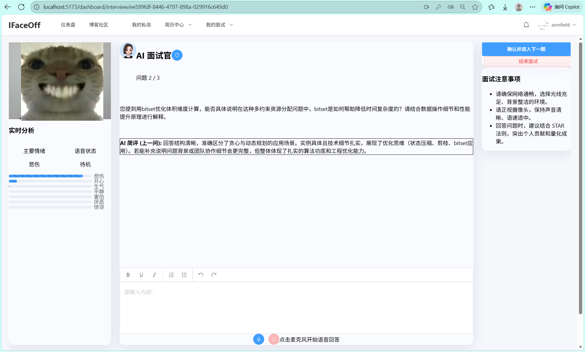

#### 2. 📊 多维度深度评估报告
面试结束后，系统会异步生成包含综合评分、能力雷达图、关键词分析、STAR 法则分析、情绪波动图等**多维度的深度评估报告**，提供量化的、可执行的优化建议。

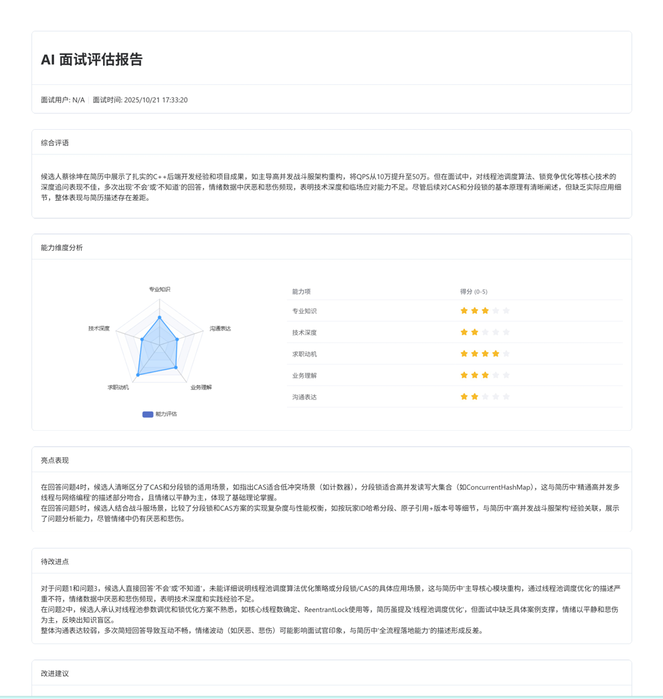
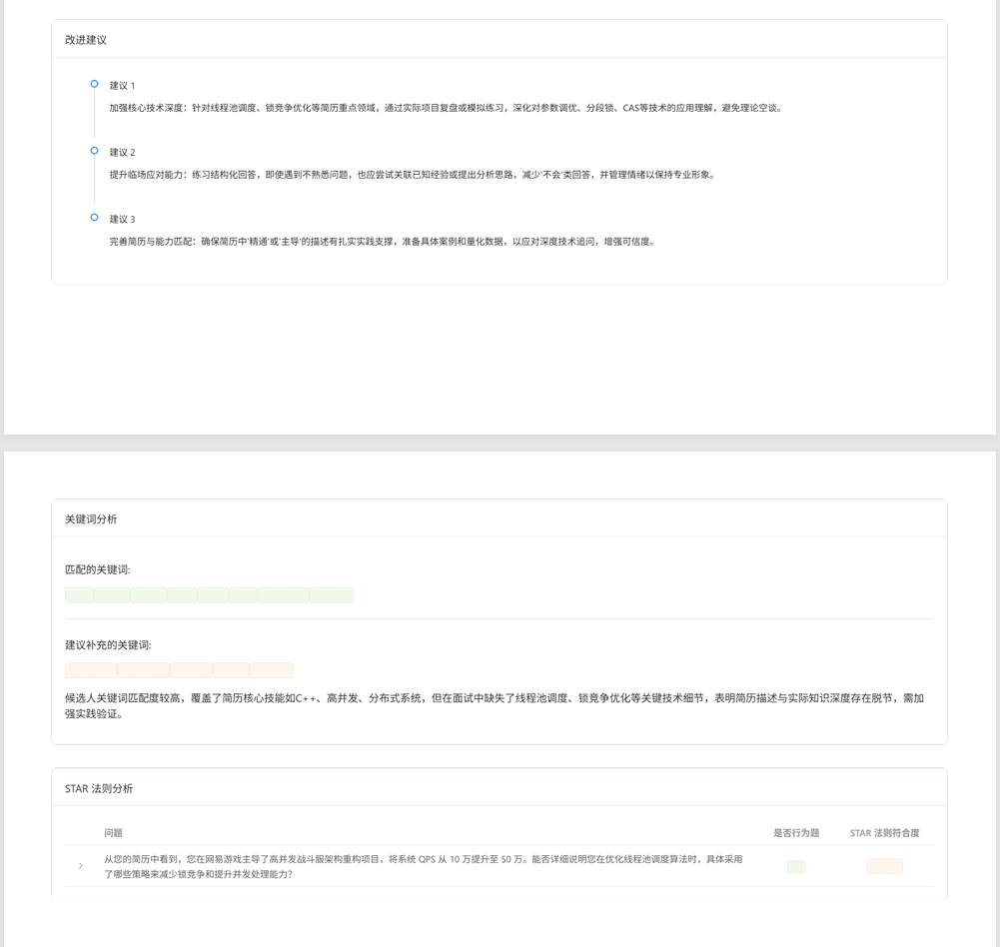
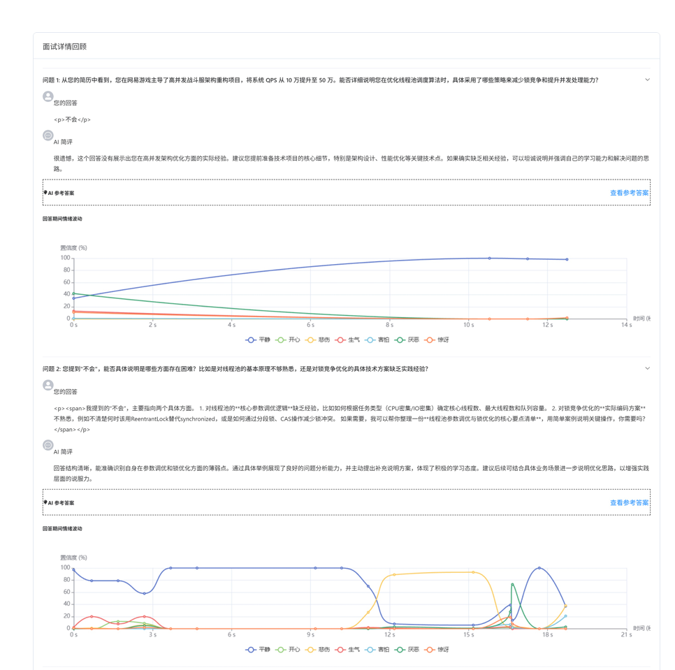

#### 3. 📄 强大的简历中心
*   **在线简历编辑器**：实现了模块化、可拖拽的画布式编辑体验，支持多套专业模板一键切换和 AI 文本润色。
*   **AI 简历诊断**：上传简历并与岗位描述 (JD) 进行匹配度分析，生成优化建议。
*   **AI 简历生成**：只需输入核心信息，即可由 AI 生成一份专业且完整的简历初稿。

|                  在线简历编辑器                  |                   AI 润色建议                    |
| :----------------------------------------------: | :----------------------------------------------: |
| 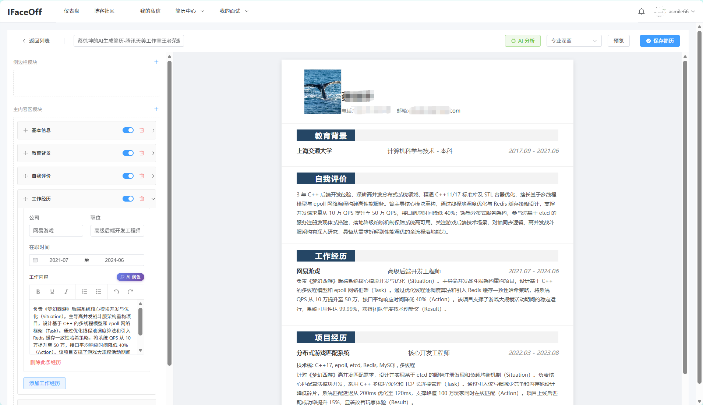 | 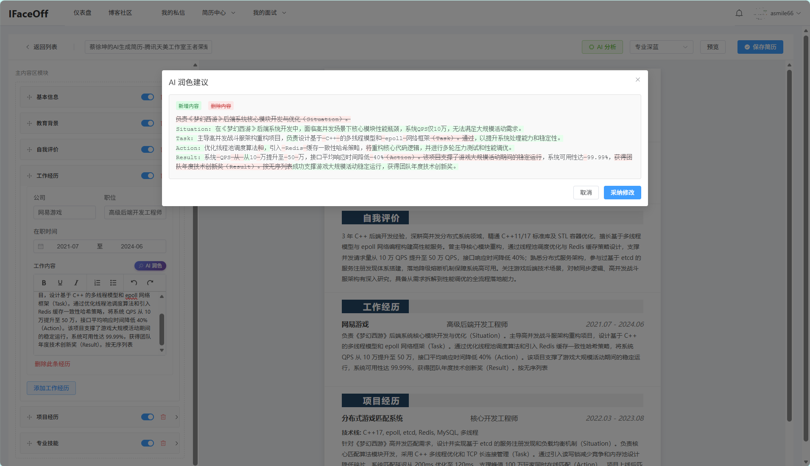 |

|                   AI 生成简历                    |                   AI 简历诊断                    |
| :----------------------------------------------: | :----------------------------------------------: |
| 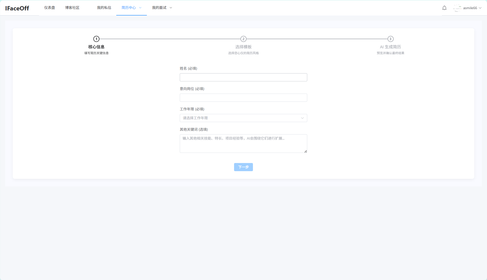 | 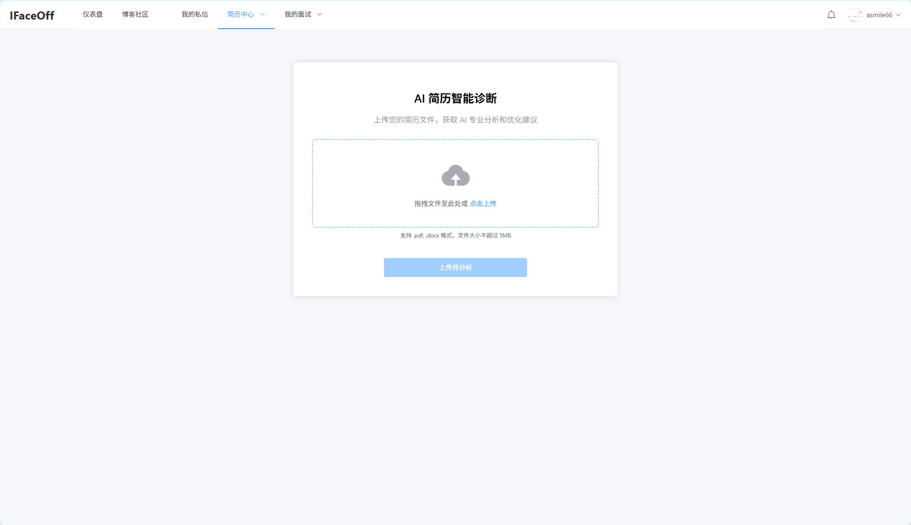 |

#### 4. ✍️ 专业博客与互动社区
内置专业级 Markdown 编辑器，支持代码高亮、数学公式、流程图等。用户可以分享求职经验，并进行点赞、收藏、评论、关注等互动。我们还实现了基于内容的智能文章推荐算法，打造一个内容驱动的社区生态。

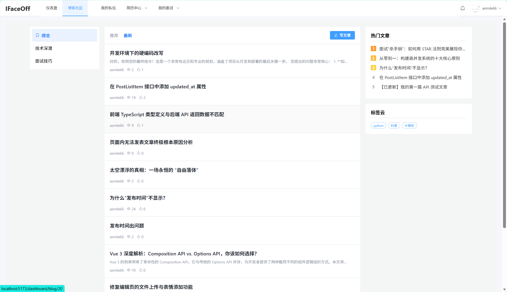
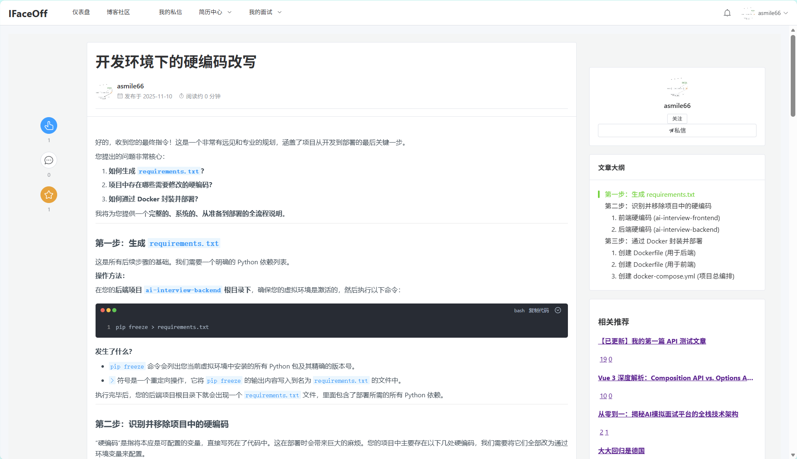

#### 5. 💬 实时通知与私信
*   **通知中心**：当用户的文章/评论被互动，或被其他用户关注时，系统会自动发送实时站内信。
*   **实时私信**: 基于 WebSocket 和 Django Channels 实现，支持文本、图片、文件等富媒体通信和“对方正在输入”提示。
*   **个性化设置**：用户可以根据自己的需求，配置偏好的 AI 模型和独立的 API Key。

|                     通知中心                     |                 AI 设置                 |
| :----------------------------------------------: | :-------------------------------------: |
| 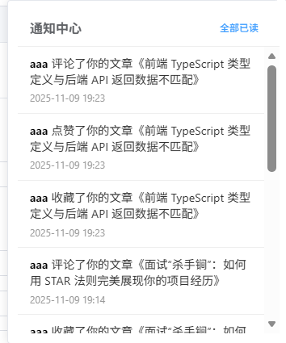 |  |


#### 6. ⚙️ 可视化后台管理

基于 `django-simpleui` 提供了美观且功能强大的后台管理界面，方便运营者管理平台内容、用户、AI 模型、岗位等所有数据。

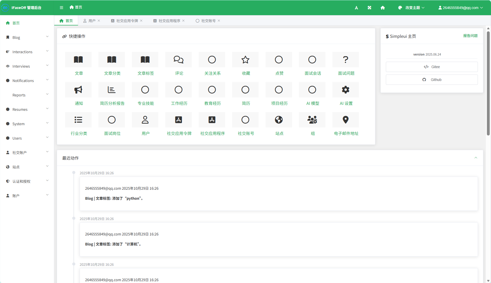

---

### 🛠️ 技术架构

项目采用**前后端分离**的现代化架构，并通过 **Docker** 容器化部署。

*   **前端 (Frontend)** - `Vue 3`
    *   **框架/构建**: `Vue 3` (Composition API & `<script setup>`) / `Vite`
    *   **语言**: `TypeScript`
    *   **UI / 状态管理**: `Element Plus` / `Pinia`
    *   **核心库**: `face-api.js`, `md-editor-v3`, `axios`, `echarts`

*   **后端 (Backend)** - `Django`
    *   **框架**: `Django` & `Django REST Framework (DRF)`
    *   **数据库**: `MySQL`
    *   **实时通信**: `Django Channels`
    *   **异步任务**: `Celery`
    *   **消息中间件/缓存**: `RabbitMQ` / `Redis`
    *   **API 文档**: `drf-spectacular` (Swagger UI)

*   **部署 (Deployment)**
    *   **容器化**: `Docker` & `Docker Compose`
    *   **Web 服务器**: `Nginx` (前端) + `Uvicorn` (后端 ASGI)

---

### 🚀 部署指南

本项目推荐使用 Docker Compose 进行一键部署。

#### 1. 先决条件
*   [Git](https://git-scm.com/)
*   [Docker](https://www.docker.com/products/docker-desktop/) & [Docker Compose](https://docs.docker.com/compose/install/)

#### 2. 克隆项目
```bash
git clone https://github.com/6Asmile/AI_interview.git
cd AI_interview
```

#### 3. GitHub OAuth App 配置
为了使用 GitHub 登录功能，您需要先在 GitHub 上创建一个 OAuth App。

1.  登录 GitHub，进入 **Settings** > **Developer settings** > **OAuth Apps**。
2.  点击 **New OAuth App** 并填写：
    *   **Application name**: `iFaceOff` (或自定义)
    *   **Homepage URL**: `http://localhost` (如果是线上部署，请填写您的域名)
    *   **Authorization callback URL**: `http://localhost/oauth/callback` (如果是线上部署，请填写 `https://your_domain.com/oauth/callback`)
3.  创建应用后，您会得到一个 **Client ID**。
4.  点击 **Generate a new client secret** 生成一个 **Client Secret**。
5.  **将这两个值填入下面的 `.env` 配置文件中**。

#### 4. 环境配置
在项目根目录下，有两个重要的 `.env` 配置文件需要您创建和修改。

##### a. 后端配置 (`ai-interview-backend/.env`)
根据 `ai-interview-backend/.env.example` 创建并编辑 `.env` 文件。
```bash
cp ai-interview-backend/.env.example ai-interview-backend/.env
```
然后，打开并编辑 `ai-interview-backend/.env`，**所有标记为 `<...>` 的值都必须被替换**：
```env
# 数据库连接信息 (与 docker-compose.yml 对应)
DB_NAME=ai_interview_db
DB_USER=root
DB_PASSWORD=<your_strong_db_password> # 数据库密码，请务必修改
DB_HOST=db
DB_PORT=3306

# Django 配置
SECRET_KEY=<your_strong_django_secret_key> # 强烈建议生成一个新的
DEBUG=True
ALLOWED_HOSTS=127.0.0.1,localhost,backend
CORS_ALLOWED_ORIGINS=http://localhost:5173,http://127.0.0.1:5173 # 开发环境，生产环境请改为你的前端域名

# Redis & RabbitMQ (使用 Docker 内部主机名)
REDIS_HOST=redis
RABBITMQ_HOST=rabbitmq

# 邮件发送配置 (用于注册验证码)
EMAIL_HOST=<your_smtp_server> # 例如: smtp.qq.com
EMAIL_HOST_USER=<your_email_address>
EMAIL_HOST_PASSWORD=<your_email_auth_code> # 通常是16位授权码，不是邮箱密码

# GitHub OAuth 配置
GITHUB_CLIENT_ID=<your_github_client_id>
GITHUB_CLIENT_SECRET=<your_github_client_secret>

# 默认 AI 服务的 API Key
DEEPSEEK_API_KEY=<your_ai_service_api_key>
```
> **提示**: 可以使用在线工具搜索 "Django Secret Key Generator" 来生成 `SECRET_KEY`。

##### b. 前端配置 (`ai-interview-frontend/.env.production`)
通常，生产环境的默认配置无需修改，它会通过 Nginx 代理将 API 请求转发到后端。
```bash
cp ai-interview-frontend/.env.development ai-interview-frontend/.env.production
```

#### 5. 构建并启动服务
回到项目**根目录**，执行以下命令：
```bash
docker-compose up --build -d
```
*   `--build`: 强制重新构建 Docker 镜像。
*   `-d`: 在后台运行容器。

#### 6. 初始化数据库与 GitHub App
当容器启动后，我们需要执行数据库迁移、创建管理员账户，并在 Django 后台配置 GitHub App。

```bash
# 1. 执行数据库迁移
docker-compose exec backend python manage.py migrate

# 2. 创建超级管理员 (按照提示输入)
docker-compose exec backend python manage.py createsuperuser
```

**3. 配置 Django 后台的 GitHub App**
*   访问 `http://localhost/admin/` 并用刚才创建的管理员账户登录。
*   在左侧导航栏找到 `SOCIAL ACCOUNTS` -> **Social applications**。
*   点击右上角的 `ADD SOCIAL APPLICATION`。
*   **Provider**: 选择 `GitHub`。
*   **Name**: 填写 `GitHub` (或自定义)。
*   **Client ID**: 粘贴您从 GitHub 获取的 Client ID。
*   **Secret key**: 粘贴您从 GitHub 获取的 Client Secret。
*   在 `Sites` 区域，将 `example.com` 移动到右侧的 `Chosen sites` 框中。
*   点击 `Save`。

#### 7. 访问应用
恭喜！一切准备就绪。
*   **前端应用**: `http://localhost`
*   **后台管理**: `http://localhost/admin/`
*   **API 文档**: `http://localhost/api/v1/schema/swagger-ui/`

#### 8. 停止服务
```bash
docker-compose down
```
> 如果您想清除所有数据（包括数据库），请使用 `docker-compose down -v`。

---

### 📄 许可证

本项目采用 [MIT License](LICENSE)。
