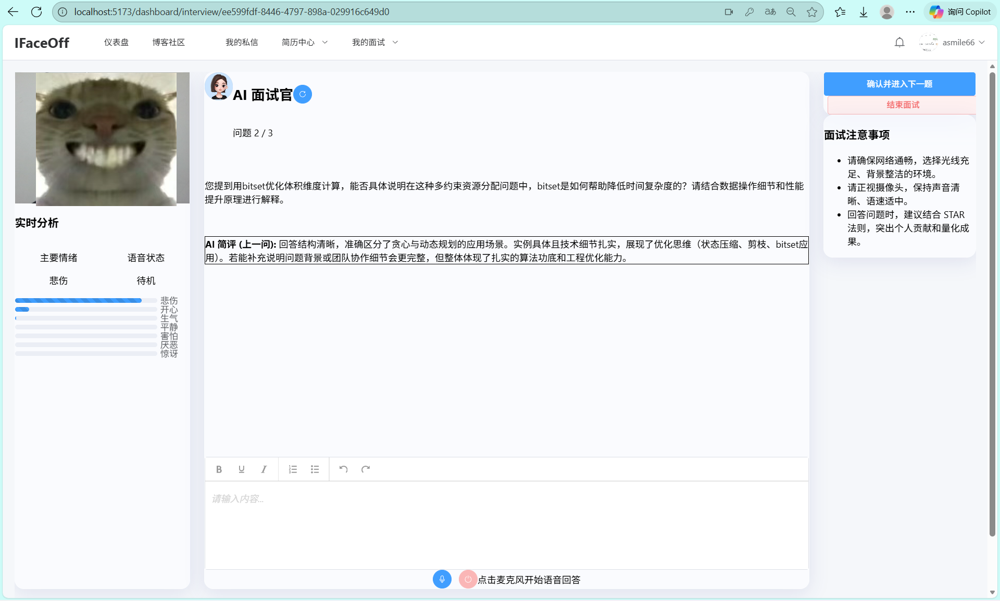
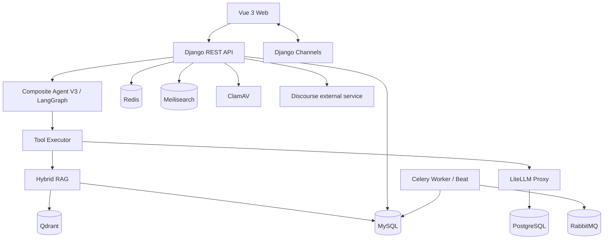

# iFaceoff

以可信职业事实和简历版本为核心的 AI 求职平台：从职业事实库、主简历、JD 定制、模拟面试，到投递跟踪、证据化评估和学习计划，形成可追溯的求职闭环。

[](https://vuejs.org/)
[](https://www.djangoproject.com/)
[](https://github.com/langchain-ai/langgraph)
[](https://qdrant.tech/)
[](https://docs.litellm.ai/)
[](LICENSE)



## 产品闭环

```text
职业事实库
  -> 主简历与不可变版本
  -> JD 定制与 iFaceoff Fit 分析
  -> 自适应 AI 模拟面试
  -> 能力证据与风险报告
  -> 投递管道与学习任务
  -> 新事实人工确认后回流
```

iFaceoff 不把模型生成内容当作事实。简历经历、候选人证据、知识库来源、面试评分和报告结论都必须能追溯到真实输入；模型不可用或输出不合法时，系统明确降级，不伪造成功结果。

## 核心模块

| 模块 | 当前能力 |
| --- | --- |
| Resume V2 | JSON Resume 兼容结构、职业事实库、不可变版本、差异建议、异步 Docling/OCR 导入、人工确认、PDF/DOCX/JSON 导出基础 |
| 求职工作台 | 岗位目标、JD、投递阶段、面试安排、Offer、学习任务与个人求职看板 |
| Composite Agent V3 | 外部单一面试官，内部 Evidence、Strategy、Retrieval、Memory、Question、Safety、Report 等 SubAgent 协作 |
| 自适应面试 | 目标时长和能力覆盖驱动结束；按回答强弱执行澄清、验证、深挖、挑战、迁移或换题；支持主题栈和自然承接 |
| 企业级评估 | 规则与 AI 双评、量表锚点、真实证据链、能力矩阵、覆盖缺口、可审计 Trace 与离线评估 |
| 知识库 RAG | 私有/公共隔离、HR/Admin 审批、Docling + OCR、层级递归语义切块、Multi Query、向量 + BM25、RRF、Rerank |
| 模型网关 | 加密 BYOK/平台凭据、任务别名、部署与路由策略、预算、调用账本、Fallback，并可接 LiteLLM 数据面 |
| 多模态 | ASR 分段转写、低置信度确认、TTS 缓存和浏览器兜底、音视频记录；多模态状态不直接决定候选人分数 |
| 个人安全 | JWT 刷新轮换与黑名单、登录审计、活动会话、TOTP/恢复码、通知偏好、数据导出和注销申请 |
| 社区与通信 | Discourse SSO/Webhook、Meilisearch 公开搜索；私信幂等、送达/已读、回复、编辑、撤回、屏蔽、举报、附件扫描和 Outbox |

## 架构


```mermaid
flowchart TB
    WEB["Vue 3 Web"]
    API["Django REST API"]
    WS["Django Channels"]
    AGENT["Composite Agent V3 / LangGraph"]
    TOOLS["Tool Executor"]
    RAG["Hybrid RAG"]
    WORKER["Celery Worker / Beat"]
    MYSQL[(MySQL)]
    REDIS[(Redis)]
    MQ[(RabbitMQ)]
    QDRANT[(Qdrant)]
    GATEWAY["LiteLLM Proxy"]
    PG[(PostgreSQL)]
    SEARCH[(Meilisearch)]
    SCAN["ClamAV"]
    DISCOURSE["Discourse external service"]

    WEB --> API
    WEB <--> WS
    API --> AGENT
    AGENT --> TOOLS
    TOOLS --> RAG
    TOOLS --> GATEWAY
    RAG --> QDRANT
    RAG --> MYSQL
    API --> MYSQL
    API --> REDIS
    API --> SEARCH
    API --> DISCOURSE
    API --> SCAN
    WORKER --> MQ
    WORKER --> MYSQL
    GATEWAY --> PG
```

### 面试 Agent Loop

```text
Observe
  -> Evaluate Evidence
  -> Update Topic State
  -> Estimate Ability Confidence
  -> Decide Termination
  -> Select Next Action
  -> Retrieve if Needed
  -> Generate Dialogue Turn
  -> Safety Validate
  -> Repair / Deterministic Fallback
  -> Persist, Reflect and Update Memory
```

面试不再由固定 10 题决定结束。模板锁定评分标准和允许的阶段，Agent 在约束内根据目标时长、必验能力、回答证据、追问深度和候选人反问动态推进。宽松或严格只改变语气、节奏和挑战率，不改变同一回答的评分量表。

### RAG 链路

1. 上传 Markdown、TXT、PDF、DOCX、XLSX、CSV、图片或 FAQ。
2. Celery 异步调用 Docling 提取标题、段落、表格、图片、页码和阅读顺序；扫描内容由 OCR adapter 增强。
3. 按标题/FAQ/表格等结构生成父块，超长块递归切分，邻近短块按语义合并。
4. 用户提交审核，HR/Admin 审批后才执行 Embedding 和 Qdrant upsert。
5. 检索按面试策略生成多 Query，并行执行向量和中文关键词召回，经 RRF 融合后 Rerank。
6. MySQL 二次校验租户、可见性、审批、索引状态和已用 chunk；向量库 payload 不能单独作为权限依据。
7. 无 Embedding、Rerank 或 Qdrant 时降级为关键词检索；无已审批证据时继续面试但不声称“基于题库”。

## 技术栈

- Frontend: Vue 3、TypeScript、Vite、Element Plus、Pinia、ECharts
- Backend: Python 3.12、Django 5.2、DRF、Channels、Uvicorn、Celery
- Agent: LangGraph、结构化 Prompt、节点契约、幂等 Run/NodeRun、上下文预算
- Data: MySQL、Redis、RabbitMQ、Qdrant、PostgreSQL、Meilisearch
- AI: OpenAI-compatible、DashScope/百炼、LiteLLM、Embedding、Rerank、ASR、TTS
- Document: Docling、OCR adapter、PyPDF、python-docx、openpyxl、jieba
- Security: encrypted credentials、JWT blacklist、TOTP、ClamAV、RBAC、tenant guard

## 目录

```text
AI_interview/
├── ai-interview-frontend/        # Vue 3 应用
├── ai_interview_backend/
│   ├── careers/                  # 职业事实、岗位目标、投递与学习任务
│   ├── resumes/                  # JSON Resume、版本、导入和建议
│   ├── interviews/               # Composite Agent、评估、ASR/TTS
│   ├── knowledge/                # 审批、解析、切块、混合检索
│   ├── system/                   # 模型配置、加密凭据和 GatewayExecutor
│   ├── community/                # Discourse 与公开搜索集成
│   ├── chat/                     # 可靠私信、附件和 Outbox
│   └── users/                    # 身份、MFA、会话与隐私
├── docker/litellm/config.yaml
├── docker-compose.infra.yml      # 仅基础设施，项目名 Ifaceoff-infra
├── docker-compose.yml            # 完整应用栈
└── scripts/
```

## 本地开发

### 1. 一键启动基础设施

应用本身在本机运行，MySQL、Redis、RabbitMQ、Qdrant、LiteLLM/PostgreSQL、Meilisearch 和 ClamAV 使用 Docker：

```powershell
git clone https://github.com/6Asmile/AI_interview.git
cd AI_interview
Copy-Item .env.infra.example .env.infra
.\scripts\ifaceoff-infra.ps1 up
```

| 服务 | 本机地址 |
| --- | --- |
| MySQL | `127.0.0.1:3307` |
| Redis | `127.0.0.1:6379` |
| RabbitMQ / 管理页 | `127.0.0.1:5672` / `http://127.0.0.1:15672` |
| Qdrant | `http://127.0.0.1:6333/dashboard` |
| LiteLLM | `http://127.0.0.1:4000` |
| LiteLLM PostgreSQL | `127.0.0.1:5433` |
| Meilisearch | `http://127.0.0.1:7700` |
| ClamAV | `127.0.0.1:3310` |

查看状态或停止：

```powershell
.\scripts\ifaceoff-infra.ps1 status
.\scripts\ifaceoff-infra.ps1 down
```

### 2. 启动后端

```powershell
cd ai_interview_backend
python -m venv venv
.\venv\Scripts\Activate.ps1
pip install -r requirements.txt
Copy-Item .env.example .env
python manage.py migrate
uvicorn ai_interview_backend.asgi:application --reload --host 0.0.0.0 --port 8000
```

异步任务使用单独终端：

```powershell
cd ai_interview_backend
celery -A ai_interview_backend worker -l info -P solo
celery -A ai_interview_backend beat -l info
```

### 3. 启动前端

```powershell
cd ai-interview-frontend
npm ci
npm run dev
```

- Web: `http://127.0.0.1:5173`
- API: `http://127.0.0.1:8000/api/v1/`
- Swagger: `http://127.0.0.1:8000/api/v1/schema/swagger-ui/`
- Admin: `http://127.0.0.1:8000/admin/`

完整容器化应用仍使用 `docker-compose.yml` 和 `.\scripts\ifaceoff-docker.ps1 up`，与基础设施模式相互独立。

## 关键配置

```dotenv
INTERVIEW_AGENT_ENGINE=composite_v3
MODEL_CREDENTIAL_ENCRYPTION_KEY=
LITELLM_PROXY_URL=http://127.0.0.1:4000
MEILISEARCH_URL=http://127.0.0.1:7700
CLAMAV_HOST=127.0.0.1
CLAMAV_PORT=3310
DISCOURSE_BASE_URL=
DISCOURSE_CONNECT_SECRET=
DISCOURSE_WEBHOOK_SECRET=
```

生产环境必须显式配置凭据加密密钥、JWT/Django 密钥和各基础设施密码。API Key 仅以密文保存，接口只返回掩码；日志、Trace 和前端状态不得出现明文密钥。

Discourse 按官方 `discourse_docker` 方式独立部署，通过 SSO/API/Webhook 接入，不复制或嵌入其源码。未配置 Discourse 或 Meilisearch 时，社区接口返回明确降级状态。

## API 概览

- `/api/v2/career-facts/`, `/job-targets/`, `/applications/`, `/learning-tasks/`
- `/api/v2/resumes/`, `/resume-imports/`, `/resume-suggestions/`
- `/api/v1/interviews/`, `/knowledge/`
- `/api/v1/gateway/credentials/`, `/deployments/`, `/aliases/`, `/requests/`
- `/api/v1/community/discourse/`, `/community/search/`
- `/api/v1/auth/mfa/`, `/auth/sessions/`, `/auth/privacy/`

旧简历和 AI 设置 API 保留兼容入口；历史 `api_keys` 在读取或迁移时转为加密 `ProviderCredential`，不继续写入明文 JSON。

## 质量检查

```powershell
cd ai_interview_backend
python manage.py check
python manage.py makemigrations --check --dry-run
python manage.py test resumes.tests careers.tests system.tests chat.tests users.tests community.tests interviews.tests knowledge.tests --noinput

cd ..\ai-interview-frontend
npm run build
```

测试使用真实匿名化业务样例验证规则和数据链路；provider boundary fake 只用于超时、错误和降级故障注入，不作为简历、评分、知识库或社区业务数据。

## License

[Apache License 2.0](LICENSE)
