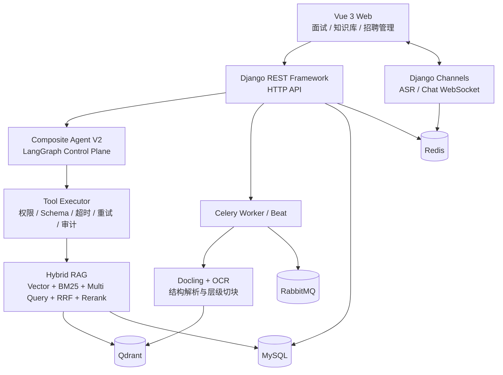

# iFaceoff

面向求职者与招聘团队的企业级 AI 模拟面试平台。iFaceoff 将可恢复的多 SubAgent 面试流程、知识库 RAG、结构化评估、语音交互、简历工具和招聘管理能力整合在同一个前后端系统中。

[](https://vuejs.org/)
[](https://www.djangoproject.com/)
[](https://github.com/langchain-ai/langgraph)
[](https://qdrant.tech/)
[](https://www.docker.com/)
[](LICENSE)


## 核心能力

| 模块 | 能力 |
| --- | --- |
| Composite Agent V2 | 外部单一面试官，内部 Evaluation、EvidenceGuard、Strategy、Retrieval、Memory、Question、Safety、Report 等 SubAgent 协作 |
| 可恢复面试流程 | LangGraph 条件路由、节点检查点、幂等恢复、生成重试、安全兜底、流式下一题 |
| 企业级评估 | 规则评分与 AI 双评、能力矩阵、证据链、覆盖缺口、降级模式、可审计报告 |
| 知识库 RAG | 多租户隔离、草稿与审批上线、Docling/OCR 解析、层级切块、混合检索、RRF、Rerank |
| 多模态交互 | 文本/语音回答、ASR 分段转写、TTS 问题播报、低置信度确认、视频录制与异步转码 |
| 模型网关 | Chat、Embedding、Rerank、ASR、TTS 分类型配置，支持 OpenAI-compatible 与 DashScope/百炼服务 |
| 招聘体系 | 面试模板、阶段计划、评分量表、能力维度、校准样例、离线评估数据集 |
| 求职工具 | 简历编辑、AI 润色、JD 匹配诊断、报告导出、历史面试复盘 |
| 社区能力 | Markdown 博客、评论互动、通知、实时私信与 GitHub OAuth |

## 系统架构


```mermaid
flowchart TB
    UI["Vue 3 Web\n面试 / 知识库 / 招聘管理"]
    API["Django REST Framework\nHTTP API"]
    WS["Django Channels\nASR / Chat WebSocket"]
    AGENT["Composite Agent V2\nLangGraph Control Plane"]
    TOOLS["Tool Executor\n权限 / Schema / 超时 / 重试 / 审计"]
    RAG["Hybrid RAG\nVector + BM25 + Multi Query + RRF + Rerank"]
    PARSER["Docling + OCR\n结构解析与层级切块"]
    WORKER["Celery Worker / Beat"]
    MYSQL[(MySQL)]
    REDIS[(Redis)]
    MQ[(RabbitMQ)]
    QDRANT[(Qdrant)]

    UI --> API
    UI <--> WS
    API --> AGENT
    AGENT --> TOOLS
    TOOLS --> RAG
    API --> WORKER
    WORKER --> PARSER
    PARSER --> QDRANT
    RAG --> QDRANT
    RAG --> MYSQL
    API --> MYSQL
    API --> REDIS
    WS --> REDIS
    WORKER --> MQ
```

后端对外只暴露一个综合面试 Agent。内部 SubAgent 运行在同一进程，由 LangGraph 负责条件路由和状态控制，不在候选人界面暴露内部角色。

### Agent Loop

```text
Observe
  -> Rule/AI Evaluate
  -> Evidence Guard
  -> Coverage & Memory Update
  -> Strategy Plan
  -> Hybrid Retrieval (optional)
  -> Context Assembly
  -> Question Generate
  -> Safety Validate
  -> Repair / Safe Fallback
  -> Persist & Reflect
```

一次在线轮次拆分为共享 `run_id` 的 Prepare Graph 和 Finalize Graph。流式连接中断后，可以通过 `InterviewAgentRun` 与逐节点 `InterviewAgentNodeRun` 从最后状态恢复，避免重复评分、重复增加能力覆盖或重复创建题目。

### RAG 数据链路

1. 用户上传 Markdown、TXT、PDF、DOCX、XLSX、CSV 或 FAQ 数据。
2. Docling 提取标题、段落、列表、表格、图片、页码和阅读顺序；扫描内容可由 OCR adapter 增强。
3. 文档按结构层级切父块，对超长内容递归切分，并对相邻短块做语义合并。
4. 用户提交审核，HR/Admin 审批通过后才执行 Embedding 与 Qdrant upsert。
5. 面试检索执行多 Query、向量召回、中文关键词召回、RRF 融合和 Rerank。
6. MySQL 对 Qdrant 候选结果进行租户、可见范围、审批状态和索引状态二次校验。
7. 无向量模型、Rerank 或 Qdrant 时降级到关键词检索，不伪造知识来源。

只有 `approval_status=approved` 且 `status=indexed` 的文档能够进入在线面试。

## 技术栈

### 前端

- Vue 3、TypeScript、Vite
- Element Plus、Pinia、Vue Router
- ECharts、Mermaid、KaTeX、Highlight.js
- MediaRecorder、WebSocket、face-api.js

### 后端

- Python 3.12、Django 5.2、Django REST Framework
- Django Channels、Uvicorn、Celery
- MySQL、Redis、RabbitMQ、Qdrant
- LangGraph、OpenAI-compatible API、DashScope
- Docling、PaddleOCR、PyPDF、python-docx、openpyxl、jieba
- FFmpeg 视频与音频处理

## 目录结构

```text
AI_interview/
├── ai-interview-frontend/       # Vue 3 前端
├── ai_interview_backend/        # Django/DRF/Channels/Celery 后端
│   ├── interviews/              # Agent、评估、ASR/TTS、面试模板
│   ├── knowledge/               # 文档解析、审批、切块与混合检索
│   ├── system/                  # AI 模型设置与模型网关
│   └── video_uploads/           # 分片上传与异步转码
├── docker-compose.infra.yml     # 仅基础设施
├── docker-compose.yml           # 完整应用栈
├── scripts/                     # 一键启动脚本
├── docs/                        # 部署说明与截图
└── nginx/                       # 前端与 API/WebSocket 反向代理
```

## 快速开始

### 方案一：本机开发 + Docker 基础设施

推荐开发时只用 Docker 启动 MySQL、Redis、RabbitMQ 和 Qdrant，前后端在本机运行，调试速度更快。

```powershell
git clone https://github.com/6Asmile/AI_interview.git
cd AI_interview
copy .env.infra.example .env.infra
.\scripts\ifaceoff-infra.ps1 up
```

基础设施端口：

| 服务 | 地址 |
| --- | --- |
| MySQL | `127.0.0.1:3307` |
| Redis | `127.0.0.1:6379` |
| RabbitMQ | `127.0.0.1:5672` |
| RabbitMQ 管理页 | `http://127.0.0.1:15672` |
| Qdrant | `http://127.0.0.1:6333/dashboard` |

准备后端环境：

```powershell
cd ai_interview_backend
python -m venv venv
.\venv\Scripts\Activate.ps1
pip install -r requirements.txt
copy .env.example .env
```

本机开发时将 `.env` 中的连接地址改为：

```dotenv
DB_HOST=127.0.0.1
DB_PORT=3307
REDIS_HOST=127.0.0.1
RABBITMQ_HOST=127.0.0.1
QDRANT_URL=http://127.0.0.1:6333
INTERVIEW_AGENT_ENGINE=composite_v2
```

启动后端和异步任务：

```powershell
python manage.py migrate
python manage.py createsuperuser
uvicorn ai_interview_backend.asgi:application --reload --host 0.0.0.0 --port 8000

# 新终端
celery -A ai_interview_backend worker -l info -P solo
```

启动前端：

```powershell
cd ..\ai-interview-frontend
npm ci
npm run dev
```

访问：

- 前端：`http://localhost:5173`
- API 文档：`http://localhost:8000/api/v1/schema/swagger-ui/`
- Django Admin：`http://localhost:8000/admin/`

详细说明见 [基础设施 Docker 文档](docs/docker-ifaceoff-infra.md)。

### 方案二：完整 Docker Compose

完整模式会同时启动 Vue/Nginx、Django、Celery、MySQL、Redis、RabbitMQ 和 Qdrant。

```powershell
copy .env.docker.example .env.docker
notepad .env.docker
.\scripts\ifaceoff-docker.ps1 up
```

启动后访问：

- Web：`http://localhost`
- API 文档：`http://localhost:8000/api/v1/schema/swagger-ui/`
- RabbitMQ：`http://localhost:15672`
- Qdrant：`http://localhost:6333/dashboard`

生产或共享环境中必须修改 `.env.docker` 内的 `SECRET_KEY`、数据库密码和模型 API Key。详细说明见 [完整 Docker 部署文档](docs/docker-ifaceoff.md)。

## 模型配置

系统按模型类型分别配置：

- Chat：回答评估、问题生成及可选语义判断
- Embedding：知识库向量索引与召回
- Rerank：混合召回结果精排
- ASR：语音回答转写
- TTS：问题语音合成

配置优先级为用户 AI 设置高于系统环境变量。API Key 不通过接口明文返回；保存掩码不会覆盖原密钥。

推荐登录后在“AI 设置”页面选择模型、填写对应 Key，并调用健康检查接口验证。未配置模型时，在线面试会明确进入规则评分或无 RAG 降级模式。

## 知识库上线流程

```text
创建/批量导入
  -> 异步解析与 OCR
  -> 结构化切块预览
  -> 提交审核
  -> HR/Admin 审批
  -> Embedding 与 Qdrant 索引
  -> 面试检索
```

普通用户只能管理自己的私有知识库；公共库由管理员发布。编辑已审批文档后会自动回到草稿状态，需要重新审核和索引。

## 测试与质量检查

后端：

```powershell
cd ai_interview_backend
python manage.py check
python manage.py makemigrations --check --dry-run
python manage.py test interviews.tests knowledge.tests system.tests
```

前端：

```powershell
cd ai-interview-frontend
npm ci
npm run build
```

当前测试覆盖 Agent 条件路由、无模型降级、节点契约、工具权限、RAG 租户隔离、审批过滤、上下文预算、问题修复、报告证据链、流式 API 与恢复幂等。

## 关键配置

| 配置 | 默认值 | 说明 |
| --- | --- | --- |
| `INTERVIEW_AGENT_ENGINE` | `default` | 可选 `default`、`langgraph`、`composite`、`composite_v2` |
| `AGENT_STATE_SCHEMA_VERSION` | `2` | Agent 状态版本 |
| `AGENT_MAX_GENERATION_RETRIES` | `2` | 问题校验失败后的最大修复次数 |
| `AGENT_CONTEXT_TOKEN_BUDGET` | `6000` | 面试上下文预算 |
| `AGENT_EVALUATION_CONFIDENCE_THRESHOLD` | `0.6` | 能力覆盖最低置信度 |
| `DOCUMENT_PARSER` | `docling` | 文档结构解析器 |
| `DOCLING_ENABLE_OCR` | `true` | 是否启用 OCR |
| `HYBRID_SEARCH_TOPN` | `30` | 混合检索候选数量 |
| `HYBRID_SEARCH_TOPK` | `4` | 最终注入 Agent 的证据数量 |
| `QDRANT_URL` | - | Qdrant HTTP 地址 |

## 安全设计

- RBAC：Candidate、HR、Admin 权限分离
- 私有知识库按用户隔离，公共库只读
- 未审批、归档、索引失败内容禁止进入 RAG
- Qdrant 命中结果必须经过 MySQL 二次归属校验
- Agent 工具调用执行权限、Schema、超时、重试和审计
- RAG 内容按不可信证据注入，不能覆盖 System Prompt
- AI 结论必须引用真实回答证据，无依据时标记并剔除
- `.env`、数据库备份、媒体文件和运行时状态禁止提交

## License

[MIT License](LICENSE)
