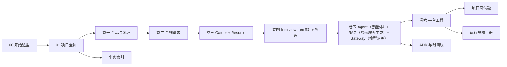
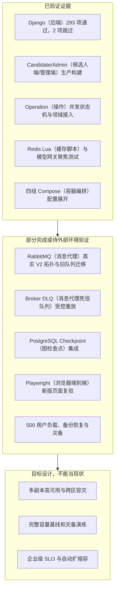

# 从这里开始复盘 iFaceoff

这套知识库不是把 18 个 Django app 分别做成“类名清单”，也不是把项目包装成一个已经全部生产化的成品。它是一部可以沿真实执行链路阅读的项目教材：先回答产品为什么存在，再从浏览器页面进入 Vue 路由、API 客户端、Django URL、View/Serializer、Service/Task/Agent、PostgreSQL 与中间件，最后回到失败恢复、测试证据和面试表达。每个实现判断都采用 [[14-词汇表与实现状态口径]] 的五级口径，截图中出现空态或失败态时也如实解释。

当前代码验证基线是 Git commit `89313f8268e96d79b6968b39846f319c0892f50c`。该提交完成权威 Operation、命令 Outbox、Redis 三域、RabbitMQ V2 拓扑、统一模型网关和领域接入；Django 全量发现 295 项，其中 293 项通过、2 项外部 PostgreSQL Checkpoint 测试显式跳过，两个 Vue 生产构建和四组 Compose config 通过。Docker daemon 不可用，所以真实 Broker/Worker、三节点故障、外部 Checkpoint、容量和灾备仍为 `pending-verification`。页面图仍来自 2026-07-28 的真实应用与合成 fixture；凡 2026-08-12 已改页面但未重拍者，在截图清单中降为 `current-partial`。

> [!important] 面试真实性口径
> “代码里有模型”不等于“页面完整可用”；“能在本地跑通”不等于“具备生产容量”；“设计了补偿字段”不等于“演练过恢复”。本书把这三类证据分开写。你可以说“实现了版本化模型与任务状态机”，但若当前页面因 API 基址拼接错误显示空态，就必须补充“当前 UI 集成仍有缺陷”。

## 这本书如何组织

观察重点：主阅读链只有七篇长文，Career 到 Agent 的因果关系没有被拆散；右侧附录用于查证，不承担解释性正文。

面试时如何讲：先用 `01` 建立全局叙事，面试官追问某个环节时再进入对应卷，最后用事实索引给出文件、类和测试位置，避免回答停留在组件名。

canonical Vault（权威知识库）始终只有 15 篇扁平 Markdown；个人学习笔记保留在 `docs/个人项目学习文件/`，不放入 Vault 嵌套目录。`scripts/doc_sync_map.json` 采用 first-match（首条匹配），Celery topology、Platform Events 管理端和 MQ infrastructure 因此使用排在宽泛规则之前的专用多章节映射。`verified_commit` 必须是当前 HEAD 可达的已验证祖先提交，而不是要求文档提交引用自身哈希；事实索引也记录最近一次应用代码/基础设施提交，避免生成文件自引用。所有 Mermaid/UML 可见标签以中文为主；必须保留的英文技术名追加中文注释。

## 30 分钟速览

### 第 1～5 分钟：产品问题与边界

阅读 [[01-iFaceoff项目全解]] 的“一个候选人的连续故事”和 [[02-卷一-产品定位与求职闭环]] 的“产品不是题库集合”。需要讲清三件事：

1. 求职准备的问题不是缺少单次 AI 对话，而是事实、目标岗位、简历版本、面试证据和补强任务彼此断裂。
2. iFaceoff 用 `CareerFact → JobTarget → ResumeVersion → InterviewSession → AbilitySnapshot/LearningTask` 把这些对象连成一条可追溯闭环。
3. 候选人端与 Staff 管理端不是同一账号体系；Staff 端承担模板、Agent、知识、模型网关和审计治理。

### 第 6～12 分钟：一次请求怎么走

阅读 [[03-卷二-全栈架构与一次请求]] 的普通 API 时序。浏览器请求大致经过：

`Vue View → api/*.ts → Axios cookie/CSRF → Django URL → DRF View/ViewSet → Serializer → Service → ORM → PostgreSQL`

高成本异步链路在同一事务创建 `Operation + OperationDispatchOutbox`，领域事实使用 `IntegrationOutbox`；专用 Publisher 经 RabbitMQ 把稳定 ID 送到隔离 Worker，Worker 以 PostgreSQL claim/lease/fencing 执行，再把结果与 `OperationEvent` 同事务提交。不要把 Celery 或 Redis 说成数据库：任务结果的权威状态仍在 PostgreSQL。

### 第 13～20 分钟：三条技术亮点

- 可验证的求职闭环：`CareerFact` 保存来源与确认状态，`ResumeEvidenceLink` 把简历条目连接到事实，面试结果再产生能力快照和学习任务。亮点不在“用了 AI”，而在输入和输出都进入可审计数据模型。
- 可恢复的 Agent 执行：`CompositeV4InterviewAgentEngine` 用 LangGraph 编排；`InterviewAgentExecution`、节点运行和事件序列保存可恢复状态；SSE 以事件游标支持断线续传；独立 checkpoint 数据库避免把图状态塞进普通业务表。
- 双索引 RAG 与模型治理：知识版本经结构化切块后分别进入 Qdrant 与 Meilisearch，在线检索做多查询、RRF、重排与上下文扩展；模型调用再经 Provider、Deployment、Alias、RoutePolicy、Budget、Ledger、Attempt 管理，而不是在每个业务模块中直接保存 API Key。

### 第 21～30 分钟：可靠性和不夸大

阅读 [[07-卷六-平台工程可靠性安全与运维]] 的 Operation、Outbox/Inbox、Redis 故障域与 Staff 安全，再看 [[10-运行与故障手册]]。2026-08-12 的代码验证与 2026-07-28 的页面证据必须分开：

- 全新 PostgreSQL 可以从零执行全部 Django migrations；
- 合成 fixture 连续执行两次保持同一组业务 ID；
- 候选人端、Staff 端和截图用 Playwright 可以运行；
- Operation/Outbox/Redis/Rabbit/Gateway 代码、293 项测试、两个前端构建和四组 Compose config 已通过；
- Resume、Task Center、Staff Operations 等截图早于本轮改造，没有重拍的页面保持 `current-partial`；
- RabbitMQ 使用 `ifaceoff.v2.*` 新队列避免旧同名参数覆盖，但 Docker/预发布环境未运行，旧队列 inventory/shovel、真实 Worker 和 Broker DLQ 不得宣称已通过。

## 两小时复盘路线

| 时间 | 阅读内容 | 读完必须能回答 |
|---|---|---|
| 0～15 分钟 | [[01-iFaceoff项目全解]] | 产品闭环、总体容器、三个技术亮点 |
| 15～30 分钟 | [[03-卷二-全栈架构与一次请求]] | Cookie/CSRF、DRF 分层、事务边界、实时通道 |
| 30～55 分钟 | [[04-卷三-Career与Resume实现]] | 事实如何进入简历、版本与草稿为何分离、渲染为何异步 |
| 55～80 分钟 | [[05-卷四-Interview与评估实现]] | 会话状态机、问题生成、媒体、报告以及 Worker 宕机恢复 |
| 80～110 分钟 | [[06-卷五-Agent-RAG与Model-Gateway实现]] | LangGraph V4、checkpoint、SSE、混合召回、预算与降级 |
| 110～120 分钟 | [[08-项目面试题与连续追问]] | 用项目证据回答“为什么、失败怎么办、规模扩大怎么办” |

两小时路线不是按文件数量复述。每次都要沿一个例子走到底。例如“候选人针对 Python 后端岗位做模拟面试”必须能从 `JobTarget` 讲到 `InterviewSession` 的 JD snapshot、问题生成、Agent 节点、RAG context、模型请求账本、答题事件和最终报告。

## 一周深度复盘

### 第一天：建立共同语言

读 `01`、`02`、`14`。手写一张闭环图，并分别列出候选人、企业角色、Staff、系统 Worker 能做什么、不能做什么。检查自己是否把“运营权限”和“候选人 JWT”混在一起。

### 第二天：把浏览器请求讲到 SQL

读 `03` 和 `09`。选择 `GET /api/v2/career-dashboard/` 与一个 Resume v2 接口，逐项找到前端调用、URL 注册、View、Serializer、ORM 查询、权限和索引。用浏览器 Network 与 Django 日志验证，不背想象中的 Controller/DAO 层。

### 第三天：Career 与 Resume

读 `04`。自己解释为什么 `Resume`、`ResumeVersion`、`ResumeDraft`、`ResumeDesignRevision`、`ResumeArtifact` 必须是不同对象；再解释 `CareerFact.verification_status` 与 `ResumeEvidenceLink` 如何降低幻觉。最后复述 `resumes.0008` 的历史迁移顺序缺陷和修复原理。

### 第四天：Interview

读 `05`。从面试模板和 Rubric 开始，画出会话状态机；对照当前 Interview Room 截图解释虚拟摄像头、文本/语音回答、问题序号和结束操作。重点掌握“业务会话状态”和“Agent 执行状态”为什么不能只用一个字段。

### 第五天：Agent、RAG 与模型网关

读 `06`。按 `构造上下文 → 检索 → 规划/生成 → 工具/节点 → 持久化 → 事件发布` 复述 V4。然后把 Qdrant、Meilisearch、PostgreSQL 各自的权威边界说清；最后用一次模型请求解释 Alias、RoutePolicy、Budget、Ledger 和 Attempt。

### 第六天：平台工程

读 `07`、`10`、`11`。重点复盘 Operation claim/lease/fencing、两类 Outbox、ConsumerInbox、幂等键、Redis 三进程故障域、RabbitMQ V2 队列与 DLQ、Celery late ACK、Staff MFA、Break Glass、上传扫描、审计哈希链、备份与回滚。

### 第七天：模拟追问

读 `08`，随机抽题。每个回答强制包含五段：业务背景、当前实现、证据位置、失败/限制、演进方案。答完用 `09` 查证符号。任何无法在事实索引或代码中找到的名词，都从项目陈述中删掉或标为目标设计。

## 从功能到代码的追踪表

| 用户看到的功能 | 前端入口 | 后端入口 | 权威数据/中间件 | 深度章节 |
|---|---|---|---|---|
| 求职概览 | `Dashboard.vue` | `CareerDashboardView` | Career、Resume、Interview 聚合 | 卷一、卷二 |
| 求职工作台 | `CareerWorkspace.vue` | `CareerFactViewSet`、`JobTargetViewSet` | `CareerFact`、`JobTarget`、`LearningTask` | 卷三 |
| 简历库与 Studio | `Resume.vue`、`ResumeStudio.vue` | Resume v1/v2 routes | `ResumeVersion`、`ResumeDraft`、Artifact | 卷三 |
| 面试配置与房间 | `Home.vue`、`InterviewRoom.vue` | Interview views + WebSocket/SSE | `InterviewSession`、Question、Execution | 卷四、卷五 |
| 面试报告 | `ReportDetail.vue` | reports/interviews APIs | 报告、Trace、AbilitySnapshot | 卷四 |
| 知识库 | `KnowledgeBase.vue` | `KnowledgeDocumentViewSet` | PostgreSQL + Qdrant + Meilisearch | 卷五 |
| 社区、私信、通知 | `CommunityHub.vue`、`Chat` views | community/chat/notifications | PostgreSQL + Channels + Outbox | 卷六 |
| Staff 平台 | `ai-interview-admin` | `/api/admin/v1/` | Staff RBAC/MFA/Audit | 卷六 |
| Agent 与 Gateway 治理 | Staff Agent/Gateway views | Staff control-plane APIs | config revision、ledger、trace | 卷五、卷六 |

## 功能状态总图

观察重点：图不是“完成度百分比”，而是把本轮可复现代码证据、缺少外部环境的待验证项、尚未落地的生产目标分开。

面试时如何讲：先说可演示闭环和本轮代码证据，再主动指出真实 Broker、外部 Checkpoint、容量与灾备缺口，最后才讲生产演进。主动暴露边界比把目标设计说成完成更可信。

## 使用截图的规则

所有图片的路由、尺寸、哈希、数据来源和状态见 [[13-截图证据清单]]。截图用于证明“这个 Commit 下页面实际渲染成什么样”，不单独证明后端能力已经完成。特别注意：

- Resume 列表与 Studio 截图证明路由和页面外壳存在，同时证明 API v2 基址错误导致数据空态；
- Interview Room 的绿色合成图形来自 Chromium fake media device，只证明权限和 video pipeline 进入页面，不是 Face API 识别准确率证据；
- Staff Agent Config 白屏保留为 `current-partial` 缺陷证据，不计入成功功能图；
- Gateway 页面显示零记录，不能推导 Provider/Deployment 模型不存在；是否写入、是否被 API 过滤必须回到请求日志和查询集验证。

## 面试回答的固定结构

### 30 秒

“iFaceoff 是一个把职业事实、目标岗位、版本化简历、模拟面试证据和学习任务串成闭环的 AI 求职平台。前端是两套 Vue 应用，后端以 Django/DRF 和 PostgreSQL 为权威数据层，RabbitMQ/Celery 执行异步任务，LangGraph V4 负责可恢复面试 Agent，Qdrant 与 Meilisearch做混合检索，模型调用统一经过带预算和账本的 Gateway。项目的重点不是简单调用大模型，而是证据可追溯、执行可恢复、平台可治理。”

### 2 分钟

先说求职准备的碎片化问题；再用一个用户从 Career Fact、Job Target、Resume Version 到 Interview Session 的故事；随后说普通请求、Operation 异步任务和 Agent 实时事件三条执行通道；再讲 Resume 版本源、Agent checkpoint、RAG 双索引、Gateway Request/Attempt 四个取舍；最后主动说明当前代码测试、构建和 Compose config 已验证，但真实 Broker/Worker、多节点故障、外部 Checkpoint、容量与容灾仍待验证。

### 容易失分的说法

- “用了 LangGraph，所以 Agent 不会丢任务。”框架不会自动替代业务执行记录、checkpoint、幂等和事件游标。
- “用了 Qdrant，所以检索准确。”向量库只是候选召回；切块、过滤、关键词召回、融合、重排和评测决定整体质量。
- “用了 Redis 保证一致性。”Redis 在本项目中分别承担缓存、协调和实时通道；权威一致性在 PostgreSQL 事务、唯一约束与 Outbox。
- “Staff 是 Django admin。”本项目有独立 StaffAccount、MFA、RBAC、审计和 Vue 管理端，和 Django 自带 admin 不是同一个边界。
- “现在可以生产部署。”当前有生产化设计与部分控制，但尚无足够的容量、灾备、SLO 和完整故障演练证据。

## 附录入口

- [[09-代码-API-数据事实索引]]：当前 Commit 下的路由、模型、约束、任务、服务、Compose 与测试入口。
- [[10-运行与故障手册]]：从零启动、迁移、演示数据、截图、Worker、索引、回滚与故障处置。
- [[11-ADR与项目演进时间线]]：为什么选择 PostgreSQL、独立 checkpoint、双索引、Gateway 与双认证边界。
- [[12-项目变更日志]]：以后代码与文档的同步记录。
- [[13-截图证据清单]]：28 张当前截图的证据元数据。
- [[14-词汇表与实现状态口径]]：不夸大的状态定义和术语。
