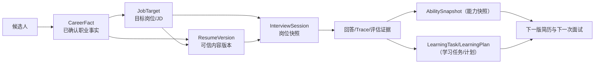
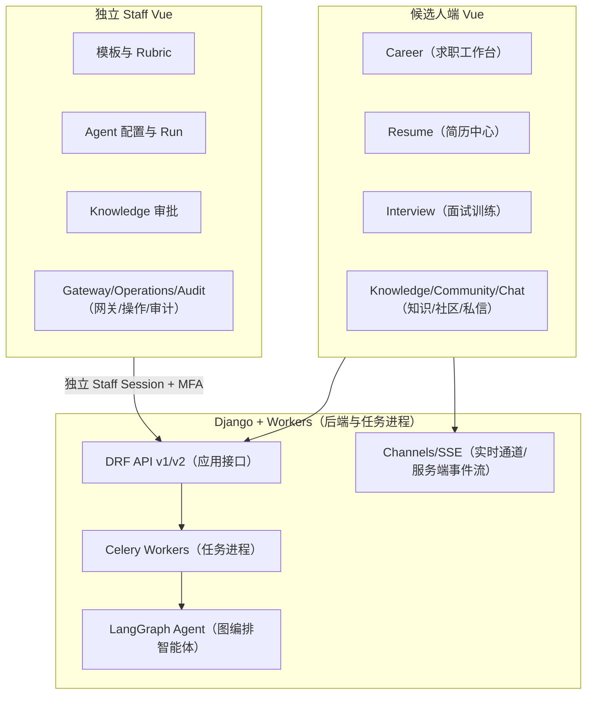
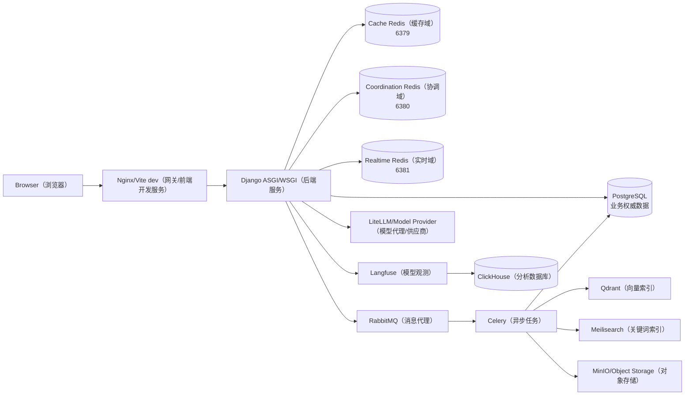
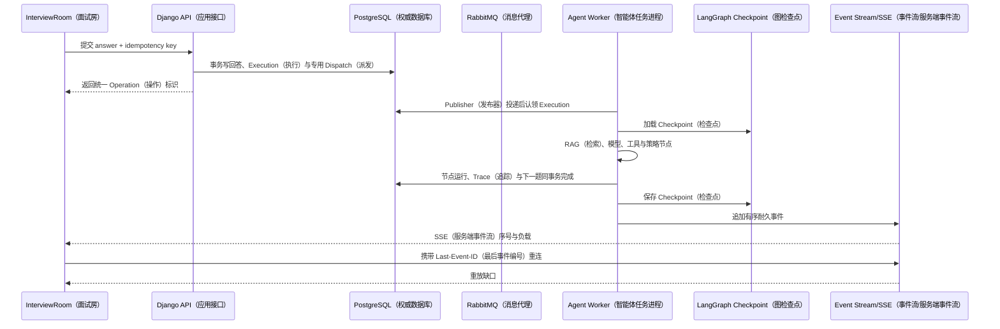
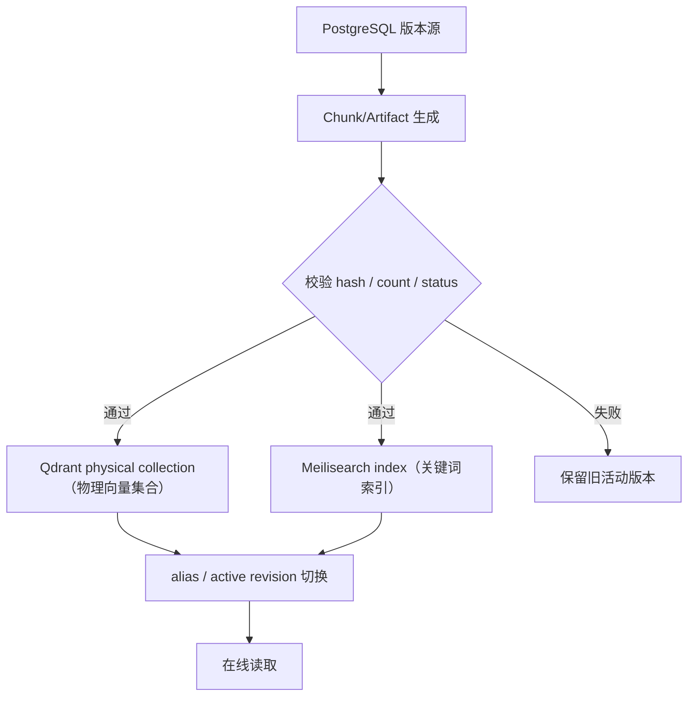
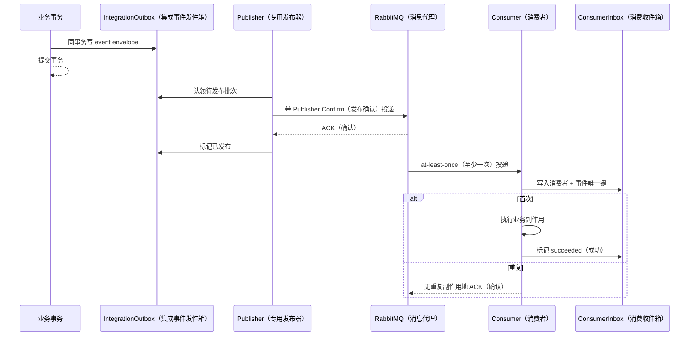

# iFaceoff 项目全解

## 1. 先说结论：它不是“AI 出题器”

iFaceoff 面向的是一个长期而连续的求职准备过程。候选人真正的问题往往不是“找不到一道面试题”，而是下面这些信息散落在不同工具里：

- 项目经历写在旧简历里，但哪些内容是本人确认过的事实没有记录；
- 看过一份 JD，却没有形成可追踪的目标岗位与技能差距；
- AI 改过简历，但改动对应哪一版、用了什么事实、能否回滚说不清；
- 做过模拟面试，但回答证据、能力维度和后续学习任务没有回到求职计划；
- 模型、Prompt 和知识库分散在各个业务函数，出了问题无法知道当时到底调用了谁；
- 运营人员需要治理模板、知识、Agent 和成本，却不应该直接拿候选人令牌或随意阅读隐私数据。

iFaceoff 的设计中心是“可追溯闭环”。一次功能不只产生一段文本，而要产生可以继续被下一个环节消费的业务对象。最简化的数据主线是：

观察重点：闭环里没有“聊天记录直接覆盖简历”这条边。事实、内容版本、业务会话、执行记录、评估结果和学习任务各自有数据边界。

面试时如何讲：先讲对象关系，再讲 AI 只是其中若干转换步骤。这样能够回答“你做的是业务系统还是模型 Demo”。

## 2. 一个候选人的连续故事

假设候选人准备 Python 后端与 AI 应用工程师岗位。他先进入“求职工作台”，把一个真实项目记录为 `CareerFact`：事实类型是 project，组织是个人项目，内容是 iFaceoff 的后端与 AI 工作，来源是 manual，`verification_status` 为 confirmed。事实不只保存一段描述，还保留来源、确认状态和时间，后续简历改写不能把未确认信息悄悄混进来。

候选人再创建 `JobTarget`，记录岗位名称、公司/JD、状态与优先级。若目标来自平台职位，`save_posting_as_target()` 会把 `JobPosting` 的关键内容形成候选人自己的目标快照，而不是让外部职位被编辑后改变历史准备语境。匹配任务创建 `JobMatchAnalysis`，Celery 的 `run_job_match_analysis()` 读取岗位要求、能力证据和简历版本，产出 gap、score、建议，并可通过 `create_learning_plan()` 形成计划。`CareerTimelineEvent` 的 `dedup_key` 唯一约束防止重试时生成重复时间线。

他随后进入简历中心。`Resume` 是简历身份和当前版本指针，真正可发布内容在 `ResumeVersion`；编辑时使用 `ResumeDraft`；模板、主题和版式属于 `ResumeDesignRevision`；PDF/HTML 输出属于 `ResumeArtifact`。这种拆分允许内容版本、编辑草稿、视觉设计和制品状态独立演进。`ResumeEvidenceLink` 负责把某个简历条目连接到职业事实，防止“AI 优化”变成无法解释的经历增补。

候选人针对目标岗位发起模拟面试。创建 `InterviewSession` 时保存岗位、难度、经验模式、JD snapshot 和 Agent 配置 snapshot，避免管理员之后修改模板导致历史会话不可解释。问题生成可以同步读取题库，也可以进入异步 `InterviewQuestionGenerationJob`。真正运行时，业务会话状态、Agent Run、Agent Execution、Node Run 和 Trace 分开保存：页面上的“面试进行中”不等于某个 Worker 进程正在占用任务。

在 Interview Room，候选人可使用文本或语音。浏览器的摄像头/麦克风权限失败时，页面仍能展示文本回答入口；Face API 信号属于辅助环境或表现信号，不能决定能力评分。当前真机图使用 Playwright 的合成视频设备，不采集真人：

每轮 Agent 执行会构造问题上下文，必要时调用 RAG。知识文档先进入 PostgreSQL 的 `KnowledgeDocument` 和 `KnowledgeDocumentRevision`，经过 chunk draft 与发布后形成 `KnowledgeChunk`。向量候选进入 Qdrant，关键词候选进入 Meilisearch，`search_knowledge_context()` 结合租户过滤、多查询、向量/关键词排名、RRF、rerank、parent/adjacent expansion 与 token budget，最终把被采用的上下文写入 trace，而不是只保存模型答案。

模型调用不应该直接读用户 API key。业务任务使用 Model Alias，Gateway 再按 `RoutePolicy` 选择 `ModelDeployment`，用 `UsageBudget` 做预算检查，以 `ModelRequestLedger` 保存请求级账本，以 `ModelAttempt` 保存每一次尝试和失败原因。Provider Credential 加密保存，管理端只展示安全元数据。模型失败后是否重试、切换部署或降级，必须在策略与账本中看得见。

面试结束后，报告不仅是自然语言总评。题目、回答、评分、Rubric、Trace、环境审计和建议行动构成证据；结果可转成 `AbilitySnapshot` 与 `LearningTask`，回到仪表盘和下一轮准备。至此，系统完成“事实 → 目标 → 简历 → 面试 → 评估 → 学习 → 下一版”的闭环。

## 3. 产品全景：两类人、三条控制路径

候选人路径解决“我如何准备”；Staff 路径解决“平台如何安全地让这套能力可配置、可观察、可审计”；Worker/Agent 路径解决“耗时或可恢复执行如何脱离 Web 请求”。三条路径不能合并成一个万能管理员账号。

当前角色包括候选人、企业相关角色与 Staff。企业公司、成员、职位、职位版本在 Career 域有模型与接口，但当前主要截图和完整演示链聚焦候选人及 Staff。不能根据模型存在就宣称完整企业招聘 SaaS 已经落地。

## 4. 容器与基础设施

PostgreSQL 是业务对象、Operation、状态与审计的权威存储；开发/预发布的 Redis 已拆成缓存、协调、实时三个进程，生产目标为三个托管故障域；RabbitMQ 提供持久队列、路由、确认、重新投递和 DLQ，业务延迟重试由 PostgreSQL Dispatch 调度；Celery 执行导入、渲染、分析、索引、媒体和 Agent 等任务；Qdrant/Meilisearch 是可重建索引；对象存储保存上传与制品；LiteLLM 是可选模型代理边界；Langfuse/ClickHouse 用于观测而不是业务事实。

为什么需要拆 Redis 故障域？因为缓存允许淘汰和回源，协调限流/租约与实时事件不能静默丢失。把它们放在同一个 evictable 空间会让一次缓存压力变成安全准入或 Channel layer 故障。本地三进程仍不是生产高可用，生产需要独立托管实例/集群、TLS/ACL、容量和故障切换证据。

## 5. 三种请求不是一个问题

### 5.1 普通 API

候选人页面读取 `GET /api/v2/career-dashboard/`：Vue API 层带 cookie/CSRF 发起请求，项目 URL 把 `/api/v2/` 分发到 Career routes，`CareerDashboardView` 读取当前用户的事实、目标、申请、简历和任务聚合，DRF 返回 JSON。事务通常在单次写接口内完成。

### 5.2 异步任务

Resume PDF 渲染不能占用 Web 请求。API 在同一事务创建 `ResumeOperationRequest`、`ResumeArtifact`、Operation 与 `OperationDispatchOutbox`；专用 Publisher 只向 RabbitMQ 发布 `operation_id`，Worker 从 PostgreSQL 重载输入、claim lease/fence，并把结果与 `OperationEvent` 同事务提交。客户端轮询 Operation 或接收事件。任务重投依靠 Operation fence、内容哈希和 Artifact 唯一约束，而不是假设 RabbitMQ 恰好一次投递。

### 5.3 Agent 实时执行

面试下一题需要长执行和增量反馈。API 创建或恢复 `InterviewAgentExecution`，Worker/LangGraph 按节点推进，checkpoint 保存图状态；每个业务事件带递增序号写入 durable record/Redis stream，SSE 客户端用 cursor 续读。WebSocket 更适合双向媒体/聊天，SSE 更适合服务器向页面推送有序 Agent 事件。

观察重点：HTTP 202 只表示受理；业务结果在数据库；checkpoint 与事件各解决不同问题；断线恢复不应重新调用模型。

面试时如何讲：重点解释事务提交和消息发布之间的窗口、Worker 宕机位置以及客户端重连位置。

## 6. 数据边界：版本、快照与可重建索引

项目中高价值的建模规律有三条。

第一，外部或可变配置进入历史业务时要 snapshot。`JobPostingRevision` 保存职位版本；`InterviewSession` 保存 JD 和 Agent 配置快照；`AgentConfigRevision` 保存 Prompt/Policy 版本。否则“昨天为什么问这道题”会被今天的配置覆盖。

第二，可编辑态与已发布态分离。ResumeDraft 不等于 ResumeVersion，KnowledgeChunkDraft 不等于 KnowledgeChunk，CommunityRevision 不等于公开内容。发布动作需要显式校验与版本号唯一约束。

第三，索引与制品可重建。Qdrant point、Meilisearch document、PDF artifact、缓存 key 都不应该成为业务唯一事实。PostgreSQL 保存源版本、索引状态、hash 和重建所需元数据；重建时使用别名切换或版本隔离，避免半套索引暴露给查询。

观察重点：切换发生在新版本完整构建后；失败时旧活动版本仍可读。具体实现的原子性和 Meili alias 能力要以当前 service 为准，目标拓扑不能代替运行验证。

面试时如何讲：用“数据库是源、索引是投影”回答一致性问题，再说明 Outbox、重试、重建和读侧版本过滤。

## 7. AI 亮点的工程含义

### 7.1 LangGraph V4 不是一个类名

`CompositeV4InterviewAgentEngine` 的价值在于把一次面试决策拆为有契约的节点，并且节点输入/输出、执行状态、checkpoint、工具调用和事件可审计。Pydantic contract 防止模型自由文本直接进入状态机。配置 snapshot 让历史 Run 可解释。Worker 丢失时，恢复逻辑要读取未完成 execution 与 checkpoint，而不是从第一题重新跑。

### 7.2 RAG 不是 `vector_search()`

项目的知识链路包含导入安全、文档/修订版本、结构化 block、child/parent chunk、embedding、Qdrant collection/alias、Meili schema、租户/可见性过滤、多查询、两路召回、RRF、重排、邻接扩展、token budget、引用与 trace。任何一步缺失都会出现“搜得到但不能用”或“能回答但不可证明”。

### 7.3 Gateway 不是简单转发

Provider Credential 处理密钥生命周期；Deployment 描述远端模型和上下文/tokenizer 能力；Alias 给业务稳定任务名；RoutePolicy/Target 决定优先级和降级；Budget 限制费用；Ledger/Attempt 保存结果、耗时、token、错误与尝试序列。只有把这些对象分开，运营人员才能轮换密钥而不改业务代码，或切模型而不修改每个 Prompt 调用。

## 8. 可靠性：从“可能重复”出发

RabbitMQ 和 Celery 的现实语义是“至少一次机会”，不是“恰好一次”。当前配置使用 `ifaceoff.v2.*` 版本队列、`task_acks_late=True`、`task_reject_on_worker_lost=True`、Publisher Confirm、Mandatory Routing、持久队列和按域 DLQ；业务延迟重试只有 PostgreSQL Dispatch 一个时钟。Worker 在完成副作用后、确认消息前崩溃，任务会再次投递，因此每个任务必须：

1. 以 PostgreSQL Operation 的 claim/lease/fencing 或领域状态机取得执行权；
2. 用唯一约束/幂等键约束副作用；
3. 在重试前识别 succeeded 状态；
4. 把可重试与不可重试错误分开；
5. 让恢复人员能看见失败原因与输入 hash。

跨服务领域事实使用 `IntegrationOutbox` 与 `ConsumerInbox`；高成本命令使用 `OperationDispatchOutbox`。生产者在业务事务中写 outbox，专用 Publisher 稍后发布；消费者以 event id/consumer name 去重并通过 claim/lease/fence 记录处理状态。它减少双写窗口，但仍需处理 Confirm 后崩溃产生的重复、毒消息、顺序和保留策略。

观察重点：Outbox 不保证消费者副作用天然幂等；Inbox 唯一键和业务约束仍必需。

面试时如何讲：主动给出“发布成功但 mark published 前宕机”和“消费成功但 ack 前宕机”两个窗口。

## 9. 安全：身份、内容和模型三个面

候选人使用用户认证、CSRF/cookie/JWT 相关接口；Staff 使用独立 `StaffAccount`、Staff Session、MFA、角色权限和审计。高风险候选人隐私访问走 Break Glass，需要操作理由和审计，而不是给 Support 永久查看权限。

上传链路需要 MIME/扩展/大小校验、隔离存储、ClamAV 扫描、解析超时、派生文件隔离与保留策略。Resume 和 Knowledge 中可能包含个人信息，日志和 trace 不应保存原文全文。模型密钥由加密字段保存，API 不回传明文；本地演示数据使用禁用且无密钥的 Provider/Deployment，不调用收费模型。

SSE 与 WebSocket 都要在握手和每次资源访问时检查 owner/Staff scope，不能因为拿到 session UUID 就订阅。公开 Resume 分享链接应使用高熵 token、过期/撤销、访问记录与最小字段投影。

## 10. 真实验证与当前差距

本轮从空 PostgreSQL 运行全部 migrations，验证了修正后的 `resumes.0008`。旧顺序在 `ResumeDraft` 三个字段创建前运行 backfill，空库前进时历史模型无法访问字段；现在字段先创建，回填再生成 Draft、DesignRevision、Asset。已应用 0008 的数据库不会因修改 migration 文件自动重跑，最终 schema 不变。

合成命令只在 `DEBUG=true` 且 `ALLOW_DOCS_DEMO_DATA=1` 时运行，密码/TOTP 从进程环境读取；相同 namespace 两次执行返回相同 ID。页面截图揭示的差距包括 Resume URL、报告 fixture 字段、Agent Config 白屏、Gateway 禁用记录可见性。

Celery 验证暴露了旧 RabbitMQ 队列拓扑：默认 vhost 已存在不含 `x-dead-letter-exchange` 的 `celery`、`notifications` 等队列，而当前代码用相同名字声明 DLX，RabbitMQ 按协议返回 406。正确处置是停发/排空、核对消费者、删除或迁移旧队列后由新代码重建，或者使用新 vhost/版本化队列；不能在线“修改”不可变声明参数。本轮未删除用户现有队列，因此 Worker 全队列启动不算通过。

## 11. 项目演进脉络

项目从面试、简历、博客等功能集合，逐步引入 Career 闭环、ResumeVersion、PostgreSQL 统一关系数据、Agent V4、RAG 版本治理、Model Gateway 和独立 Staff 控制面。迁移策略保留 v1/v2 API 并行，代价是客户端 base URL 更容易混淆；Resume 当前缺陷就是具体例子。

演进原则不是“一次全部重写”，而是先把权威数据与契约立住，再迁移调用者，最后删除兼容层。`interactions` 与 `questions` 需要明确遗留边界；旧 API 必须有调用统计、弃用头和删除条件。

## 12. 设计取舍

| 选择 | 得到什么 | 付出什么 |
|---|---|---|
| PostgreSQL 统一业务关系数据 | 事务、约束、JSONB、审计查询 | 迁移旧 MySQL/SQLite 需严格验证 |
| Resume 内容/设计/制品分离 | 可回滚、可复现、模板不污染内容 | 对象和状态更多 |
| LangGraph + 独立 checkpoint | 图恢复和节点可观察 | 两库一致性与运维更复杂 |
| RabbitMQ + Celery | 成熟路由、重试、Worker 生态 | 队列声明迁移与幂等必须治理 |
| Qdrant + Meili 双索引 | 语义与关键词互补 | 同步、融合和重建成本 |
| Model Gateway | 密钥、路由、预算、账本集中 | 控制面成为关键依赖 |
| 独立 Staff 身份 | 降低候选人令牌横向风险 | 两套认证与前端运维成本 |
| API v1/v2 并行 | 渐进迁移 | 客户端基址、文档和弃用复杂 |

## 13. 30 秒与 2 分钟口述卡

### 30 秒

“iFaceoff 是一个证据驱动的 AI 求职闭环平台。候选人把已确认职业事实和目标岗位沉淀成版本化简历，基于岗位快照进行可恢复的 Agent 模拟面试，评估结果再形成能力快照和学习任务。系统用 Django/PostgreSQL 保存权威状态，RabbitMQ/Celery 执行异步任务，LangGraph V4 加 checkpoint 和 SSE 做 Agent 恢复，Qdrant/Meilisearch 做混合 RAG，模型调用统一通过带预算和账本的 Gateway，Staff 端独立做配置和审计。”

### 2 分钟

先讲求职信息割裂的问题；再用 CareerFact、JobTarget、ResumeVersion、InterviewSession、AbilitySnapshot/LearningTask 五个对象串起闭环；说明前端有候选人和 Staff 两套 Vue，后端普通 API、异步任务、Agent 实时执行三种通道；强调版本/快照、Outbox/Inbox、checkpoint/SSE、RRF/Gateway 四个工程取舍；最后说明本轮从空 PostgreSQL 和合成数据做了真机截图验证，同时 Resume v2 客户端、旧 RabbitMQ 队列和部分治理页仍是已知差距，生产 HA/SLO 只是目标。

## 14. 连续追问

**为什么不用一张 JSON 表保存整个求职档案？** 
因为事实确认、岗位目标、内容版本、业务会话和执行状态的生命周期、唯一约束、权限与查询完全不同。可以在版本内容中使用 JSONB，但实体边界和外键仍要显式。

**为什么 Agent checkpoint 单独建库？** 
图状态写入频率、清理策略和恢复语义与业务事务不同，隔离可降低 checkpoint 膨胀影响主库；代价是不能用单个事务同时提交业务和 checkpoint，必须依赖 run/execution ID、幂等节点和恢复协议。

**RAG 两个索引不一致怎么办？** 
PostgreSQL revision 是源；每个 chunk 带 revision/tenant/visibility；索引任务有状态与重试；查询只接受活动 revision；严重漂移时从源重建新物理集合/索引并切换。需要监控 count/hash/lag，而不是双写后假设成功。

**模型网关挂了是否所有功能都挂？** 
AI 生成路径会受影响，但事实、简历编辑、历史报告、社区等非模型路径应继续；业务根据任务设置 fail-open/fail-closed：评估等高风险结果不应伪造，提示用户稍后重试；可选的文案建议可降级为规则或缓存结果。

**你本人如何证明这些不是背的？** 
从 `CareerDashboardView`、`ResumeVersion/ResumeDraft`、`CompositeV4InterviewAgentEngine`、`search_knowledge_context`、`ModelRequestLedger/ModelAttempt`、`IntegrationOutbox/ConsumerInbox` 六个位置现场画链路，再运行 migration test、fixture 与截图脚本，最后展示当前缺陷日志。能指出失败证据比只展示成功截图更能证明参与深度。
