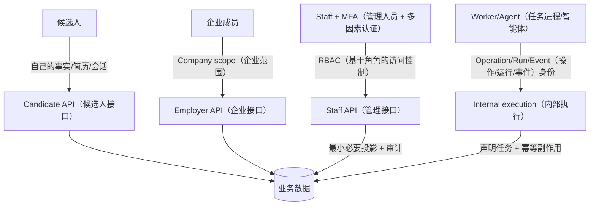
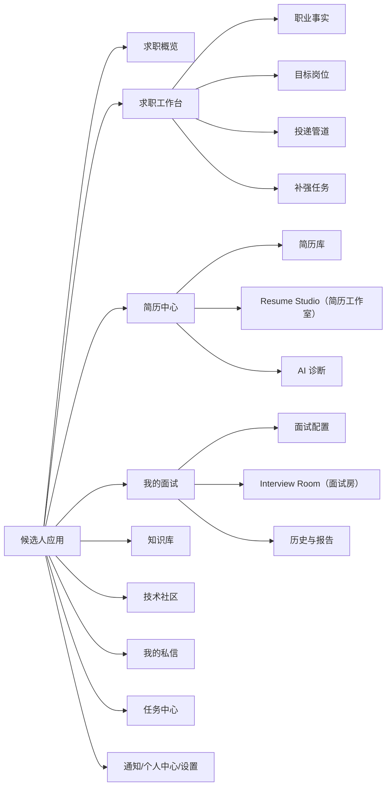
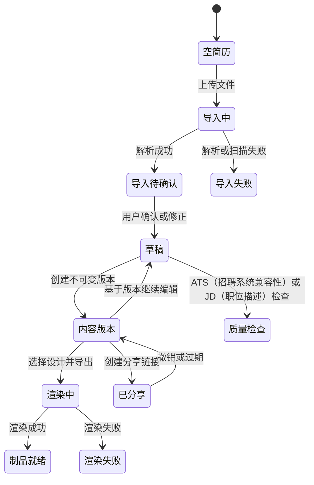
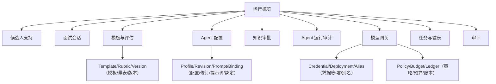

# 卷一：产品定位与求职闭环

## 1. 产品要解决的不是“不会回答一道题”

求职准备通常被拆成简历工具、题库、AI 聊天、岗位收藏、面经和日程。每个工具局部有效，却留下三个结构性问题。

第一是输入失真。候选人把旧简历上传给 AI，模型只能把文本当事实，无法区分本人确认过的经历、过时描述、模板示例和模型曾经润色出的夸张内容。第二是目标漂移。同一份通用简历面对不同岗位，诊断分数没有岗位语境；一次面试问题也无法说明为何适合当前目标。第三是输出断裂。报告给出“系统设计薄弱”，但没有生成可排期的学习任务，也没有影响下一版简历或下一次面试。

iFaceoff 把产品单位从“单次生成”改为“有状态的求职准备”。每次 AI 操作都应该回答四个问题：

1. 输入来自哪一个用户、事实、岗位、内容版本和配置版本？
2. 产生了哪个可保存、可回滚、可审计的结果？
3. 失败时用户看到什么，系统能否恢复而不是重复扣费？
4. 结果如何进入闭环的下一步？

这决定了产品边界：iFaceoff 可以辅助组织事实、生成建议、模拟面试和制定任务，但不能替候选人捏造经历，不能把面部信号当能力事实，不能把模型分数包装成招聘结论，也不能承诺真实 Offer。

## 2. 目标用户与权限边界

### 2.1 候选人

候选人维护自己的职业事实、目标岗位、申请、简历、面试、知识、社区、私信、通知和设置。绝大多数查询必须以 `request.user` 做 owner 过滤。UUID 或递增 ID 不是授权凭证。

### 2.2 企业相关角色

Career 域存在 `Company`、`CompanyVerification`、`CompanyMember`、`JobPosting`、`JobPostingRevision` 与 employer API，表达企业资料、成员和职位版本。它们提供企业化演进基础，但当前真机复盘没有完成一条企业入驻到候选人投递的全链路，因此状态是部分实现，面试时不应描述成成熟 ATS。

### 2.3 Staff

Staff 是平台运营和治理人员，使用独立的 `StaffAccount`、登录页、Session、MFA、角色权限和审计事件。他们管理模板/Rubric、Agent 配置、知识审批、Run/Trace、Gateway、任务和平台审计。普通支持人员不应默认看到候选人回答原文；高风险访问走 Break Glass。

### 2.4 系统执行者

Celery Worker、Agent Runtime、索引任务和 webhook consumer 不是“用户角色”，但拥有机器权限。它们用 operation/run/event id 找到工作，不应使用 Staff 超级账号模拟后台操作。

观察重点：四条访问路径的身份、scope 和审计方式不同；不能用同一个 `role` 判断覆盖全部边界。

面试时如何讲：用“候选人 token 不能登录 Staff 端”作为直观例子，再说明对象 owner、Company membership、Staff permission 和 Worker claim 四种授权。

## 3. 用户端信息架构

顶部导航的当前核心入口是求职概览、求职工作台、技术社区、我的私信、简历中心、我的面试和任务中心，右侧是通知与个人设置。

信息架构的关键不是菜单数量，而是主线优先级：仪表盘告诉用户下一步做什么；工作台维护可信输入；简历和面试是两种训练产物；任务中心把反馈变成行动；社区/私信属于支持性增长环节。

## 4. 核心旅程一：从空账户到可信职业画像

### 页面操作

用户注册并完成 onboarding 后进入求职概览。空账户首先需要新增职业事实，而不是立刻让模型生成一份完整简历。Career Workspace 的“职业事实”Tab 支持新建、编辑、删除与确认；事实类型可覆盖项目、工作、教育、技能等。用户再建立目标岗位，填写职位、公司、JD 或从公开 JobPosting 保存。

### 状态变化

`CareerFact` 至少要区分来源和 `verification_status`。manual + confirmed 表示用户明确确认；导入或模型抽取得到的事实应先进入 pending/review，不应直接作为可投递内容。`JobTarget` 有准备状态和优先级；申请进入 `JobApplication` 后按 pipeline status 与 `next_action_at` 管理。每次变化可记录 `ApplicationEvent` 或 `CareerTimelineEvent`。

### 异常体验

- 没有事实：仪表盘准备清单显示未完成，引导到工作台；
- JD 无法解析：保留原始输入与失败状态，允许手动编辑，不创建假分析；
- 重复保存平台岗位：由业务查重或唯一/稳定 hash 复用目标，不重复堆积；
- 匹配任务失败：`JobMatchAnalysis` 显示失败和可重试，不把空结果显示成零分；
- 未确认事实：Resume 建议可提示，但发布前必须由用户确认。

当前截图中合成事实 `[ifaceoff-docs-v1] iFaceoff全栈与AI项目` 已确认。它证明表格、Tab 与读取链路工作，不证明所有事实类型的编辑/删除都做过本轮自动化测试。

## 5. 核心旅程二：目标岗位驱动简历

用户进入简历库，可创建结构化简历、导入 PDF/DOCX/TXT，或基于已有 Resume 创建岗位 Variant。产品把一次导入拆成“上传 → 扫描/解析 → 预览 → 用户确认 → 版本发布”，避免解析器直接覆盖主简历。

Resume Studio 应同时回答内容和设计两个问题，但模型上保持分离：左侧或编辑区操作 Draft 内容，模板/主题操作 DesignRevision；“创建版本”把确认内容变成 ResumeVersion；“导出”创建 Artifact；“ATS 检查”创建 QualityReport；岗位建议创建 Suggestion/Variant。公开分享创建可撤销的 ShareLink。

观察重点：导入失败、诊断失败和渲染失败不会破坏最后一个已发布版本；Draft 和 Version 的转换需要显式动作。

面试时如何讲：从“防止 AI 或解析器覆盖可信内容”解释版本化，而不是只说“方便历史记录”。

当前截图暴露了真实端到端缺陷：Resume v2 的 API 路径被拼在 v1 base URL 后。用户看到 0 份简历，数据库实际有 Resume；Studio 顶栏存在但内容空白。产品口径必须是“Resume 后端与版本模型存在，当前候选人 UI 集成部分可用”，修复前不能把这两张图当成功演示。

## 6. 核心旅程三：岗位化模拟面试

### 配置阶段

用户选择 JobPosition/JobTarget、难度、面试模式、时间或题量、简历版本与是否启用媒体。系统创建 `InterviewSession` 并保存 snapshot。若问题生成需要模型，先返回 job/operation 状态，页面展示准备中，而不是卡住一个长 HTTP 请求。

### 进行阶段

Interview Room 展示当前问题、问题序号、文本/语音回答入口、环境信号、进度和结束操作。用户提交答案时，前端必须防重复点击；后端以 session owner、当前 question sequence 和幂等 key 校验。Agent 可能生成追问或下一题；页面通过实时事件更新。

### 结束阶段

结束动作使 Session 进入终态，后台评估生成报告。若评估未完成，报告页显示 processing；若部分维度失败，显示“部分报告”与重试，而不是将无数据解释成 0 分。评估后形成改进建议、AbilitySnapshot 和 LearningTask。

### 失败和恢复

- 浏览器刷新：读取 Session、当前 Question 与事件 cursor 恢复；
- 摄像头拒绝：降级文本/音频，不阻断核心面试；
- Worker 在下一题生成时宕机：Execution 保持 running/stale，可由 recovery task 重新 claim 并从 checkpoint 继续；
- SSE 断线：使用 Last-Event-ID 补发，不能重新触发生成；
- 用户重复提交：幂等键/唯一 question sequence 阻止双写；
- 结束与生成并发：状态转换采用事务/条件更新，终态后 Worker 不再推进问题。

## 7. 核心旅程四：报告变成下一步行动

理想报告回答：发生了什么、依据是什么、能力维度如何、哪些信号不可靠、下一步做什么。它不只是一个总分。

报告需要展示面试基本信息、题目和回答、Rubric 评分、证据引用、改进建议、环境/媒体说明与生成版本。当前 `interview-report-current.png` 的结构已渲染，但合成完成态与页面期望字段没有完全对齐，综合评语和能力项为空，因此状态是 `current-partial`。这提示产品验收不能只检查“页面能打开”，还要核对数据契约。

报告行动可映射为：

- `LearningTask`：短周期、可完成、带 due date；
- `LearningPlan`：针对一个 JobMatchAnalysis 的一组计划；
- `AbilitySnapshot`：某时间点能力维度快照；
- `CareerTimelineEvent`：可复盘的关键事件；
- ResumeSuggestion：将有证据的改进建议带回 Draft。

## 8. 社区、聊天、通知为什么放在平台卷而不是主闭环

Community/Blog 解决内容与增长，Chat 解决用户间私信，Notifications 解决跨模块提醒。它们能提高留存和协作，但不是“生成简历/面试”的核心事务，因此在产品上作为支持环节。

Community 使用内容与 Revision 分离、互动关系、挑战、审核和申诉；Blog 有分类、标签、文章、评论、推荐和统计；Chat 有 Conversation、Message、Attachment、参与者状态、屏蔽举报与 Outbox；Notification 有用户偏好、通知模型与投递 Outbox。旧 `interactions` 的点赞/收藏/关注与 Community 原生互动并存，属于遗留兼容风险。

## 9. Staff 信息架构

Staff 首页优先展示失败 Agent Run、待审批知识、失败任务、举报与隐私请求，而不是候选人内容榜单。治理页面的核心操作必须有权限代码、MFA 状态、审计 actor、request id 和变更前后摘要。

2026-07-28 Staff 截图证据：

- Dashboard、Interview Config、Knowledge、Agent Runs、Operations、Audit 正常呈现；
- Agent Config 标题短暂出现后白屏，属于该次历史运行缺口；
- Gateway 页面结构正常，但禁用无密钥 fixture 未显示，需要核对 queryset/过滤。

2026-08-12 Staff Operations/Reliability 已更新为统一 Operation、三 Redis capability 与数据库 Dead/Broker DLQ 分栏；本机没有重新运行 Playwright，因此旧截图只能标 `current-partial`，不能证明新版页面已端到端通过。
- 这些缺陷记录在清单中，不用旧后台图替换。

## 10. 产品状态与验收口径

| 能力 | 当前状态 | 本轮证据 | 还缺什么 |
|---|---|---|---|
| 候选人登录/Session | 已实现 | Playwright 登录并访问受保护页 | 更完整安全/并发测试 |
| Career 工作台/仪表盘 | 已实现主读取 | 合成事实、目标、申请、任务显示 | CRUD 全流程 E2E |
| Resume 版本后端 | 已实现模型/迁移 | 空库 migration 与回填测试 | UI v2 URL 修复、渲染链全测 |
| Resume 候选人 UI | 部分实现 | 当前 404 与空态截图 | 修复 API client 基址 |
| Interview Room | 已实现主界面 | 合成媒体与问题进度 | 实际 Agent/Worker 全链路 |
| Interview 报告 | 部分实现 | 报告结构、空维度 | fixture/serializer/UI 契约对齐 |
| Knowledge 管理 | 已实现主列表 | 文档/chunk/审批/索引状态 | Qdrant/Meili 重建演练 |
| Agent V4 | 代码已实现，运行待扩展验证 | Engine/Execution/Checkpoint/测试入口 | 本轮独立 Worker 被队列拓扑阻断 |
| Staff 治理 | 部分实现 | 多页面真机截图 | Agent Config 白屏、权限矩阵 E2E |
| Model Gateway | 后端模型与治理接口存在 | 模型/路由/账本代码 | 当前 fixture 可见性与收费模型禁用验证 |
| 企业闭环 | 部分实现 | Company/Posting/Revision 模型 | 端到端企业旅程与产品验收 |
| 生产 HA/SLO | 目标设计 | Compose/运行配置 | 容量、容灾、演练证据 |

## 11. 产品指标

产品指标必须能回到业务对象，而不是只看页面访问。

- 可信输入：confirmed CareerFact 数、事实到 ResumeEvidenceLink 覆盖率、被用户拒绝的模型事实比例；
- 准备进度：有 JobTarget 且有匹配 ResumeVersion/Interview 的用户比例；
- 简历质量：版本创建率、Artifact 成功率、报告到 Draft 采纳率，而不是平均 AI 分数；
- 面试闭环：Session 完成率、断线恢复率、报告生成延迟、报告到 LearningTask 转化；
- 检索质量：有引用回答比例、召回命中、重排提升、空上下文率、跨租户拒绝；
- 平台质量：失败 Operation、队列年龄、恢复成功率、预算拒绝、审计覆盖；
- 安全：MFA 覆盖、Break Glass 使用/复核、上传扫描失败、隐私请求时效。

没有埋点或可复现查询时，指标属于验收设计，不写虚构数值。

## 12. 产品取舍

**为什么先要求事实而不是先生成简历？** 
会增加首次使用步骤，但显著降低幻觉和后续解释成本。可以通过导入提取候选事实降低填写负担，仍需用户确认。

**为什么报告不直接更新简历？** 
面试表现可能受题目和环境影响；报告建议应进入可审阅 Draft/Suggestion，由用户决定是否采用。自动覆盖破坏版本源。

**为什么候选人也能管理知识？** 
用户私有知识可以增强个性化面试；但公共/平台知识要经 Staff 审批并做租户/可见性过滤，二者不能混查。

**为什么保留 Community/Chat？** 
它们提供内容、同伴反馈和通知触达，但引入审核、举报、隐私和实时安全成本。核心闭环尚未稳定时，不能让增长模块挤占可靠性建设。

## 13. 30 秒口述卡

“iFaceoff 解决的是求职准备信息割裂：先把候选人确认过的经历变成 Career Fact，再围绕目标岗位生成版本化简历和岗位化模拟面试，报告形成能力快照和学习任务，回到下一轮准备。产品有候选人端和独立 Staff 治理端，强调事实可追溯、版本可回滚、执行可恢复，而不是一次 AI 生成。”

## 14. 2 分钟口述卡

用一个候选人故事说明 Career、Resume、Interview、Learning 闭环；解释候选人、企业、Staff、Worker 四种权限；说出 Resume Draft/Version/Design/Artifact 分离和 Interview Session/Agent Execution 分离；再展示当前 Dashboard、Career、Interview、Knowledge 与 Staff 截图。最后主动指出 Resume UI、报告字段和 Agent Config 当前是部分实现，企业链路与生产 HA 尚未完成。

## 15. 连续追问

**用户为什么愿意多维护 Career Fact？** 
它减少每次简历/面试重复解释背景，支持跨功能复用；产品上要用导入提取、确认队列和完成度提示降低成本。

**如何防止产品把用户困在数据录入？** 
允许从 Resume/JD 提取候选事实，但标为待确认；提供最小可用事实集；每一次确认立即用于匹配、简历或面试，体现收益。

**页面空态和系统故障如何区分？** 
空态响应是 200 + 空集合并显示下一步；故障有 error code/request id/retry 行为。本轮 Resume 页面把后端 404 错误呈现成 0 份简历，是需要修复的产品缺陷。

**企业用户和 Staff 为什么不能合并？** 
企业只能管理所属公司/职位/候选关系，Staff 管全平台配置与治理；合并会扩大横向越权和隐私访问面。

**什么才算闭环完成？** 
不是页面全有，而是同一用户的事实、岗位、内容版本、面试证据和任务能带稳定 ID 串联，失败可恢复，操作可审计，并有 E2E 验收。
