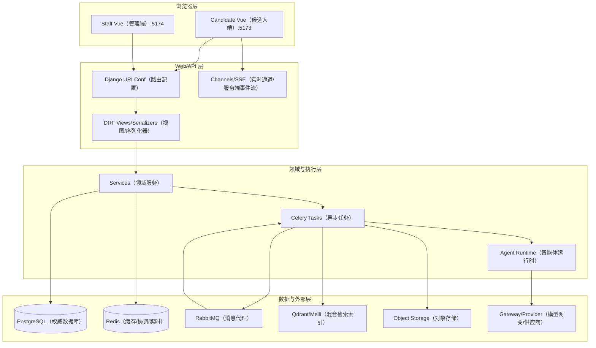
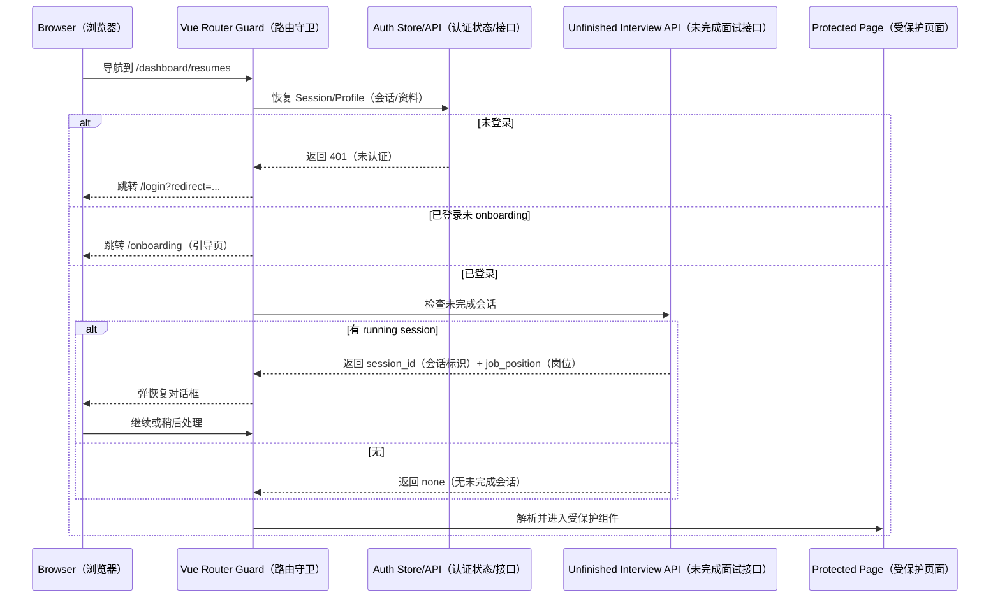
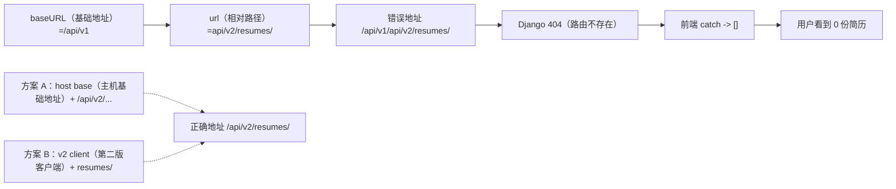
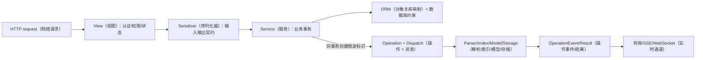
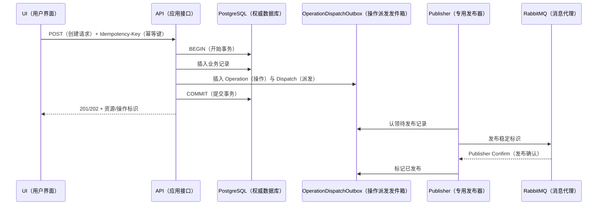
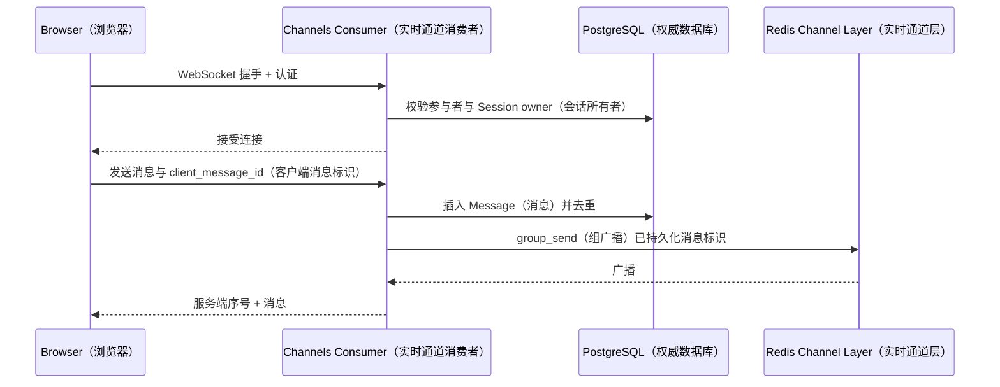
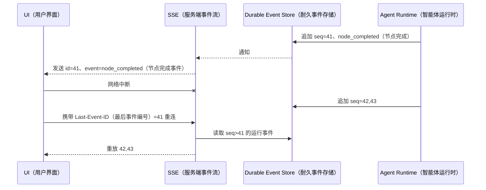
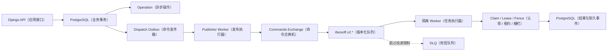
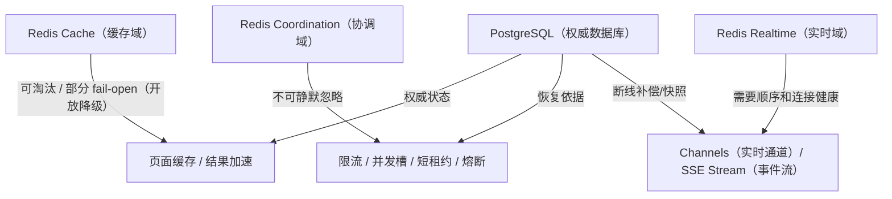
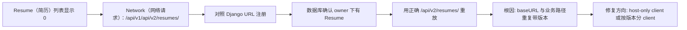

# 卷二：全栈架构与一次请求

## 1. 仓库怎样分层

仓库不是一个单体前端加一个 `views.py`。运行时主要有三套应用：

- `ai-interview-frontend/`：候选人 Vue 3 应用，Vue Router、Pinia、Axios、Element Plus，包含 Career、Resume、Interview、Knowledge、Community、Chat、Tasks、Settings 等页面；
- `ai-interview-admin/`：独立 Staff Vue 3 应用，独立 router/auth/API，包含 Dashboard、InterviewConfig、AgentConfig、KnowledgeReviews、AgentRuns、Gateway、Operations、Audit；
- `ai_interview_backend/`：Django + DRF + Channels + Celery，按业务域拆 app，并在 `ai_interview_backend/urls.py` 聚合 API v1、v2、Staff、公开分享和 health/schema 路由。

基础设施由 Compose 提供 PostgreSQL、Redis、RabbitMQ、Qdrant、Meilisearch、LiteLLM、ClamAV 等。Nginx/ASGI 在完整部署中统一入口；文档截图环境使用 Vite dev server 代理到 `127.0.0.1:8000`。

观察重点：View 不应直接承担文件解析、RAG、模型路由等长逻辑；Task 也不能绕开业务状态直接写不可追踪副作用。

面试时如何讲：用三个目录建立容器边界，再沿一个 Career GET 和一个 Resume render 说明同步/异步分层。

## 2. 前端路由与认证守卫

候选人路由在 `ai-interview-frontend/src/router/index.ts`。公开页包括 Landing、About、Login、Register、OAuth callback、公开简历分享；受保护页面位于 Dashboard layout 下。路由守卫大致执行：

1. 检查目标是否需要认证；
2. 若前端 store 尚无用户，调用 session/profile 接口恢复；
3. 未认证跳到 Login，并带 `redirect`；
4. 未完成 onboarding 跳 Onboarding；
5. 检查 route meta role；
6. 每次应用加载后检查未完成面试，弹出“继续面试/稍后处理”；
7. 决定进入目标页或未完成 Interview Room。

这段逻辑直接影响 E2E：Playwright 用 `page.goto()` 会重载整个 SPA，模块变量 `hasCheckedForUnfinishedInterview` 重新初始化，因此每个受保护路由都会再次弹恢复框。截图测试必须显式选择“稍后处理”。这不是截图工具的偶然细节，而是“应用级只检查一次”与“浏览器级每次 reload”的语义差异。

Staff 路由在独立应用中，登录状态由 `src/auth.ts` 管理。候选人 cookie/token 不能让 Staff router 进入页面；Staff 登录请求同时提交 email、password 与 TOTP/recovery code，服务端建立独立 Session。

观察重点：前端守卫改善体验，但真正授权仍在后端。绕过 router 直接调用 API 必须被 owner/permission 拒绝。

面试时如何讲：区分“是否显示页面”和“是否允许访问资源”，再说明 401、403、404 的使用边界。

## 3. Axios、Cookie、CSRF 与 API 基址

候选人开发环境设置 `VITE_API_BASE_URL=http://127.0.0.1:8000/api/v1`，Vite 也代理 `/api/v1` 与 `/api/v2`。API 客户端通常配置 `withCredentials`，写请求先获取 CSRF cookie 或读取已有 token，把 `X-CSRFToken` 加入 header；响应拦截器处理 session 失效、request id 和统一错误。

路径有两种正确策略，只能选一种：

- base URL 只到 host，例如 `http://127.0.0.1:8000`，调用方传 `/api/v1/...` 或 `/api/v2/...`；
- 为 v1/v2 分别建 client，base 到 `/api/v1` 或 `/api/v2`，调用方只传域内相对路径。

当前 Resume 前端混用了两种策略：全局 client base 已到 `/api/v1`，调用字符串又包含 `api/v2/resumes/`，Axios 将它拼成 `/api/v1/api/v2/resumes/`。服务器日志返回 404，页面把错误降成空集合。这解释了截图中“数据库有 1 份，页面显示 0 份”。

观察重点：这是契约集成问题，不是 Resume seed、serializer 或权限问题。排障必须对比最终 URL。

面试时如何讲：现场从 Network URL 走到 `urls.py`，解释为什么 404 被错误映射为空态，以及怎样为 v1/v2 建类型化 client 和契约测试。

## 4. Django URL 的版本边界

项目根 URLConf 聚合 authentication、domain routes、admin control plane、schema 和公开资源。v1 保留历史接口，v2 承载 Career/Resume Intelligence 等新契约。DRF router 注册 ViewSet 的标准 CRUD 和 action；显式 `path()` 注册 profile/dashboard/debug 等非资源接口。

路由设计需要满足：

- 资源名稳定，动作使用子资源或 `@action`；
- v2 不复用 v1 serializer 假装升级；
- Staff API 使用独立前缀与 authentication/permission；
- WebSocket 在 ASGI routing，不与 HTTP URL 混淆；
- SSE 是 HTTP streaming endpoint，但事件契约独立版本；
- 公开分享用随机 token，不能暴露 owner API。

`09-代码-API-数据事实索引` 自动列出现有 path/router register，OpenAPI 只能覆盖 DRF 可发现的 HTTP 接口；WebSocket、SSE 和 webhook 必须另写契约。

## 5. View、Serializer、Service、Task 各自做什么

### View/ViewSet

处理认证/权限、queryset owner scope、输入 serializer、HTTP 状态、幂等 header、事务入口和响应 serializer。以 `CareerFactViewSet` 为例，queryset 只返回当前用户；以 `CareerDashboardView` 为例，它聚合多个只读数据源。

### Serializer

做字段类型、枚举、跨字段校验和 API 投影；不能把复杂模型调用藏进 `create()` 让请求不可控。敏感字段只写或完全排除，Staff 也只拿必要投影。版本对象的 immutable 字段需要只读。

### Service

承载可复用的业务事务和领域动作。例如 `save_posting_as_target()`、`create_learning_plan()`、`record_timeline_event()` 明确输入/返回；RAG 的 `index_document()`、`search_knowledge_context()` 编排多个外部系统；Gateway service 解析 alias/route/budget。

### Task

接收稳定 ID，不接收大段可变对象；从数据库重载权威状态；claim operation；执行耗时工作；更新成功/失败；按错误类型重试。`process_resume_import_job()`、`render_resume_artifact()`、`review_resume_quality()`、`run_job_match_analysis()`、`reindex_knowledge_document()` 均属此类。

观察重点：异步任务的参数是稳定 ID；如果把完整 Resume JSON 放进消息，用户随后创建新版本时任务来源会变得不可解释。

面试时如何讲：用“View 决定能不能做，Serializer 决定输入是否有效，Service 决定业务如何提交，Task 决定耗时副作用如何恢复”概括。

## 6. 一次 Career Dashboard GET

候选人访问 `/dashboard`，`Dashboard.vue` 调用 v2 dashboard API。Django 认证中间件解析会话/令牌，`CareerDashboardView` 使用 `request.user` 查询：

- 活跃 `JobTarget`；
- confirmed `CareerFact`；
- 当前用户 `Resume`；
- `JobApplication` 状态计数；
- 未完成 `LearningTask`；
- 近期动作/事件。

返回值是一个读模型，不创建新的权威表。优势是 UI 一次请求得到一致展示；代价是查询变多，需要 `select_related/prefetch`、索引、限量和必要缓存。缓存 key 必须包含 user id、schema version；写 Career/Resume/Interview 时失效或使用短 TTL。Redis 失败时 dashboard 可回源 PostgreSQL，属于 fail-open 缓存。

截图显示目标岗位 1、职业事实 1、简历 1、补强任务 2，投递管道面试中 1。它与 fixture 和数据库一致，证明聚合主路径。

## 7. 一次写请求与事务

以“保存平台职位为 JobTarget”为例：

1. View 校验登录和目标 `JobPosting` 可见；
2. Serializer/Service 校验岗位状态；
3. `transaction.atomic()` 内创建或复用 JobTarget，保存 JD snapshot/hash；
4. `record_timeline_event()` 用 dedup key 写事件；
5. 若需分析，同事务创建 `JobMatchAnalysis`、Operation 与 `OperationDispatchOutbox`；
6. 专用 Publisher 稍后以 Confirm/Mandatory 发布 `operation_id`；
7. 返回资源和 operation id。

如果先发消息再提交事务，Worker 可能读不到记录；如果先提交后进程崩溃再发消息，会留下永远 pending。高成本命令用同事务 `OperationDispatchOutbox`，领域事实用 `IntegrationOutbox`。直接 `on_commit(send_task)` 只适合非关键唤醒，不能作为可靠投递保证。

观察重点：HTTP 成功与任务完成是两个状态；前端必须区分 201 resource ready 与 202 accepted。

面试时如何讲：给出 DB commit 前、commit 后、broker ack 前后的故障窗口。

## 8. 幂等与并发

`core.IdempotencyRecord` 在 `(user, scope, key)` 上唯一。请求携带 key 时，服务端可以：

- 首次创建 processing claim；
- 同 key 同 payload 返回已有响应/operation；
- 同 key 不同 payload 返回冲突；
- processing 超时后按策略恢复；
- 保留期后清理。

`core.AsyncOperation` 是兼容类名，语义上已是平台权威 Operation：用 user/operation type/idempotency hash 关联输入、结果、lease、fencing、attempt、取消与耐久事件。异步 Header、Body、events/result URL 使用同一个 Operation UUID。业务层仍需要自己的唯一约束，例如 `ResumeVersion(resume, version_number)`、`InterviewQuestion(session, sequence)`、`CareerTimelineEvent(user, dedup_key)`、`ModelAttempt(request, attempt_number)`。

并发更新 Draft 可使用 revision/updated_at 乐观锁；会话推进用条件 update（只有当前状态/sequence 匹配才成功）；队列任务 claim 使用 `select_for_update(skip_locked)` 或原子状态更新。不要用 Redis lock 代替数据库唯一约束，锁过期或网络分区仍会产生重复。

## 9. 错误契约

API 错误至少需要 `code`、用户可理解 message、字段 errors、`request_id`、retryable。HTTP 语义建议：

- 400：格式/跨字段校验；
- 401：未登录/会话失效；
- 403：已认证但无权限；
- 404：资源不存在或为了防枚举隐藏越权对象；
- 409：版本/幂等/状态冲突；
- 413：上传过大；
- 422：可解析但业务语义不满足（若项目统一采用）；
- 429：`capacity_limited`，用户/企业配额、速率或并发槽不足；
- 503：`dependency_unavailable` 或 `async_backpressure`，协调依赖或队列背压不可用；
- 503：依赖不可用且不能降级。

前端不能把所有异常变为空数组。空集合是有效业务响应；404/503 应显示故障、request id 与重试。Resume 当前正是反例。

## 10. WebSocket：双向实时

Chat 与面试媒体/互动适合 WebSocket。握手时从 cookie/token 建立 user scope；consumer 再验证 conversation/session owner。消息协议应包含 type、client_message_id、sequence/timestamp、payload；服务端先持久化或通过 Outbox 确保消息不因连接断开丢失，再广播到 Channels group。

Redis Channel Layer 是分发层，不是消息权威库。断线后从 PostgreSQL 按 sequence/pagination 补消息。附件在独立上传/扫描完成前不能当安全文件广播。

## 11. SSE：单向有序 Agent 事件

SSE 使用普通 HTTP，浏览器易重连，适合 Agent 的 started/node/progress/token/question/completed/failed 等事件。每个事件需要稳定 `event_id`/sequence、run id、event type、schema version 和最小 payload。客户端传 `Last-Event-ID`；服务端从 durable event/Redis stream 找缺口。

SSE 重连不能触发新的 Agent run；事件消费与命令提交必须分开。事件保留不足时返回 snapshot + new cursor，而不是悄悄缺事件。

## 12. RabbitMQ/Celery 拓扑

当前代码保留三个稳定 Exchange（交换机）：`ifaceoff.commands`（命令直连）、`ifaceoff.events`（领域事件主题）和 `ifaceoff.dlx`（死信交换机）。队列名称升为 `ifaceoff.v2.*`，避免旧同名队列参数不一致导致 406：

- 关键 Quorum Queue（仲裁队列）：`agent.interactive`、`career.analysis`、`documents`、`resume.render`、`media`、`community.moderation`、`events`；
- 可重建普通持久队列：`notifications`、`search.index` 与短任务 `default`；
- 独立 `publisher` 队列负责 Operation Dispatch（异步操作派发）、Integration Outbox（集成事件发件箱）和 Agent Dispatch（智能体派发）的可靠唤醒与恢复。

代码配置包括：

- durable message/queue；
- Publisher Confirm（发布确认）与 Mandatory Routing（强制路由）；
- late/manual ACK（延迟/手工确认）；
- `task_reject_on_worker_lost`；
- prefetch multiplier 1；
- soft/hard time limit；
- delivery limit、max-length/max-bytes、`overflow=reject-publish` 与按领域 DLQ（死信队列）。

业务延迟重试只由 PostgreSQL `OperationDispatchOutbox.available_at` 调度，默认退避为 5 秒、30 秒、2 分钟、10 分钟和 30 分钟并加入抖动。仓库已经移除“只声明但没有消费者链路”的 Rabbit TTL Retry Queue（延迟重试队列）说法；RabbitMQ 只负责运输、Worker 崩溃重投和最终死信。

RabbitMQ 队列参数在声明后不能用相同名字改写。历史日志里的 406 来自默认 vhost（虚拟主机）旧队列缺少当前 DLX 参数；它是 Broker（消息代理）的预期保护，不是网络抖动。当前代码通过新 vhost/`ifaceoff.v2.*` 做蓝绿迁移，先 passive inventory（被动盘点）depth、unacked、consumer、binding，再 canary（小流量）验证、排空或受控 shovel（搬运），旧队列保留回滚窗口。禁止直接删除仍有 ready/unacked 消息的旧队列。

## 13. Redis 三个故障域

`docker-compose.infra.yml` 和生产韧性覆盖已经提供三个进程：Cache 使用 `allkeys-lfu`，Coordination/Realtime 使用 `noeviction`、AOF（追加日志）、TTL（过期时间）和容量上限。本地完整栈为兼容开发仍可用同一 Redis 的 `/1`、`/2`、`/3` 逻辑库，但不能把它描述为生产故障隔离。统一 Key Builder（键构造器）生成 `ifaceoff:<env>:<domain>:<tenant-or-global>:<resource>:v<schema>:<opaque-id>`，邮箱、IP、Token 先做 HMAC/Hash（哈希）。

Coordination 故障时登录验证码、MFA、高成本 AI 和安全写入返回 `503 dependency_unavailable`；Cache 故障绕过缓存；Realtime 故障从 `OperationEvent`（耐久操作事件）或业务快照轮询恢复。Redis lease（租约）只优化协调，最终正确性仍由 PostgreSQL fencing（栅栏）与唯一约束保证。

## 14. 上传和对象存储请求

统一上传流程应是：

1. API 校验用途、大小、扩展、声明 MIME；
2. 保存到隔离临时区，生成内部随机名；
3. ClamAV 扫描；
4. 解析器在超时/资源限制下处理；
5. 业务模型只引用通过扫描的 object key/hash；
6. 异步生成缩略图、PDF、chunk 等派生物；
7. 按隐私/业务保留期清理源文件和临时文件。

下载使用授权 endpoint 或短期签名 URL；不能把真实本地路径返回浏览器。上传日志不记录文件正文和敏感元数据。

## 15. 前后端构建与配置

候选人和 Staff 各自执行 `npm run build`。Vite 的 `VITE_*` 会进入浏览器 bundle，禁止放 secret。后端 `.env`/环境变量控制数据库、Redis、RabbitMQ、对象存储、Gateway、公共 URL 和安全 key；Secret 不进入文档或前端。

生产配置必须校验 `DEBUG=False`、ALLOWED_HOSTS、CORS/CSRF origin、Secure/HttpOnly/SameSite cookie、HTTPS、对象存储和加密 key。`SECRET_KEY`、TOTP encryption、Provider 密钥轮换需要独立管理。

## 16. 测试这条全栈链

本轮在代码提交 `89313f8` 上执行了 Django 全量 295 项测试，全部通过；其中 2 项真实 PostgreSQL Checkpoint（检查点）测试因外部数据库未启动而按显式环境开关跳过。`manage.py check` 为 0 issues，`makemigrations --check --dry-run` 无漂移，Candidate/Admin 两个 Vue production build（生产构建）通过，四组 Compose 配置展开通过。

已自动覆盖 Operation（异步操作）同事务创建、24/100 并发幂等、lease/fencing、cancel/complete 竞态、Dispatch payload 仅 Operation ID、Inbox 活跃租约、Redis Lua 原子桶、Staff first-claim（首次认领）、Gateway Closed/Open/Half-open（关闭/打开/半开熔断）、Resume/Career/Knowledge/Media/Community/Agent 接入和跨用户 404。

Celery eager（进程内急切执行）或 memory broker（内存代理）不能代替真实 RabbitMQ。当前 Docker daemon（容器守护进程）不可用，因此以下仍为 `pending-verification（待验证）`：三节点 Quorum 节点故障、Publisher Confirm NACK/timeout、Broker 停机后恢复、Worker 在提交/ACK 前后被杀、真实 DLQ 受控重放、PostgreSQL Checkpoint crash/restart、500 在线用户和 100 个高成本并发任务。

关键 E2E 断言不只找 heading，还应：

- 截获 API response 并断言 status/schema；
- 页面显示 fixture 的稳定业务标识；
- 数据库/接口最终状态一致；
- 失败态不伪装成空态；
- 重新加载后可恢复；
- Staff 无权限看不到/调不了操作。

## 17. 30 秒口述卡

“候选人请求从 Vue Router 和 Axios 进入 Django v1/v2 URL，DRF View 做权限，Serializer 做契约，Service 做事务，PostgreSQL 保存权威状态；耗时任务在同事务写 operation/outbox 后由 RabbitMQ/Celery 执行，WebSocket 负责双向实时，SSE 负责 Agent 有序事件和断线续传。Redis 的缓存、协调、实时用途分开，索引和对象存储都是可重建投影。”

## 18. 2 分钟口述卡

选择 Career Dashboard 讲同步 GET，再选 Resume Artifact 讲 202 + Celery，再选 Interview 下一题讲 Execution/checkpoint/SSE。补充 cookie/CSRF、owner permission、幂等、Outbox、唯一约束和错误契约。最后展示 Resume `/api/v1/api/v2` 缺陷和 RabbitMQ 406，说明自己如何从页面、Network、Django 日志和 Broker 声明定位。

## 19. 连续追问

**为什么 `on_commit(send_task)` 还不够？** 
它避免 Worker 在事务提交前读取，但提交后、send 前进程宕机仍丢任务；Outbox 把待发布事件纳入同一事务。

**SSE 和 WebSocket 怎么选？** 
服务器单向、有序、可用 HTTP 重连的 Agent 进度选 SSE；需要客户端持续发送音频/聊天的双向通道选 WebSocket。两者权威状态都不在连接本身。

**缓存击穿怎么办？** 
短 TTL 加 jitter、请求合并/协调锁、只缓存 bounded read model、数据库索引和限流；锁失败时不应让所有请求无限等待。

**如何避免 v1/v2 路径再出错？** 
每版本独立 Axios client 或 host-only client，禁止字符串混用；用 OpenAPI 生成类型 client；E2E 断言请求 URL 和 2xx；404 不转换为空列表。

**队列参数变更怎么上线？** 
不能热改同名队列。用版本化 queue/vhost 或停机排空迁移，检查未确认消息和消费者，再删除重建；上线前做 passive declaration/拓扑测试。

## 20. 调试实录：怎样把“页面没数据”定位到一行 URL

下面不是抽象排障套路，而是本次文档采集时真实出现的链路。独立 PostgreSQL 已经通过
`seed_documentation_demo` 创建了 Resume、ResumeVersion 和 ResumeDraft，Django Admin 也能查到；
候选人登录成功，Career 页面能够显示合成数据，但 Resume 列表仍显示 0。这个现象首先排除了“整
个数据库未连接”和“登录态彻底失效”，却不能直接排除 owner filter、Serializer 或 API 版本错误。

浏览器 Network 给出的关键证据是请求实际发往 `/api/v1/api/v2/resumes/`。前端 Axios 实例已经把
`/api/v1` 作为 baseURL，而 Resume 页面又传入绝对业务前缀 `/api/v2/resumes/`，客户端拼接后形成
一个后端没有注册的混合版本路径。Django 返回 404，页面的数据适配层把失败结果折叠成了空列表，
于是“接口寻址错误”在 UI 上看起来像“用户还没有简历”。这类缺陷危险之处不是 404 本身，而是
错误语义被空态吞掉：开发者会反复检查 seed、权限和数据库，却看不到真正的路径。

一条可复用的诊断顺序如下：

1. 在页面确认登录态和可复现操作，记录路由、用户角色与时间。
2. 在 Network 中查看**最终 URL**，不要只看源码里传给 Axios 的字符串。
3. 对照 Django 根 `urls.py`、应用 `urls.py` 和 DRF router，确认版本前缀只出现一次。
4. 用同一 Cookie/CSRF 上下文直接调用正确 URL，区分寻址问题与权限问题。
5. 在 PostgreSQL 用 owner 条件查询，确认权威记录是否存在。
6. 查看 Django access log 的状态码；404、401、403、409、422、500 的排查方向不同。
7. 最后才检查页面的数据映射和空态组件，避免先改 UI 掩盖后端错误。

观察重点：排障证据从用户可见结果逐层向下收敛，任何一层都不能由“目录里看起来有代码”替代。

面试时如何讲：不要回答“我看日志修了一个 404”。应讲清楚如何通过对照组排除数据库、身份和
owner filter，为什么错误折叠为空态会延长 MTTR，以及你会用生成 client 与 E2E URL 断言防复发。

本轮知识库只记录此缺陷为 `current-partial`，没有借文档重构修改业务行为。这样截图仍是当前真实
页面，而不是为了让教材好看临时改成 Mock 数据。

## 21. 四类请求的逐层执行剖面

### 21.1 同步只读：Career Dashboard

浏览器进入 Career 工作台后，Vue Router 先执行认证守卫；Axios 携带会话 Cookie，并在需要时附带
CSRF header。Django URL 把请求交给 `CareerProfileView` 或对应只读 `ViewSet`。`OwnedReadOnlyViewSet`
的价值是把 `request.user` 约束放在查询入口，而不是先查任意对象再由前端隐藏。Serializer 把模型
和嵌套展示字段变成稳定响应；PostgreSQL 是权威源，Redis 只能缓存有明确 owner/tenant 维度的读
模型。一次成功响应不产生后台任务，也不应该为了“统一”强行走消息队列。

如果页面要同时展示 Fact、Target、Application、AbilitySnapshot 和 LearningTask，最直接的五次
HTTP 调用会制造瀑布。可选方案有后端聚合端点、并行请求或缓存 dashboard projection。当前实现
保留多个领域端点，面试中应说成“现有边界”，不能声称已经有完整 BFF。扩容时要先用浏览器 waterfall
和数据库 query count 证明瓶颈，再决定是否新增聚合接口；否则聚合接口很容易变成无法缓存、无法
独立授权的大查询。

### 21.2 同步写入：创建 Career Fact

`CareerFactSerializer` 负责字段类型、枚举和长度验证，ViewSet 负责把 owner 固定为当前用户。
业务写入若还要追加 `CareerTimelineEvent`，两者应在 `transaction.atomic()` 中完成；如果时间线由
事件消费者投影，则主事务写 Fact 与 Outbox，消费者幂等生成 Timeline。两种方案的产品语义不同：
强一致方案保证响应成功时立即可见，事件投影方案允许短暂延迟但解耦更多下游。

客户端重复提交不能仅靠按钮 disabled。网络超时后用户重试时，服务端要依据 idempotency key、
自然业务键或唯一约束返回原结果。若一个事实允许多个来源和历史版本，不能粗暴用
`(user, fact_type)` 唯一；应把语义相同的请求 hash 与业务修订概念分开。冲突响应使用 409，并返回
当前版本/ETag，页面才能提示刷新或合并。

### 21.3 接受即异步：Resume Artifact

PDF/DOCX 渲染可能调用 RenderCV、Typst、字体和对象存储，不适合占用 Web worker 等待。API 在事务
中创建 `ResumeArtifact`，其输入固定为 ResumeVersion、ResumeDesignRevision、格式和
`artifact_cache_key()`；提交后发布 Celery 任务，响应返回 202 和 operation/artifact id。前端轮询
或订阅状态，而不是假装文件已生成。

Worker 调用 `render_artifact()` 时必须把状态推进与外部副作用分开考虑。对象已写但数据库未标记
ready 时，重试应复用稳定对象 key 或先验证对象 hash；数据库已 ready 但响应丢失时，客户端再查
同一个 Artifact。只有输入 hash、唯一 cache key 和状态条件更新同时存在，重复投递才不会造成多
份不可追踪制品。

### 21.4 长运行实时：Agent 下一题

回答文本先写 InterviewQuestion/Answer 相关权威记录，再由 `create_answer_execution()` 创建
`InterviewAgentExecution`、generation job 与 `InterviewAgentDispatch`。Web 请求不用持有数据库锁
等待模型；Worker 通过 `run_interview_execution` 获取执行权，V4 图节点写 checkpoint 与
AgentEvent；SSE 只传输已排序的事件。浏览器断线后带 last sequence 重连，服务端先补 durable event，
再继续推送 live event。

这里的“实时”不是把模型 token 直接从 Worker 内存扔给浏览器。若连接、Web 进程或 Redis 中断，
权威 `Execution.status`、`last_durable_sequence` 和最终 question 仍可恢复。实时层可以降级为轮询；
业务执行不能依赖某条 TCP 连接一直存在。

## 22. 事务边界清单：哪些事绝不能放在同一个锁里

| 场景 | 事务内必须完成 | 事务外完成 | 故障后的判断依据 |
|---|---|---|---|
| 保存 Career Fact | owner、字段、版本/时间线或 Outbox | 搜索投影、统计 | PostgreSQL Fact 与事件 id |
| 创建 Resume Version | version number、content hash、基线关联 | 质量分析、渲染 | 唯一约束与 content hash |
| 提交面试回答 | 回答、Execution、Dispatch | 模型评估、下一题 | request hash 与 execution id |
| 上传知识文档 | ImportBatch/File 元数据、隔离状态 | 解压、OCR、切块、Embedding | batch status 与文件 hash |
| 模型调用 | Budget reservation、Ledger pending | Provider HTTP 调用 | ledger id、attempt、reservation |

外部 HTTP、模型调用、FFmpeg、ClamAV 和大文件 I/O 都不应在持有业务行锁时执行。否则一个慢服务
会把数据库并发退化为串行，并导致锁超时与级联重试。正确做法是：事务内固化输入和执行意图，
事务外做不可控工作，再以 compare-and-set 或唯一键提交结果。锁保护的是“谁有权推进状态”，不是
保护整个耗时过程。

以预算为例，先锁定 `UsageBudget` 并预留估算额度，立即提交；Provider 返回后按真实 token 结算。
如果 Provider 超时，reservation 进入可回收状态，由 reconciliation 确认是否有 Attempt 账单再
释放。把 Provider 调用放在预算行锁里会让同租户所有模型请求排队，也无法避免网络结果未知。

## 23. 错误语义与页面体验对照表

| 后端结果 | 代表含义 | 页面应该怎样表现 | 不应做什么 |
|---|---|---|---|
| 400/422 | 请求结构或字段不合法 | 定位到字段，保留用户输入 | 转成“服务器繁忙” |
| 401 | 身份过期或未登录 | 清理无效态并跳转登录 | 显示空列表 |
| 403 | 已认证但无权限/MFA不足 | 告知权限边界，可引导 step-up | 自动重试 |
| 404 | 资源不存在或 owner filter 隐藏 | 区分页面失效和集合 URL 配错 | 对所有接口返回空态 |
| 409 | 幂等 hash、版本或状态冲突 | 展示当前版本，允许刷新/rebase | 覆盖服务端数据 |
| 429 | 限流、预算或准入拒绝 | 显示 retry-after/额度原因 | 立即无限重试 |
| 502/503 | 依赖或服务暂不可用 | 降级、轮询或稍后恢复 | 把 partial 说成 completed |

错误契约至少应有 `code`、用户安全 message、field details、request id 和可选 retry metadata。错误
code 是前端分支和监控聚合的稳定键，message 允许本地化；不能让页面依赖 Python exception 文本。
对于隐私敏感资源，404 可以有意隐藏其是否存在，但服务端审计仍应记录真实拒绝原因。

## 24. 从小规模到生产的演进顺序

当前组合适合在一个 Compose 环境展示完整边界，但“组件都启动”不等于生产就绪。演进应按证据而
不是按组件清单推进：

第一阶段先把契约变得可观测：统一 request id、operation id、execution id 和 ledger id；建立
成功率、P95、队列等待、索引延迟与预算偏差指标。没有这些数据，增加缓存和拆服务只会把问题藏
得更深。

第二阶段消除已知单点错误语义：统一 API client 版本策略，修复错误吞空态；为 RabbitMQ topology
增加版本化迁移和 passive startup check；把 readiness 与 liveness 分开。此阶段的收益通常大于
立即上 Kubernetes。

第三阶段根据热点做边界扩容：Web、Celery 队列与媒体 Worker 可独立扩；只读 dashboard 可加投影；
Qdrant/Meili 索引器按 revision 分片；对象存储从本地兼容层迁到具备生命周期策略的服务。任何拆分
都保留 PostgreSQL event/outbox 作为重放依据。

第四阶段才讨论多可用区、Broker/Redis/PostgreSQL 高可用、WAF 与灾备演练。高可用不是把每个组件
复制三份，还必须验证客户端超时、DNS、连接池、fencing、备份可恢复和运维权限。面试时给出这个
顺序，比罗列云产品更能说明工程判断。
