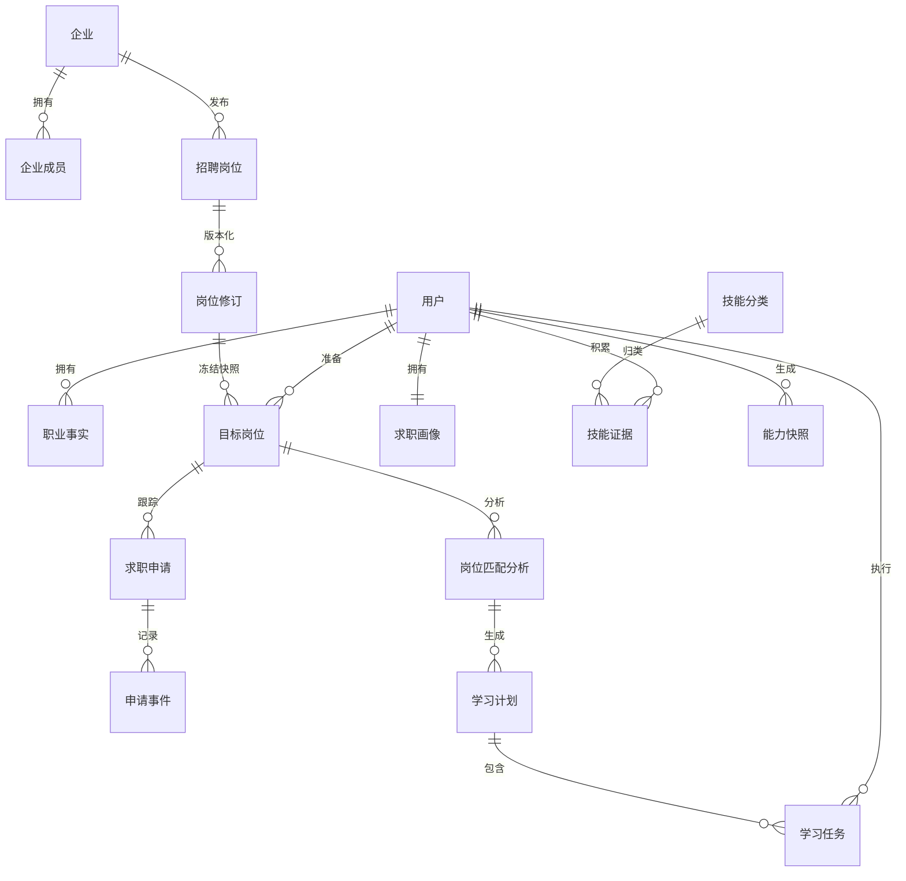
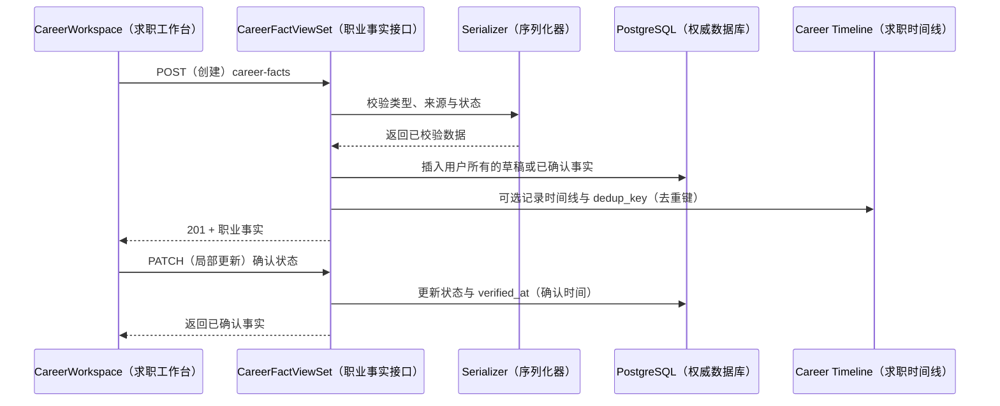
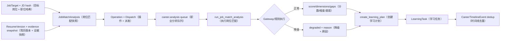
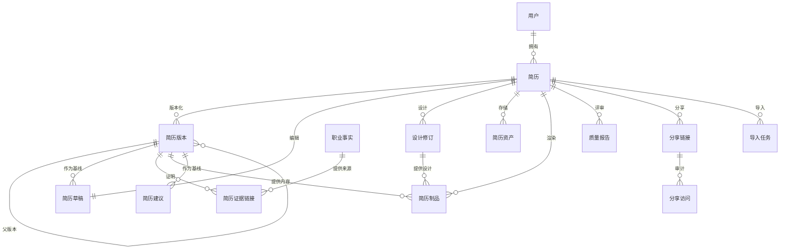
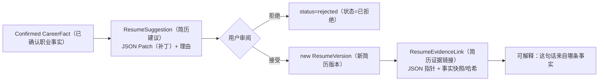
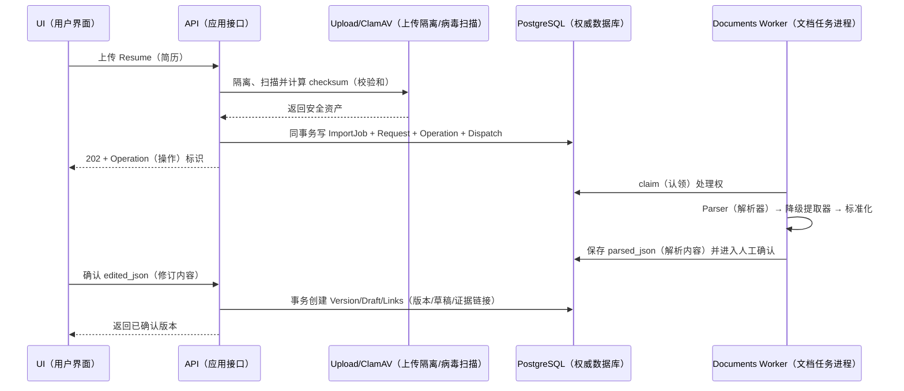
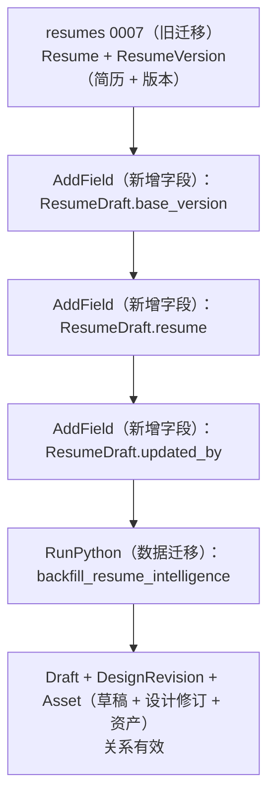
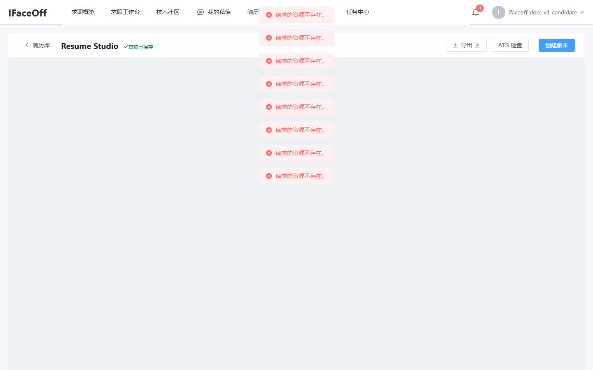
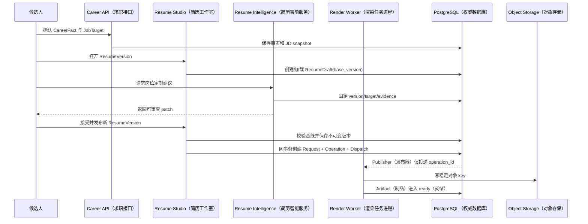
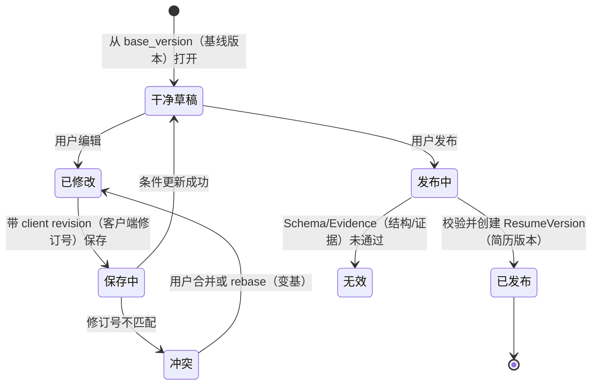

# 卷三：Career 与 Resume 实现

## 1. 为什么把 Career 和 Resume 放在同一卷

Resume 不是孤立文档编辑器。候选人的姓名、项目、工作、技能和量化结果来自职业事实；岗位定制来自 JobTarget/JD；ATS 与 AI 建议要能引用证据；投递记录必须指向当时使用的 ResumeVersion。因此 Career 是可信输入与目标语境，Resume 是版本化表达，两者合在一起才构成“可投递证据”。

若直接把上传文件解析成一张 `Resume` 表并让 AI 改写，会出现：

- 无法区分原始事实和模型扩写；
- 页面自动保存覆盖最后可投递内容；
- 模板切换修改内容结构；
- PDF 生成失败影响编辑；
- 投递后继续编辑使历史申请无法复现；
- 同一 JD 的建议无法说明基于哪版简历。

当前模型用事实、目标、版本、草稿、设计、制品、分析和分享边界解决这些问题。

## 2. Career 数据模型



观察重点：CareerFact 是用户证据，SkillEvidence 是标准技能维度上的证据投影，AbilitySnapshot 是某时点聚合结果；三者不是一张“技能表”。

面试时如何讲：先从 Fact/Target/Application 三个核心对象开始，追问能力分析时再展开 Taxonomy/Evidence/Snapshot。

### 2.1 `CareerFact`

关键字段：

- `fact_type`：summary、education、work、project、skill、certification、achievement、open_source；
- `title/organization/role/description/start_date/end_date`：可读事实；
- `skills`、`metrics`：结构化技能和量化信息；
- `source_type`：manual、resume_import、github、interview；
- `source_url/source_metadata`：来源线索；
- `verification_status`：draft、confirmed、rejected；
- `verified_at`：确认时间。

索引 `(user, fact_type, verification_status)` 支持按用户和事实类别读取已确认输入。它没有全局唯一标题，因为同名项目或经历合理；去重应结合来源 ID/hash 和用户确认。

### 2.2 `JobTarget` 与职位快照

`JobTarget` 保存候选人的公司、岗位、JD、location、deadline、keywords 与 `jd_snapshot_hash`。它可关联平台 `JobPosting` 和特定 `JobPostingRevision`。这是重要的历史语义：企业发布新 revision 后，候选人的旧匹配仍指向当时版本。

`JobPosting` 保存可变身份和 `current_revision` 指针；`JobPostingRevision(posting, version)` 唯一，正文、requirements、skills、salary 与 content_hash 不可混成当前行。`save_posting_as_target()` 将已发布职位转成用户目标。

### 2.3 `JobApplication`

申请状态包括 saved、applied、screening、interview、offer、accepted、rejected、withdrawn。`resume_version` 指向投递时版本，`next_action_at` 支持行动提醒。索引 `(user, status, next_action_at)` 支持仪表盘管道和到期任务。详细变化写 `ApplicationEvent`，避免只保留最后状态。

### 2.4 技能证据与快照

`SkillTaxonomy.slug/name` 唯一，aliases 支持术语归一；`SkillEvidence` 以 `(user, skill, source_type, source_id)` 唯一，proficiency 由 CheckConstraint 限制在 0～100。`confidence` 和 `verified` 与 proficiency 分开：模型认为“可能高级”不等于用户验证。

`AbilitySnapshot` 保存 trigger、dimensions、source_refs 和 config_hash。它是某次评估的不可变结果，而不是持续被覆盖的用户字段。

## 3. Career 页面到 API

`CareerWorkspace.vue` 以四个 Tab 展示 CareerFact、JobTarget、JobApplication 和 LearningTask。前端对 v2 endpoints 发请求：

- `career-facts`；
- `job-targets`；
- `applications`；
- `learning-tasks`；
- `career/profile`；
- `career-dashboard`；
- 只读 timeline、ability snapshots、weekly reports、match analyses、learning plans；
- public companies/jobs 与 employer company/job endpoints。

后端 `OwnedModelViewSet` 统一 owner queryset 和 `perform_create`，具体 ViewSet 负责 serializer/action。`CareerDashboardView` 是聚合读模型。Employer ViewSet 还需要 CompanyMember role/status scope，不能只验证登录。

### 创建 Fact 的典型时序



确认动作最好由服务端根据状态转换设置 `verified_at`，不信任客户端随意填写时间。删除被 `ResumeEvidenceLink(PROTECT)` 引用的 Fact 时，应提示先解除/创建新版本，而不是级联破坏历史简历证据。

## 4. Job Match 与 Learning Plan

`JobMatchAnalysis` 绑定 user、JobTarget、受保护的 ResumeVersion、可选 JobPostingRevision 和统一 Operation。它本身就是不可变的 Career 分析输入快照：包含 `jd_snapshot`/hash、config snapshot/hash；输出包括 score、dimensions、matched_skills、gaps、evidence_refs、recommendations。View 在同一事务创建 Analysis、Operation 与 Dispatch，Worker 只凭 operation id 重载 Analysis。



观察重点：分析保存 JD 和配置快照，因此目标或模型策略改变后历史仍可解释；降级结果显式标记，不与正常结果混合。

面试时如何讲：重点说明输入版本、异步 operation、降级字段和任务生成的幂等。

`run_job_match_analysis()` 应以 analysis id 重载对象，检查状态，更新 running；通过统一 AI/gateway 生成结构化结果；校验得分范围和 evidence；事务保存；必要时建 plan/task。Worker 重试如果 analysis 已 succeeded 就返回，避免重复计划。

## 5. Resume 的聚合根与兼容字段

`Resume` 保存 user、title、原始 file/parsed_content、旧 `content_json/template_name`、JSON Resume schema version、旧结构化姓名电话等字段、`current_version`、`current_design_revision`、is_default、status 与时间。旧字段仍可读，属于兼容窗口；新内容源是 ResumeVersion。

条件唯一约束 `uniq_default_resume_per_user` 确保一个用户最多一份默认简历。设置默认项必须在事务中先清旧默认再设新默认，或使用条件 update，避免并发唯一冲突。



观察重点：Version 与 DesignRevision 都不可变；Artifact 同时指向内容和设计；EvidenceLink 固定事实快照；ShareAccess 只保存散列化访问元数据。

面试时如何讲：选“修改一行项目描述”和“换一个模板”两个动作，分别指出只产生内容版本还是设计 revision。

## 6. `ResumeVersion`：内容真相

字段包括：

- `(resume, version_number)` 唯一；
- `parent` 形成版本树；
- `schema_version=1.3.1` 与 `resume_json`；
- `content_hash`；
- `language`、兼容 `layout_json`；
- `evidence_snapshot`；
- source：legacy_migration/editor/import/ai_suggestion/jd_variant/restore；
- `change_summary`、created_by/at。

模型 `save()` 拒绝修改已有实例，强制创建新版本。应用层仍应禁止 QuerySet `update()` 绕过；数据库层若要求更强不可变性，可加 trigger/权限，但当前证据是模型级保护与调用约定。

版本号生成存在并发风险。错误实现是 `max(version)+1` 后直接 insert；两个请求会冲突。正确做法可锁定 Resume 行或捕获唯一冲突并重试，创建版本、EvidenceLinks 和 current_version 更新放一个事务。

## 7. `ResumeDraft`：可编辑工作区

一份 Resume 只有一个 Draft，`base_version` 指明来源；`resume_json/design_json` 保存工作区；`revision` 和 `etag` 提供乐观并发；`updated_by` 支持审计。

保存流程：

1. 客户端读取 Draft + etag；
2. PATCH 携带 If-Match/etag；
3. 服务端计算当前 etag；
4. 不一致返回 409，并返回最新 revision/冲突提示；
5. 一致则校验 JSON Resume schema、更新 Draft、revision+1、重新计算 etag；
6. 用户显式“创建版本”时把 Draft 固化为 ResumeVersion。

当前是否所有端点严格实现 If-Match 要以 v2 service/view 核验，模型字段本身不能当成完整并发控制证据。

## 8. Evidence Link：防止 AI 捏造

`ResumeEvidenceLink` 绑定 ResumeVersion、JSON Pointer、CareerFact，保存 `fact_snapshot` 与 `fact_hash`，唯一约束避免同一指针/事实重复。JSON Pointer 可以指向 `/work/0/highlights/1` 等内容位置。

事实后来被编辑时，旧 Version 仍保留 snapshot/hash；新版本重新选择事实。删除 Fact 使用 PROTECT，保证历史链接不被级联删除。模型建议返回 JSON Patch 时同时带 `evidence_fact_ids/evidence_links`；没有证据的措辞只能作为待确认建议。



观察重点：模型输出不直接改 Version；用户接受才创建新版本和证据链。

面试时如何讲：用一个量化 bullet 举例，说明 CareerFact.metrics、JSON Patch、Pointer 和 snapshot 如何串起来。

## 9. 文件导入

`ResumeImportJob` 状态：pending → processing → review_required → confirmed，或 failed/canceled。保存 parser name/version、fallback reason、parsed text/JSON、error 和时间。`ResumeAsset(kind=source)` 保存随机 object、原名、MIME、大小、SHA-256。

导入入口先创建唯一敏感输入快照 `ResumeOperationRequest`，正文只落 PostgreSQL；Operation 的 `input_id` 指向该快照，RabbitMQ 消息只包含 operation id。handler 从 `OperationExecutionContext` 重载快照后调用既有导入逻辑：

1. claim Job/Operation；
2. 确认 source Asset 已通过上传安全；
3. 使用 document parser，失败时按允许策略退到 PDF/DOCX/TXT extractor；
4. 标准化为 JSON Resume 1.3.1；
5. 保存 parsed preview，状态 review_required；
6. 不创建可投递 Version，等待用户确认。

`confirm_resume_import()` 接受用户修正 JSON，创建 Version/Draft、Evidence 候选与 current pointer，Job 变 confirmed。重试解析不覆盖用户已确认版本。



观察重点：扫描、解析、确认是三个信任边界；解析结果不直接成为公开版本。

面试时如何讲：强调文件名/MIME 不可信、解析器需超时/资源限制、确认动作决定权威内容。

## 10. 设计与渲染隔离

`ResumeDesignRevision` 保存 template_key/version、language、page_size、design_json/hash、parent 和 `(resume, revision_number)` 唯一；已有 revision 也拒绝修改。

`ResumeArtifact` 同时锁定 `content_version` 和 `design_revision`，或明确保存 Draft etag/preview input/design；format 可 preview/PDF/DOCX/JSON；status pending/processing/ready/failed；`cache_key` 唯一；生成后关联 ResumeAsset，记录 renderer name/version、页数和错误。

cache key 应由 content hash、design hash、renderer/version、format、locale 等稳定输入计算。同一输入重复导出复用 ready Artifact；failed 是否重试要创建 attempt/重置状态并保留错误史。

`render_resume_artifact()` 在 `resume.render` queue 执行。Worker 不读取“当前版本”这种可变指针，而读取 Artifact 固定的 content/design；否则排队期间用户切版本，PDF 会不可复现。

## 11. ATS/JD 智能分析

`ResumeQualityReport` 绑定受保护的 content_version，状态 pending/processing/completed/failed，保存 schema_version、config_hash、score、report_json 和 error。`review_resume_quality()` 是异步任务。

一个可靠报告应区分：

- schema/必填项：规则可确定；
- ATS 可解析性：结构、标题、日期、表格/图形风险；
- JD 关键词覆盖：基于固定 JD snapshot；
- 证据质量：结论是否有 CareerFact；
- 文案建议：模型输出，需 JSON schema 校验；
- degraded：模型不可用时只返回规则项，不能伪造完整分数。

`reports.ResumeAnalysisReport` 还承载更完整的简历分析输出及 evidence sources。两个报告模型的职责需在 API 中保持清楚，防止 UI 混用字段；当前诊断截图部分空态说明仍需契约收敛。

## 12. 岗位定制与 Suggestion

`ResumeSuggestion` 保存基于哪一版、JSON Patch、summary、rationale、evidence IDs/links、pending/accepted/rejected 和 accepted_version。接受建议时检查 base_version 是否仍是客户端当前基线；若用户已创建新版本，返回冲突或重新 rebase，不能盲打 patch。

`ResumeVariant` 连接 source_version、输出 version 和 JobTarget。它不是复制一份无来源 Resume，而是明确“为哪个岗位从哪一版生成了哪一版”。投递时 JobApplication 指向输出 version。

## 13. 分享与隐私

`ResumeShareLink` 保存 token hash/hint，而不是明文 token；绑定 content_version/design_revision；可设置 password hash、field policy、expires/revoked、下载开关/上限/次数。`ResumeShareAccess` 记录 view/download/denied，IP 和 User-Agent 只存 hash。

公开响应必须应用 field policy，默认隐藏电话、邮箱等敏感字段；下载计数的检查与递增需要事务/原子 update；撤销立即生效；公开页不能暴露 owner ID、内部 evidence 或对象 key。

## 14. `resumes.0008` 历史迁移修复

0008 新增 Resume Intelligence 的 Draft、EvidenceLink、QualityReport、Artifact 等。原操作顺序先运行 `backfill_resume_intelligence`，后添加 `ResumeDraft.base_version/resume/updated_by`。Django data migration 使用当时的历史 model state，回填函数创建 Draft 时访问尚不存在的字段，空库或从 0007 前进会失败。

修复把 `RunPython` 移到三个 AddField 后。最终 schema 没变；已应用 0008 的数据库不会重跑；只修复尚未经过 0008 的环境。



观察重点：数据迁移可用字段由 migration state 决定，不是当前 `models.py`。调整顺序不能改变已应用数据库。

面试时如何讲：描述复现、历史 state 原理、为何不新建 0009、如何覆盖空库/有数据/重复迁移。

`resumes.test_migrations.ResumeIntelligenceMigrationTests` 使用 `MigrationExecutor`：

- 迁到旧 target；
- 创建历史 User/Resume/Version；
- 迁到 0008；
- 断言 Draft、DesignRevision、Asset 及关联/hash；
- 再迁同一 target，断言不重复。

## 15. 当前真机状态

Career Dashboard/Workspace 正确显示 fixture；Resume 数据在 PostgreSQL 和 v2 后端存在，但客户端最终 URL 错误。Studio 页面外壳显示“草稿已保存、导出、ATS 检查、创建版本”，编辑区因请求 404 为空。这个缺陷应在前端 API client 修，不修改业务 API。

截图可用于解释“如何定位”，不能用于证明 Studio 端到端完成：



## 16. 并发、一致性与恢复

- Fact 确认与 evidence 链：Version 创建事务内 snapshot；历史 Fact 更新不回写旧版本；
- Draft：etag/revision 乐观锁，冲突返回 409；
- Version/Design number：锁 Resume 或捕获唯一冲突重试；
- Artifact：cache key 唯一，任务按 Artifact ID 幂等；
- Import：Job claim + Operation；stale job 定时标记/恢复；
- Match：Analysis 输入固定 Version/JD hash；重复 task 不重复 Plan；
- Share：原子计数、过期/撤销过滤；
- Dashboard：聚合缓存失效失败时允许短时旧值，但写模型不依赖缓存。

## 17. 权限和安全

所有 Resume/Career owner queryset 必须过滤 user。Employer API 用 CompanyMember。导入限制文件大小/MIME/扫描，解析器防 zip bomb/超时。Resume JSON 与 parsed text 含 PII，不进入普通日志、Prompt trace 或文档。公开 share 使用 token hash。AI 建议不能引用其他用户 CareerFact；RAG/Gateway 也要传 user/tenant。

## 18. 测试矩阵

- Model：默认简历条件唯一、Version/Design 不可变、版本号唯一、Evidence 唯一、proficiency 范围；
- Serializer/API：owner、状态转换、etag、公开 field policy、无权限 404/403；
- Service：save posting snapshot、timeline dedup、learning plan；
- Task：import 成功/解析失败/重复；render cache/失败；quality degraded；match retry；
- Migration：0007→0008 空数据/历史数据/再次执行；
- E2E：Career CRUD、Resume list/studio/创建版本/导出/诊断/分享；
- 当前缺口：v2 URL 契约 E2E、真实 RabbitMQ render、跨进程 parser/renderer、分享并发下载上限。

## 19. 设计取舍

**JSON Resume 还是关系表？**<br>
版本内容使用 JSON Resume 便于完整快照和生态转换；Career Fact、版本元数据、分享、任务等用关系表做约束和查询。旧 Education/WorkExperience 等表在兼容期保留。

**不可变版本是否浪费空间？**<br>
会增加存储，但简历 JSON 相对小，换来历史可复现、投递审计和安全回滚。可用压缩/对象存储优化，不应先牺牲语义。

**为什么 DesignRevision 也不可变？**<br>
同一内容换模板需要复现；如果 design 原地改，旧 PDF 无法解释。Artifact 固定二者。

**为什么不让模型直接输出最终 PDF？**<br>
模型输出不稳定且难做版面/字体/安全控制；模型生成结构化建议，确定性 renderer 负责制品，更易缓存与测试。

## 20. 30 秒口述卡

“Career 保存已确认事实、目标岗位和申请，Resume 用不可变 ResumeVersion 保存内容，用 Draft 做乐观锁编辑，用 DesignRevision 保存模板，用 Artifact 异步渲染。EvidenceLink 把每个简历 JSON Pointer 连接到 CareerFact snapshot；岗位分析固定 JobTarget JD 和 ResumeVersion，结果再生成 LearningPlan。这样 AI 建议不会直接覆盖可信简历，投递和导出都能复现。”

## 21. 2 分钟口述卡

从 CareerFact 的 source/verification 讲可信输入；从 JobPostingRevision/JobTarget 讲岗位快照；从 Resume/Version/Draft/Design/Artifact 讲四种生命周期；从 ImportJob、QualityReport、Suggestion、ShareLink 讲异步与安全；再讲 0008 MigrationExecutor 回归。最后展示 Career 成功截图和 Resume URL 失败截图，说明当前端到端边界。

## 22. 连续追问

**如何保证版本号不重复？**<br>
数据库唯一约束是最后防线；创建时锁 Resume 或捕获 IntegrityError 重试；不要只用 `max+1`。

**事实被用户删除怎么办？**<br>
被历史 EvidenceLink 引用时 PROTECT；允许归档/拒绝或新版本不再引用，旧 snapshot 保留。

**模型建议如何避免打到错误版本？**<br>
Suggestion 固定 base_version；接受时比较当前基线/content hash，冲突则拒绝或显式 rebase。

**渲染 Worker 重复执行会生成两份吗？**<br>
Artifact cache_key 唯一，任务先查 ready/processing；对象 key 按 hash 稳定；成功后原子关联 Asset。外部写仍需幂等。

**Resume 当前为什么显示 0？**<br>
不是权限/seed，而是 v1 Axios base 与 v2 path 拼接成 `/api/v1/api/v2`。证据是数据库有记录、Django 404 和截图空态。

## 23. 一个候选人从事实到投递稿的完整故事

假设候选人准备投递“后端工程师”。他先在 Career 工作台确认一条项目经历和一组技能证据，
`CareerFact` 保存事实类型、结构化 payload、来源、验证状态和 revision/hash；如果岗位来自平台，
`JobPostingRevision` 固定企业当时发布的 JD，如果来自手工输入，`JobTarget` 也保存 JD snapshot，
避免招聘方后来修改文本导致匹配结果不可复现。

候选人选择一份简历时，`Resume` 只表示“这份简历”这个长期聚合。真正可引用的内容是
`ResumeVersion`：JSON Resume 内容、schema version、content hash、父版本和创建来源共同描述一次
不可变快照。Studio 打开后创建或复用 `ResumeDraft`，Draft 指向 `base_version`，保存可变
`content_json`、lock/version 字段和更新者。页面每次自动保存都提交“我基于哪个版本修改”，而不是
把整个 Resume 聚合无条件覆盖。

AI 建议由 `generate_resume_suggestion()` 读取固定 ResumeVersion、任务类型和可选 JobTarget；
`build_resume_context()` 只选入允许的 Career 事实与证据，Prompt 输出经 `_coerce_patch()` 转成受限
patch，`_validate_evidence_and_metrics()` 拒绝没有依据的指标。`ResumeSuggestion` 保存 base version、
输入/输出和状态；用户必须显式接受。接受时再次比较基线，发生漂移就提示 rebase，而不是静默把
旧建议打到新简历。

准备导出时，内容版本与 `ResumeDesignRevision` 组合得到 Artifact 输入。`artifact_cache_key()` 把
内容 hash、设计 hash、格式和渲染器版本纳入缓存身份；`render_artifact()` 生成 PDF/DOCX 后关联
`ResumeAsset`。公开分享创建 `ResumeShareLink`，它指向固定版本/制品并记录访问策略，而不是暴露
当前 Draft。这样“编辑中的内容”“已投递版本”“公开版本”不会互相漂移。



观察重点：每一个可能变化的输入都先冻结成版本或 snapshot，模型建议和渲染结果只引用冻结输入。

面试时如何讲：用“同一份简历在编辑、投递、分享三个时间点如何保持可复现”作为主线，比逐个背
模型名更清晰；再补充 EvidenceLink 防捏造和 Artifact 幂等，形成产品价值到数据库约束的闭环。

## 24. 字段级不变量：模型为什么不是普通 CRUD

### CareerFact

- owner 决定租户边界，View 层必须从 `request.user` 注入，不能信任 body 中的 user id。
- source 与 verification status 描述“从哪里来、是否确认”，不能合并成一个布尔值。
- payload 允许不同事实类型保存结构化内容，但 hash/snapshot 让引用方能够证明当时看到的值。
- 被历史 EvidenceLink 使用的事实应归档或产生新 revision，物理删除要受保护。

### JobTarget / JobPostingRevision

- title、company 与 JD snapshot 共同构成分析输入；只保存 posting 外键会让历史报告随职位编辑变化。
- 用户手工目标和企业发布岗位来源不同，但下游匹配应消费统一、冻结后的目标契约。
- `JobMatchAnalysis` 应固定 target、resume version、状态、输入 hash 和结果，重复请求按同一输入复用。

### ResumeVersion

- `(resume, version_number)` 唯一约束是并发创建版本的最后防线。
- content hash 识别相同语义快照，也服务于 Artifact 缓存和建议基线校验。
- 父版本表达编辑谱系，不代表可以原地改变父节点。
- schema version 必须随内容保存；升级转换是显式迁移，不是读取时悄悄改变历史。

### ResumeDraft

- Draft 是可变协作面，不是发布真相；离开 Studio 后也不能把 Draft URL 当投递链接。
- base_version 与 lock/version 字段支持乐观并发：更新条件必须包含客户端看到的版本。
- `updated_by` 是协作和审计证据，不能只依赖 `updated_at` 猜是谁修改。
- 发布新版本成功后，Draft 要么推进基线并清空 dirty 状态，要么关闭并创建下一 Draft，语义需固定。

### ResumeArtifact / ResumeAsset

- Artifact 表示“生成任务和语义输入”，Asset 表示“实际文件与安全元数据”，两者生命周期不同。
- ready 必须意味着对象存在、hash/size 已记录且格式通过验证；不能在文件写完前提前置 ready。
- 渲染失败保留 error code、renderer version 与 retry count，但对用户隐藏内部路径和命令。
- 清理对象时必须先判断 ShareLink/历史投递的保留要求，不能只按最近访问时间删除。

## 25. Studio 保存、发布与冲突处理

一个健壮的自动保存请求至少携带 draft id、client revision、base version、patch/full content 和
idempotency key。服务端在短事务中锁定 Draft 或做条件更新：

```text
UPDATE resume_draft
SET content_json = :normalized, revision = revision + 1, updated_by_id = :user
WHERE id = :draft AND revision = :client_revision AND resume_id IN (:owned_resumes)
```

影响行数为 0 不是“数据库失败”，而是可能发生了权限变化、Draft 被关闭或并发冲突。服务端读取
当前 revision 返回 409；页面保留本地修改，展示差异或允许用户复制，而不是自动覆盖。若 patch
基于 JSON Pointer，数组元素必须有稳定 internal id，否则插入一条 experience 会让后续 index
全部偏移。

发布时先 `normalize_resume()` 和 `validate_resume()`，计算 `sha256_json()`，再在事务中分配版本号
并创建 ResumeVersion。数据库唯一冲突可以有限重试，但不能无限循环。发布后再通过 `on_commit`
安排质量报告/渲染；如果业务要求绝不丢，应同事务写 Outbox，而不是只注册内存回调。



观察重点：自动保存成功和发布版本成功是两个不同承诺；冲突是正常业务状态，不应变成 500。

面试时如何讲：从“两台设备同时编辑”追问展开，先给数据库条件更新，再讲稳定 item id、409 UI、
发布唯一约束与异步后处理，体现前后端一致设计。

## 26. 导入链路：不可信文件如何变成可信草稿

上传入口只接受有限扩展名、MIME、大小和数量，原始字节先进入隔离对象区。`ResumeImportJob` 保存
owner、文件元数据、状态和错误，而不是把临时路径暴露给用户。ClamAV/格式检查通过后才能解析；
PDF/DOCX 的文本抽取可能不完整，OCR 也可能把数字和日期识错，所以解析结果只能生成 Draft 或
待确认 Suggestion，不能直接发布成权威 ResumeVersion。

`imported_text_to_json_resume()` 把文本/解析结果映射为 JSON Resume；`normalize_json_resume()` 统一
字段形状，`validate_resume()` 给出 schema 错误。对旧模型，`legacy_resume_to_json_resume()` 是
兼容桥，而不是长期双写理由。导入结果需要记录 parser/version、输入 hash、警告和未识别片段，
页面逐项让用户确认姓名、日期、公司、项目和技能。

失败矩阵必须区分：

| 失败点        | 可否重试  | 用户看到什么       | 运维证据                        |
| ---------- | ----- | ------------ | --------------------------- |
| 病毒/恶意结构    | 否     | 文件被拒绝，建议更换来源 | scan result、hash、审计         |
| 加密 PDF     | 条件性   | 需要无密码版本      | parser code，不保存密码           |
| OCR 服务不可用  | 是     | 进入等待/可手工填写   | job retry、dependency health |
| schema 不完整 | 可人工修复 | 高亮缺失字段       | validation errors           |
| 任务重复投递     | 幂等复用  | 同一个导入状态      | file hash、job id、唯一键        |
| 对象丢失       | 需重新上传 | 明确文件已失效      | object head 失败与清理日志         |

## 27. ATS/JD 分析的确定性层与模型层

`calculate_resume_fit()` 可以先做确定性关键词覆盖、证据数量和缺失项分析；`build_quality_report()`
对结构、长度、空字段、指标证据和基本可读性产生可重复 issue。它们适合作为快速反馈、回归测试
和模型不可用时的保底，不应伪装成真实 ATS 厂商的秘密算法。

模型层负责更强的语义归纳和改写建议，但输入固定为 ResumeVersion + JobTarget + Evidence snapshot，
输出必须落到明确 JSON Pointer 和 operation。每条建议至少回答：要改哪里、为什么、依据是什么、
接受后会产生什么文本。模型若返回“提升 30%”但没有 CareerFact/metric evidence，
`_validate_evidence_and_metrics()` 应拒绝。这样产品卖点不是“AI 写得更漂亮”，而是“AI 在证据
边界内帮助用户表达”。

质量分也不能把所有维度压成一个神秘总分。页面应分别展示结构完整性、岗位覆盖、证据可信度和
可读性；版本、规则集和时间与报告一同保存。规则升级后可重新评估同一版本，但不能覆盖旧报告，
否则用户无法解释为何昨天 82 分今天 73 分。

## 28. 分享、导出与数据保留的威胁推演

公开分享 token 必须是高熵随机值，数据库可只保存 hash；访问时做恒定时间比较并检查 revoked、
expires_at、最大访问次数/密码策略。`ResumeShareAccess` 记录必要的访问审计，但 IP、User-Agent
属于个人数据，要有截断、保留期和访问权限。分享响应不得包含 Draft、内部 evidence、模型 Prompt、
owner email 或对象存储真实 key。

下载 URL 应短期签名并绑定 Artifact；不能让用户通过修改 object key 枚举其他人的文件。导出文件
要设置安全 Content-Type、Content-Disposition 和缓存头。撤销分享后，CDN/浏览器缓存不会魔法消失，
产品文案必须说明边界；高敏场景可禁公共缓存并缩短签名 TTL。

账户删除时，Career Fact、Resume、ShareLink、Artifact、对象、搜索投影和审计保留不是一个简单
CASCADE。可执行流程是：先撤销访问和登录，建立删除任务；主库按法规/业务保留策略删除或匿名化；
Outbox 驱动对象与索引清理；失败项可重试；最终写不含正文的完成证明。历史备份中的删除依赖备份
过期策略，不能声称立即物理消失。

## 29. 生产差距与两周落地顺序

第一优先级是修复 Resume v2 URL 组合并添加 E2E：seed 后列表必须非空、Studio 必须加载同一
ResumeVersion、Network 不得出现双版本前缀。第二优先级是把 Draft 保存/发布的冲突契约固定为
409，并对两客户端并发做数据库测试。第三优先级是把导入、质量和渲染任务接入版本化队列拓扑，
验证 Broker 重建、重复任务和对象写后宕机。

独立 PostgreSQL 的扩展测试还暴露了一个更底层的当前缺陷：`ensure_studio()` 在
`select_for_update()` 后同时 `select_related('current_version', 'current_design_revision')`。这两个
current 外键可空，PostgreSQL 会生成 LEFT OUTER JOIN，并拒绝对 nullable join 一侧执行
`FOR UPDATE`，报 `NotSupportedError: FOR UPDATE cannot be applied to the nullable side of an outer
join`。Resume Intelligence 相关 10 项测试因此在创建/加载 Studio 时失败。修复应把“锁 Resume
主行”和“读取可空关联”拆成两次查询，或使用只锁主表的查询并验证 Django/PostgreSQL 行为；本轮
不越界修改业务实现。

随后再补分享 token hash、对象保留清理和真实字体/中文 PDF 回归。模型质量优化排在证据与版本
不变量之后：如果基线都可能漂移，Prompt 调得再好也无法重现一份投递稿。面试中这样排序能够说明
你把用户数据正确性置于“AI 效果展示”之上。

测试口径必须分层：`resumes.test_migrations` 两项在全新 PostgreSQL 通过，证明 0008 顺序修复；
但综合 99 项领域测试中，Studio 因上述锁问题产生 10 个错误。因此不能把“迁移通过”外推为
“Resume 全链通过”。下一次修复至少要覆盖新 Resume 尚无 current version/design、已有二者以及
两个并发 Studio 请求。
