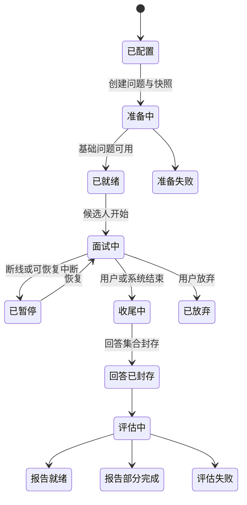
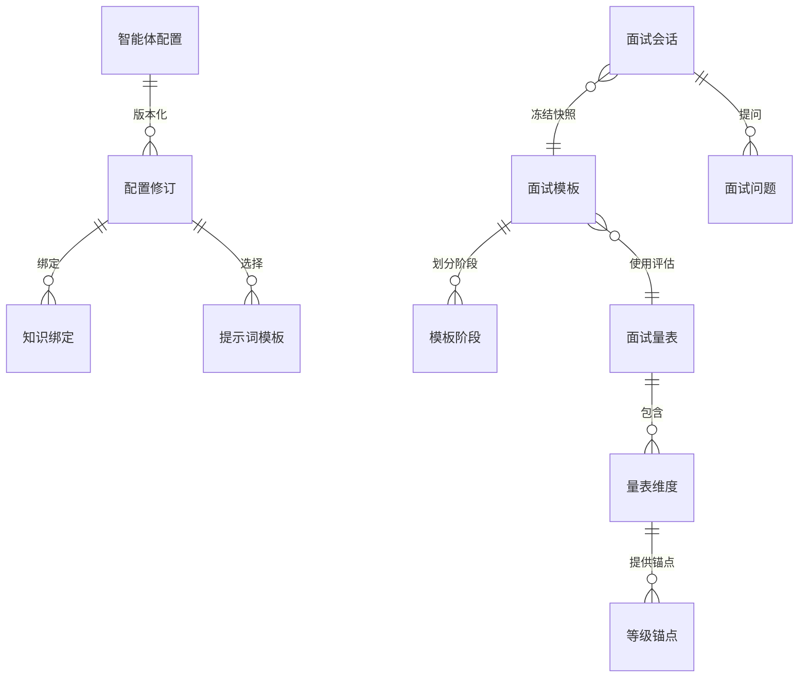
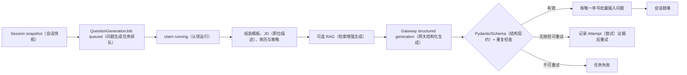
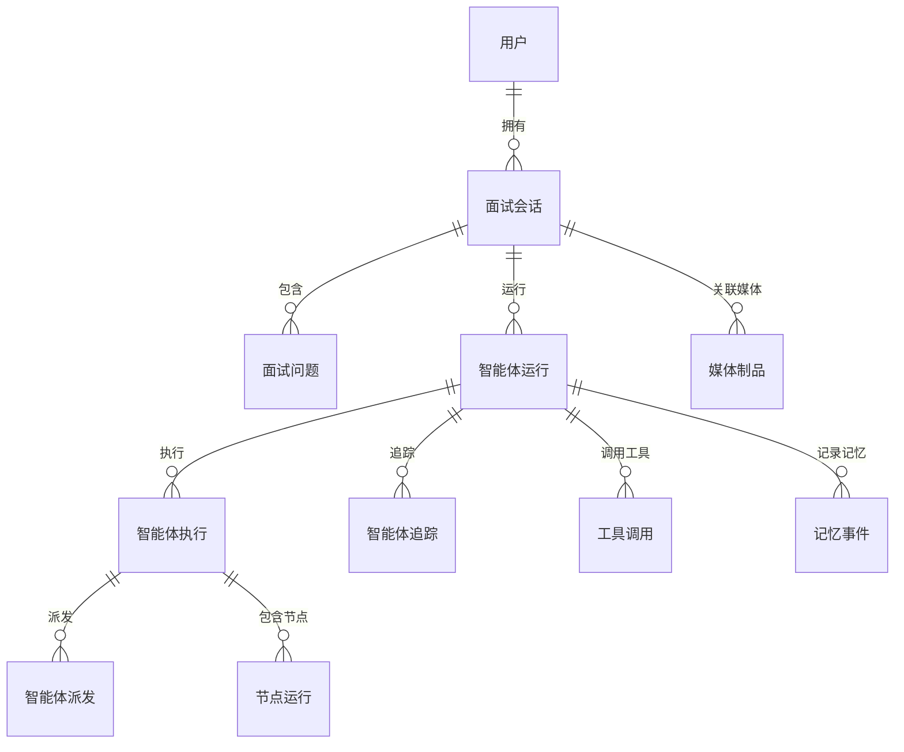
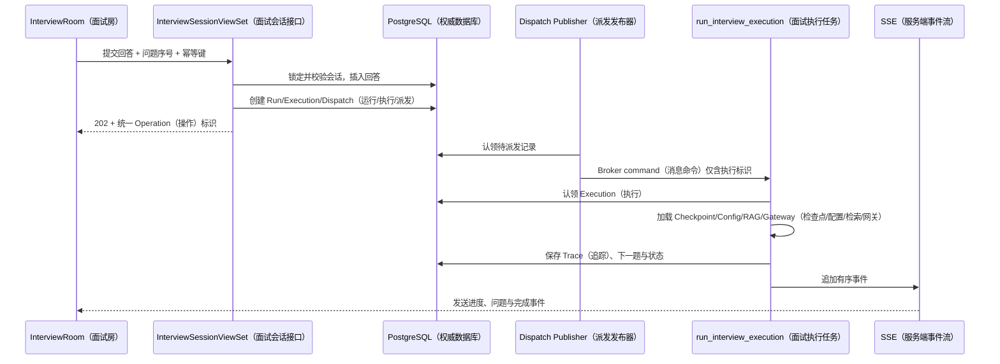
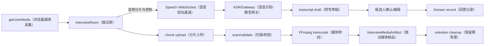
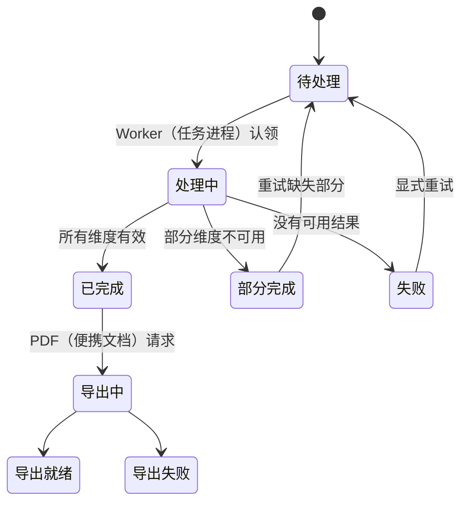
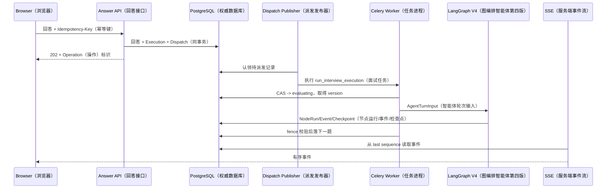
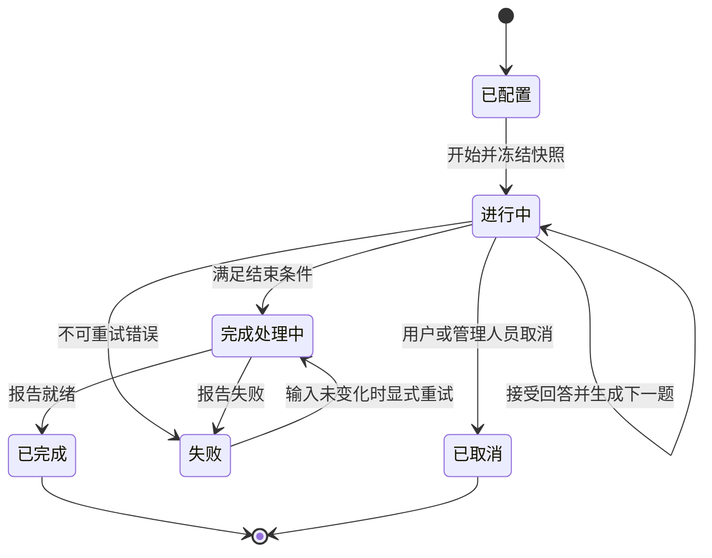

# 卷四：Interview 与评估实现

## 1. 一次面试包含哪些不同状态

面试功能最容易犯的建模错误是只在 `InterviewSession.status` 上写 running/finished。实际至少有五条相互关联但不同的状态线：

1. 业务会话：候选人是否配置、开始、暂停、结束、放弃；
2. 题目生成：题集是否 queued/running/ready/failed；
3. Agent 执行：某一轮是否 pending/claimed/running/waiting/completed/failed/stale；
4. 媒体：录音/视频 chunk 是否上传、扫描、转码、保留；
5. 评估报告：是否等待输入、生成、部分成功、完成或失败。

如果用一列表示全部，Worker 失败会把整个面试误判 finished，或者报告失败让已完成回答丢失。当前模型把 Session、QuestionGenerationJob、AgentRun/Execution/Dispatch/NodeRun/Trace、MediaArtifact、EvaluationRun 分开。

观察重点：Completed 表示回答集合封存，不等于报告已生成；Paused 不等于 Agent Execution failed。

面试时如何讲：先画业务状态机，再把“下一题生成”作为会话内部的子执行展开。

## 2. 模板、Rubric 与配置版本

### InterviewTemplate

模板描述面试用途、岗位/难度/模式适用范围、总时长/题量、题型或阶段。`InterviewTemplateStage` 把面试分成开场、基础、项目深挖、系统设计、反问等阶段，保存 order、目标、题量/时长策略。

### InterviewRubric

Rubric 描述评估标准；`RubricDimension` 保存维度、权重、说明；`RubricLevelAnchor` 为分数级别提供行为锚点。锚点比“1～5 分”更重要，因为它约束模型把证据映射到分数。

### 配置快照

Agent 控制面使用 `AgentConfigProfile` 与不可变 `AgentConfigRevision`；Prompt 使用 `AgentPromptTemplate`；知识绑定使用 `AgentConfigKnowledgeBinding`；发布/评测使用 `AgentConfigEvaluationRun`。Session/Run 保存选中的 revision、template/rubric snapshot 或 hash，避免 Staff 更新后历史结果漂移。

观察重点：模板决定面试结构，Rubric 决定评估，Agent revision 决定运行策略，三者不能用一段 Prompt 代替。

面试时如何讲：解释运营如何修改下一版而不污染正在进行/已完成的 Session。

## 3. 面试配置页面

候选人在面试配置页选择职位、难度、经验模式、可能的 Resume、JD 与媒体选项。ViewSet 创建 Session 时必须：

- 绑定 `request.user`；
- 读取并固化 JobTarget/JobPosition、JD snapshot/hash；
- 读取 ResumeVersion 而不是可变 Resume 当前内容；
- 解析 Template/Rubric/Agent config 的已发布 revision；
- 校验题量、时长、模式和权限；
- 初始化状态、last_activity_at 和 operation；
- 决定使用题库、规则还是异步问题生成。

前端不能提交任意 staff-only config id；服务端只允许当前环境发布且符合 scope 的 revision。

当前页面证明配置入口与候选人会话恢复可运行。不同岗位/难度组合和问题生成的完整 E2E 仍需要测试矩阵。

## 4. 题目从哪里来

题目来源可以是遗留 `questions` 题库、Staff 模板、RAG 知识、Job Description、Resume 事实和模型生成。问题对象需要记录 source/type、sequence、difficulty、stage、能力标签、RAG context、生成配置/trace 等，不能只保存文本。

`InterviewQuestionGenerationJob` 把准备阶段异步化。一个可恢复流程是：

`InterviewQuestion(session, sequence)` 的唯一约束是重试防重复的最后防线。生成 5 题时不能逐题提交后在第 4 题失败留下“看似 ready”的半套题；可在事务中批量插入，或保存 generation revision 并只切换完整版本。

遗留 Questions 模型仍可作为种子/兼容源，但新的权威上下文应记录到 InterviewQuestion，避免题库被编辑后历史会话改变。

## 5. Session、Run 与 Execution

`InterviewSession` 是候选人业务会话，保存用户、岗位/简历/JD/模板/配置 snapshot、状态、current question/progress、媒体开关、体验模式和时间。

`InterviewAgentRun` 是一次 Agent 运行的审计聚合，保存 engine/config、状态、开始结束、结果/错误、事件序列等。`InterviewAgentExecution` 是可调度、可 claim、可恢复的执行单元；`InterviewAgentDispatch` 是待发布的任务/命令，解决数据库提交和 broker publish 之间的窗口；`InterviewAgentNodeRun` 保存节点级输入输出 hash、尝试、状态和耗时；`InterviewAgentTrace` 保存可审计 trace；`ToolCall`、`MemoryEvent` 分别保存工具和记忆事件。

观察重点：Dispatch 解决“数据库有执行但消息未发”，Execution 解决 claim/recovery，NodeRun/Trace 解决解释与定位。

面试时如何讲：用 Worker 在 broker 消息确认前后宕机的两个例子说明四层对象不是过度设计。

## 6. 提交一轮回答

页面显示 session 的第 3/5 题。候选人可选文本、语音、场景、行动和结果补充。提交时典型链路：

1. 浏览器生成 client request/idempotency key；
2. API 校验 owner、Session=running、Question 是当前 sequence；
3. 保存 answer/transcript/source、完成时间与媒体引用；
4. 条件更新进度，创建 AgentRun/Execution/Dispatch；
5. 同事务提交，publisher 发 `run_interview_execution(execution_id)`；
6. 立即返回 202 和 execution/run id；
7. Worker claim，读取固定 snapshot 与 answer；
8. 执行评估、追问/下一题决策；
9. 保存 NodeRun、Trace、checkpoint、Question/Session；
10. 发布有序 SSE 事件，页面推进。

观察重点：前端不等待模型返回；回答已持久化后执行可恢复；消息只携带 execution id。

面试时如何讲：明确事务锁/条件更新发生在 API，长模型调用发生在 Worker。

## 7. LangGraph V4 在面试域的职责

卷五会深入节点，这里关注业务边界。`CompositeV4InterviewAgentEngine` 接收严格 Turn/State contract，输出结构化 decision/assessment/question/event。它可以组合规则、RAG、模型和工具，但不能自行绕过 Session 状态：

- Session 已结束：Execution 应取消/失败，不再插入问题；
- 当前 sequence 已被别的执行推进：本执行结果不能覆盖；
- RAG required 但不可用：按 policy fail 或 degraded，写 reason；
- Gateway 预算拒绝：映射为可解释错误，不把空字符串当问题；
- checkpoint 恢复：仍要用数据库 Execution fencing token/attempt 判断旧 Worker。

## 8. Checkpoint 与 Worker 宕机恢复

设置 `INTERVIEW_AGENT_ENGINE=composite_v4`；`AGENT_DATABASE_URL` 指向独立 PostgreSQL checkpoint 库。Graph 使用 thread/run identity 存状态。业务主库保存 Execution；checkpoint 库保存图内部状态，两者无法单事务提交。

恢复协议必须容忍四个点：

- checkpoint 已写，业务结果未写；
- 业务 NodeRun 已写，checkpoint 未写；
- 结果和 checkpoint 已写，SSE 未发；
- SSE 已发，Worker 未 ack，任务重投。

处理方法是节点幂等、输入 hash、attempt/fencing、唯一 question sequence、事件 dedup/sequence 和 reconciliation。`recover_stale_agent_executions()` 扫描 last heartbeat/lease 超时的 running execution，判断是否可重试并重新 dispatch。不能仅把 status 设 queued 而不检查旧 Worker 是否仍可能提交。

## 9. 媒体与语音

`InterviewSpeechConsumer` 提供 WebSocket 语音交互边界；`speech_services.py` 的 ASR/TTS 已统一经过 `ModelGateway.transcribe_audio/synthesize_speech`，账本只保存字节数/字符数和安全元数据，不保存音频或正文。`InterviewMediaArtifact` 保存会话/问题/类型、对象、时长、hash、处理状态和保留信息。`video_uploads` 处理分片上传与 FFmpeg 转码。

媒体流程：

观察重点：ASR 文本先作为 transcript draft，候选人能确认；视频/面部信号不直接成为能力分数；媒体有独立保留和清理。

面试时如何讲：说明浏览器权限拒绝、网络断开、分片重复、转码失败、ASR 置信度低分别怎样降级。

当前截图使用浏览器 fake media device，绿色几何图证明 video 元素收到合成帧。它没有真人、不能作为人脸模型准确性证据。

## 10. Face API 的边界

仓库包含/依赖 `face-api.js` 用于前端辅助分析。合理用途是提示光线、遮挡、是否离开画面等低风险环境信号，并显示“未检测到/仅供参考”。不合理用途是根据表情直接推断诚信、性格或技术能力。

安全和产品要求：

- 默认明确告知并取得选择；
- 不启用时核心文本面试可用；
- 原始视频不上传或按设置/同意处理；
- 模型结果带置信度和 unknown；
- 报告区分回答证据与视觉辅助信号；
- 保留期与删除请求可执行；
- Staff 不默认查看录像。

## 11. 结束面试与竞态

用户点击结束与 Worker 正在生成下一题可能并发。结束接口应：

1. 在事务中锁 Session；
2. 若已终态则幂等返回；
3. 状态变 finishing/completed，记录 finished_at；
4. 取消/标记尚未 claim 的 Execution/Dispatch；
5. 已运行 Worker 使用 fencing/状态条件，在提交新题前再次检查；
6. 封存答案集合和评估输入 hash；
7. 创建 Evaluation operation。

如果只在前端隐藏按钮，旧 Worker 仍能写入第 6 题，报告输入不稳定。

## 12. Rubric 评估

评估输入包含固定 Template/Rubric revision、题目、回答/确认 transcript、允许的 RAG/ReferenceAnswer、Trace、环境说明。输出每个 dimension 的 score、anchor、evidence refs、confidence、flags 和 suggestions。

`InterviewReferenceAnswer` 提供参考，不代表唯一正确答案。`EvaluationDataset/Case/Run/Metric` 用于离线评测；`InterviewCalibrationCase` 用于对齐 Staff 标注与模型评分。`run_evaluation_run()` 执行评测数据集，不能与真实候选报告混库而无标志。

评分规则：

- 没有证据的维度应 unknown/insufficient，不是 0；
- ASR 不确定要标记 transcript risk；
- 视觉信号不能覆盖内容证据；
- 模型 JSON 必须通过 contract；
- config/rubric/model version 进入 report；
- 失败可部分返回，但清楚标注 incomplete/degraded。

## 13. 报告生命周期

报告页当前展示标题、Session Overview、综合评语、能力维度和导出。合成完成会话可打开，但“面试用户 N/A、能力项 0/无数据”，说明 seed 的 report/answer 字段与当前页面 serializer 没有完全对齐。状态为部分实现。

正确生命周期：

观察重点：无能力数据不是 0 分；Partial 与 Failed 分开；PDF 是派生制品。

面试时如何讲：以当前截图为反例说明为什么 UI/serializer/fixture 需要契约测试。

## 14. 报告如何回到 Career

报告完成后，可信输出可以写：

- `SkillEvidence(source_type=interview_answer, source_id=...)`；
- `AbilitySnapshot(trigger=interview_completed, source_refs=...)`；
- `LearningTask(interview_session=..., evidence_refs=...)`；
- `CareerTimelineEvent(dedup_key=...)`；
- ResumeSuggestion（若建议有事实证据）。

写入应由一个幂等 integration event 驱动，或在评估事务中 outbox。重复消费用 ConsumerInbox 和业务唯一 key 防重。候选人可以拒绝/编辑建议，不把模型结果自动标 verified。

## 15. 权限、安全与隐私

- Session/Question/Report/Media 以 owner 过滤；
- Staff 只按 permission 和必要投影读取；
- Break Glass 查看敏感回答/录像需要理由、MFA、限时和审计；
- WebSocket handshake 后仍检查 session；
- SSE run id 不是 secret，必须校验 owner；
- Prompt/Trace 日志脱敏，避免保存完整 Resume/回答；
- 媒体 object key 不公开，下载用短期授权；
- 隐私删除要处理主库、对象、索引、checkpoint 与观测数据。

## 16. 可靠性与容量

一次异步回答在同一主库事务中保存 Answer（回答）、`InterviewAgentExecution`、`InterviewQuestionGenerationJob`、专用 Agent Dispatch（智能体派发）和一对一公共 `Operation`（异步操作）。外部 API 只暴露 Operation UUID；Agent execution/run ID 仅保留作领域诊断。专用 Dispatch 继续承担 LangGraph 的命令发件箱，公共 Operation 提供统一进度、取消、重试、事件游标和任务中心投影，两者不重复执行外部任务。

Worker 同时 claim（认领）Execution 与 Operation，二者都有 lease owner（租约持有者）、lease expiry（到期时间）、heartbeat（心跳）和 fencing token（栅栏令牌）。Question、GenerationJob、Execution、Operation result/status 和耐久事件在主库事务内完成；取消先成功会提高 Operation fence，迟到 Worker 即使恢复也不能提交新题。Publisher 只向 `ifaceoff.v2.agent.interactive` 发布 execution ID，并使用 Publisher Confirm（发布确认）和 Mandatory Routing（强制路由）。

主要容量变量是并发会话、每轮模型时长、事件速率、音频带宽、媒体存储和评估队列。Agent、Career、Document/OCR、Render、Media、Moderation、Events、Notification/Search、Publisher/Recovery Worker 分组隔离，prefetch=1，并分别设置 soft/hard time limit（软/硬时限）和资源上限。高峰时先保护进行中会话，再用 Coordination Redis（协调域）限制用户、任务与模型 Deployment（部署）的并发槽，不能让 Dashboard 请求被 Agent Worker 挤占。

SLO 建议分层：提交回答 API 延迟、Execution 排队、首个 SSE 事件、下一题完成、报告完成、断线恢复成功率。当前没有足够压测结果，属于目标验收。

## 17. 测试证据与缺口

本轮 Django 全量 295 项测试通过（2 项外部 PostgreSQL Checkpoint 集成测试显式跳过）。`interviews/test_agent_v4.py` 新增 Execution lease/fencing、公共 Operation 投影、幂等提交、取消栅栏、过期版本拒绝写题；`interviews/test_evaluation_operation.py` 覆盖离线评估同事务 Operation/Dispatch、幂等和 Handler（处理器）回载；语音用例验证无部署时不伪造转写或音频。Candidate/Admin 构建通过。

当前真实缺口：

- 真实 PostgreSQL checkpoint 集成；
- RabbitMQ Worker kill/recover（杀进程/恢复）与三节点 Quorum 故障；
- SSE cursor gap/replay；
- WebSocket owner 与断线补消息；
- 真实模型完成与取消竞态；
- fake media E2E 的 ASR/上传降级；
- Rubric fixture 与报告 UI 字段契约；
- 更新后的 Staff Operations/Reliability 页面浏览器截图与真实 Broker 指标。

上述项目因 Docker daemon 与外部 PostgreSQL 未运行标为 `pending-verification`；本轮不能据静态 Compose 或 SQLite 测试声称已完成生产 HA（高可用）验收。

## 18. 设计取舍

**为什么问题预生成与动态追问并存？** 
预生成保证结构、时长和故障下的基础题；动态追问利用当前回答。动态失败时可继续预生成题，降级更稳。

**为什么业务 Session 和 Agent Run 分开？** 
一次会话可能有多轮/多次恢复/评估 Run；业务状态面向用户，执行状态面向调度与审计。

**为什么用 SSE 而不是只轮询？** 
Agent 事件需要低延迟、有序进度和断线续传；轮询可做 fallback/快照，但会增加延迟和重复查询。

**为什么面部信号不进主评分？** 
准确性、公平性、隐私和可解释性不足；技术能力应基于回答和 Rubric 证据。

## 19. 30 秒口述卡

“Interview 用模板和 Rubric 定义结构与评分，Session 固化岗位、简历和配置快照。每轮回答先事务落库，再创建 Agent Run/Execution/Dispatch，Worker 用 LangGraph checkpoint 推进，NodeRun/Trace/ToolCall 留审计，SSE 用事件序号断线续传。媒体是可选辅助链，报告和业务会话分状态，评估结果通过能力快照和学习任务回到 Career。”

## 20. 2 分钟口述卡

先画业务状态机；再讲 Template/Rubric/Config 三类版本；沿提交回答时序讲 Session、Run、Execution、Dispatch；解释 checkpoint 与主库双写恢复；讲 WebSocket 媒体和 SSE 事件；最后讲报告证据、Career 回流与当前报告字段/Worker 队列缺口。

## 21. 连续追问

**Worker 生成下一题时宕机怎么恢复？** 
Execution lease/heartbeat 变 stale，recovery task 用 fencing 重新 dispatch，从 checkpoint 读图状态；节点输入 hash/唯一 sequence 防重复；事件缺口按 durable sequence 补发。

**checkpoint 写了但业务表没写怎么办？** 
恢复节点读取业务幂等结果；若不存在则以同一输入重放；写业务时条件更新/唯一约束；reconciliation 对比 Execution/Checkpoint。

**用户重复点“下一题”怎么办？** 
请求 idempotency key + 当前 question sequence 条件；同 key 返回同 execution；不同 key 但 sequence 已推进返回 409。

**如何证明评分可解释？** 
报告保留 rubric revision、dimension anchor、题目/回答 evidence refs、config/model/trace；没有证据返回 unknown，不只给总分。

**当前 Celery 为何没在截图环境全启动？** 
默认 RabbitMQ vhost 有旧同名队列，其声明缺 DLX，新代码声明不可兼容参数，Broker 406 拒绝。未删除用户队列，因此本轮只验证到故障定位，不能说全链路通过。

## 22. 一轮回答的状态账本

面试页面上看似只有“提交回答—出现下一题”，后端实际要维护三类不同进度。业务进度回答“用户答
到第几题、Session 是否结束”；Agent 执行进度回答“哪个 Run/Execution 正在评估”；传输进度回答
“浏览器已经看到哪个事件序号”。把三者塞进一个 `status` 会产生无法恢复的模糊状态。

`create_answer_execution()` 在事务中固化回答、request hash、trigger question、Run、Execution、
question generation job 和一条 `InterviewAgentDispatch`。`InterviewAgentExecution` 的唯一幂等约束
防止同一请求创建两次执行；`version` 与状态条件为 Worker 提供 fencing。Worker 进入
`run_interview_execution()` 后使用 `cas_transition()` 从允许的旧状态推进到 EVALUATING，模型调用
期间不持有数据库行锁。完成节点再检查 execution version/状态，过期 Worker 即使迟到也不能写入
新问题。

| 层次 | 关键字段 | 谁推进 | 重复时如何判断 |
|---|---|---|---|
| Session | status、current sequence、started/completed | API/终止服务 | 当前题与终止条件 |
| Run | phase、config/model/rubric refs | Agent orchestration | run id 与 phase |
| Execution | request_hash、version、lease、last durable sequence | Worker/CAS | 唯一幂等键与 fence |
| NodeRun | node、input/output hash、attempt | 图节点包装器 | 节点输入身份 |
| Event | sequence、type、payload ref | 事件写入器 | `(run, sequence)` |
| SSE client | Last-Event-ID | 浏览器 | 已确认最后序号 |

观察重点：HTTP 接受、消息投递、图执行、业务结果和浏览器显示都有自己的可恢复记录。

面试时如何讲：重点不是“用了 LangGraph”，而是回答模型调用跨越事务之后，如何用 Execution、
Dispatch、checkpoint、event sequence 和 fence 把每个故障窗口变成可判断状态。

## 23. Session 状态机的非法转换

Session 可能经历 created/configured/ready/in_progress/completing/completed/failed/cancelled 等概念，
实际枚举以模型为准。设计时比枚举名字更重要的是允许转换表。开始操作必须验证配置快照、题目和
用户权限；提交回答只允许发生在 in_progress 且当前题未回答；finish 必须幂等，重复请求返回同一
报告任务而不是重复计算；completed 后不再接受答案。

以下竞态必须有明确结果：

- 两个标签页同时回答同一题：唯一 sequence/answer 约束只允许一个成功，另一个返回 409。
- finish 与下一题任务并发：终止条件或 Session version 使晚到问题写入失效。
- 用户取消与 Worker 完成并发：cancelled 是终止态，Worker fence 拒绝提交，但可保存诊断 Trace。
- 报告生成重试：复用同一 report/run identity，不产生两个“最终报告”。
- 管理员修订 Rubric：已有 Session 固定旧 revision，新会话才使用新配置。

观察重点：`Completing` 单独存在，避免页面看到 Session 已 completed、报告却还不存在的矛盾。

面试时如何讲：主动举“finish 和迟到 Worker”这个竞态，说明状态转换、条件更新和固定 revision，
比泛泛说“用了事务”更有说服力。

## 24. 模板、Rubric、Prompt 与模型的四种版本

模板定义阶段和题型，Rubric 定义评分维度与 anchor，Prompt 定义模型如何执行某个节点，Gateway
deployment/alias 决定实际模型。四者更新频率和责任人不同，不能用一个 `config_version` 模糊代替。
Session 启动时保存具体 revision/id 或不可变 snapshot；Agent Run 再记录 resolved prompt、
knowledge revision、model deployment 与参数。这样报告才能回答“这次分数由什么规则和模型产生”。

Rubric dimension 例如“问题拆解、技术准确、证据、沟通”，每一维要有可观察 anchor。模型结构化
输出只能选择 score/level 并引用回答片段；后处理验证范围、总权重和 evidence refs。没有足够证据
的维度应返回 unknown/not_observed，而不是补一个中间分。汇总分是可派生结果，不能丢掉维度证据。

校准不是简单看一次模型输出是否顺眼。`InterviewCalibrationCase`/evaluation dataset 保存脱敏输入
和期望维度区间；候选 Prompt/模型在同一数据集运行，比较一致性、偏差、拒答和成本。只有通过阈值
的配置才能发布，新版本不覆盖旧 Run。Staff 页的价值正是在不改业务代码的前提下治理这些版本。

## 25. 音视频不是评分真相源

Interview Room 可通过 WebSocket/媒体上传接收音频、视频片段或感知摘要，但视频通道断开不应让
文本回答消失。浏览器本地采集先经过明确授权；上传按 session/user 鉴权、大小/时长/类型限制，
服务端生成 `InterviewMediaArtifact`，异步 FFmpeg 转码，原始对象与派生对象均有保留期。

Face API 只适合输出可解释的技术信号，例如检测是否有画面、帧质量或粗粒度事件。它不应根据表情
直接推断诚实、人格或招聘结论。模型偏差、光线、肤色、摄像头质量和残障都会影响结果，因此此类
信号最多作为用户自我复盘的可选提示，不能成为不可申诉的评分维度。

媒体故障按层处理：

| 现象 | 权威业务是否继续 | 降级 | 恢复证据 |
|---|---|---|---|
| 摄像头拒绝 | 是 | 纯文本/音频 | 前端 permission state |
| WebSocket 断线 | 是 | 本地缓冲后重连或文本 | session + chunk sequence |
| 单片上传重复 | 是 | hash/sequence 去重 | MediaArtifact/chunk record |
| FFmpeg 失败 | 是 | 标记媒体不可用 | task error、stderr 摘要 |
| 对象存储暂不可用 | 视策略 | 暂停媒体，不丢回答 | operation retry |
| 感知服务超时 | 是 | perception=unavailable | trace 与降级原因 |

本次截图使用 Playwright 虚拟摄像头/麦克风，画面是确定性的绿色测试源，不包含真人。这能验证浏览
器权限与页面状态，但不能证明真实设备兼容、转码吞吐或模型感知质量；这些仍需设备矩阵和专门测试。

## 26. 报告生成的证据链

报告不是把每轮 feedback 拼接成一段模型作文。生成输入应固定 Session、Question/Answer、
RubricRevision、Agent Run/Trace 和可选 Career/Resume snapshot。维度结论引用 question/answer id
或安全 excerpt；建议关联 LearningTask 的来源。报告表先进入 generating，成功后原子切 ready；
失败保留安全 error code 和可重试性。

一次可审计的报告至少能回答：

1. 候选人当时应聘的岗位和使用的简历版本是什么？
2. 总共问了哪些题，哪些是模板题、RAG 题或追问？
3. 每一维得分引用了哪段回答，使用哪个 anchor？
4. 哪个 Prompt、模型 deployment、knowledge revision 参与？
5. 是否发生 fallback、RAG degraded、媒体缺失或人工修订？
6. 哪些结论回流为 `AbilitySnapshot`、`LearningTask` 或 Career timeline？

报告可被重新渲染，但历史语义输入不可变。若评分规则升级，要生成新的 evaluation/report revision
并保留旧版；不能静默改写候选人已经看到的结果。Staff 若修正结果，需要操作理由、前后值和审计，
用户侧也应能看到“已修订”而非假装从未变化。

## 27. Worker 恢复演练

演练一：数据库事务已经提交，但 Publisher 尚未投递时 Broker（消息代理）停机。API 仍返回 Operation
已受理；Agent Dispatch 保持 pending/failed 并保存 `next_attempt_at`。Broker 恢复后 Publisher 重新投递，
不依赖 `transaction.on_commit()` 回调保存可靠性。

演练二：Worker 完成模型调用后在写下一题前崩溃。Execution 仍处于 evaluating 且 heartbeat 过期，
`recover_stale_agent_executions` 重新取得 lease 并提高 Execution/Operation fence。LangGraph Checkpoint
（检查点）可能已有节点输出；节点输入 hash 和 checkpoint namespace 使它复用或确定性重放。最终写
下一题仍要求当前 lease owner + fencing token，并受题号唯一约束保护。

演练三：数据库已写下一题但 Celery ack 丢失。任务重投后读取 Execution 已到终态，直接返回 durable
snapshot；不得再次调用收费模型。若 Result/Execution 状态短暂不一致，reconciliation 以业务题目
唯一键与 node output hash 修复状态，不创建第二题。

演练四：SSE 发到 sequence 18 后 Web 进程重启。浏览器携带 `Last-Event-ID: 18`，新连接从 durable
`OperationEvent` 或 Agent durable event store 查询大于 18 的事件，再切 live stream（实时流）；即使
Redis Stream 丢失逐 Token 增量，阶段事件和最终 PostgreSQL snapshot（快照）仍能补。

演练五：checkpoint 数据库不可用。required checkpoint 策略应拒绝开始新的高价值运行并返回可恢复
错误；不能悄悄切无 checkpoint 后还声称支持恢复。已有执行保持 retryable，readiness 暴露依赖故障。

代码层已覆盖上述 fence、幂等、取消和结果复用；真实 Broker 重启、进程 kill、Checkpoint 数据库恢复
尚未在当前机器执行，运行记录必须继续标记 `pending-verification`。

## 28. 当前界面证据如何解读

配置页、Interview Room 与报告页都是当前前端连接当前 Django/独立 PostgreSQL 的截图。Room 证明
路由、登录态、合成 Session 和媒体权限页面能够进入；它不证明 RabbitMQ Worker 已完成下一题。
报告截图显示页面骨架和部分确定性数据，但 fixture 没有填满所有生产字段，因此标为
`current-partial`。这种证据口径比拿旧的“看起来完整”截图更可靠。

本轮从零 PostgreSQL 迁移和 seed 成功，说明模型/迁移可以建立演示数据；但当前默认 RabbitMQ vhost
的旧队列声明与新 DLX 参数冲突，Worker 启动收到 406。因为队列可能属于用户现有环境，本轮没有
删除重建。这一事实应进入运行手册：产品链路“代码具备持久执行设计”和“本机完整实时演示已通过”
是两个不同结论。

## 29. 两周可靠性补强顺序

先建立版本化 RabbitMQ vhost/queue 的 bootstrap 和拓扑测试，让 Worker 能在全新环境从零启动；
随后跑提交答案→Execution→下一题→SSE→报告的真实 E2E，并在模型处注入确定性 fake provider，避免
收费和随机性。第二步加入 crash points：模型前、checkpoint 后、业务写前、ack 前分别杀 Worker，
验证每次只生成一个下一题。

第三步补两标签页竞态、finish/cancel 竞态、报告 revision 和 SSE gap 测试；第四步才做真实设备
媒体矩阵和容量压测。容量指标要分 API 接受延迟、队列等待、模型耗时、checkpoint 写耗时、事件
延迟与报告耗时，不能只报一个“面试响应时间”。最后在 Staff Operations 暴露 stale execution、
dispatch backlog、event gap 和可控重放入口，并要求 MFA/审计。
