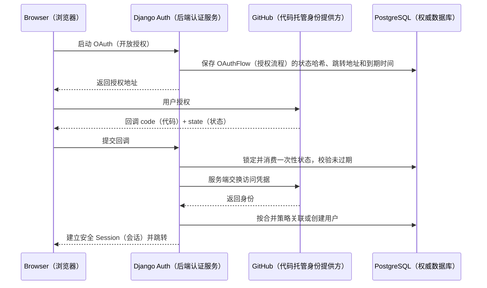
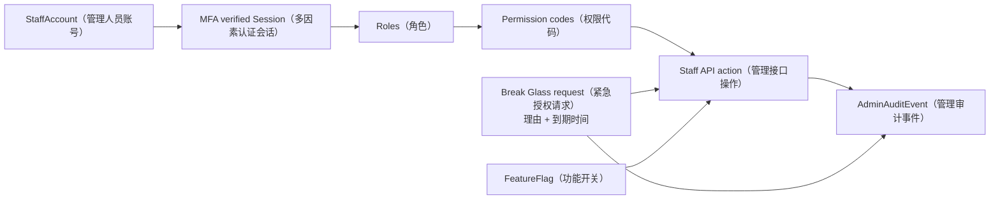
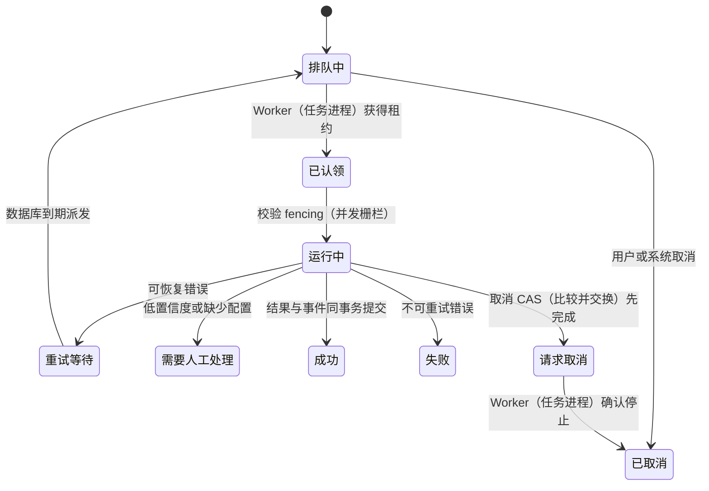
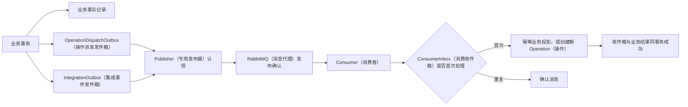
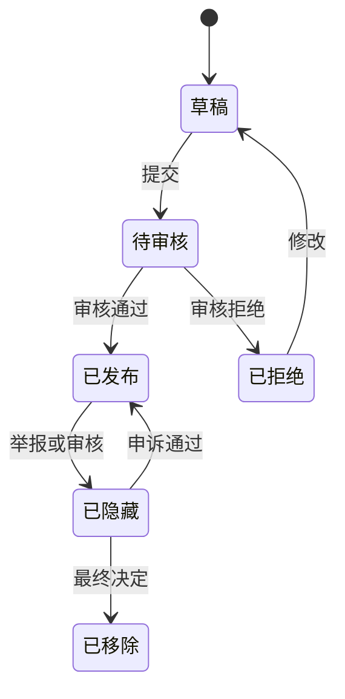
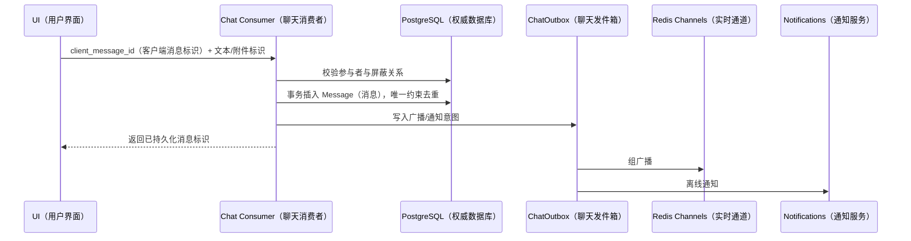
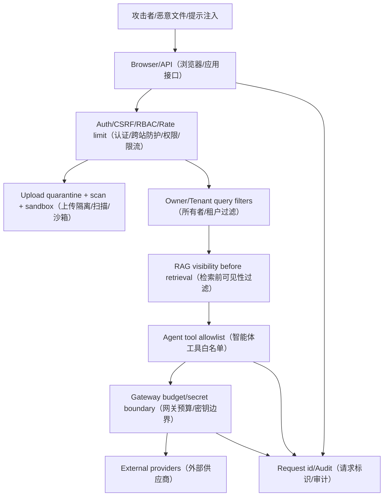
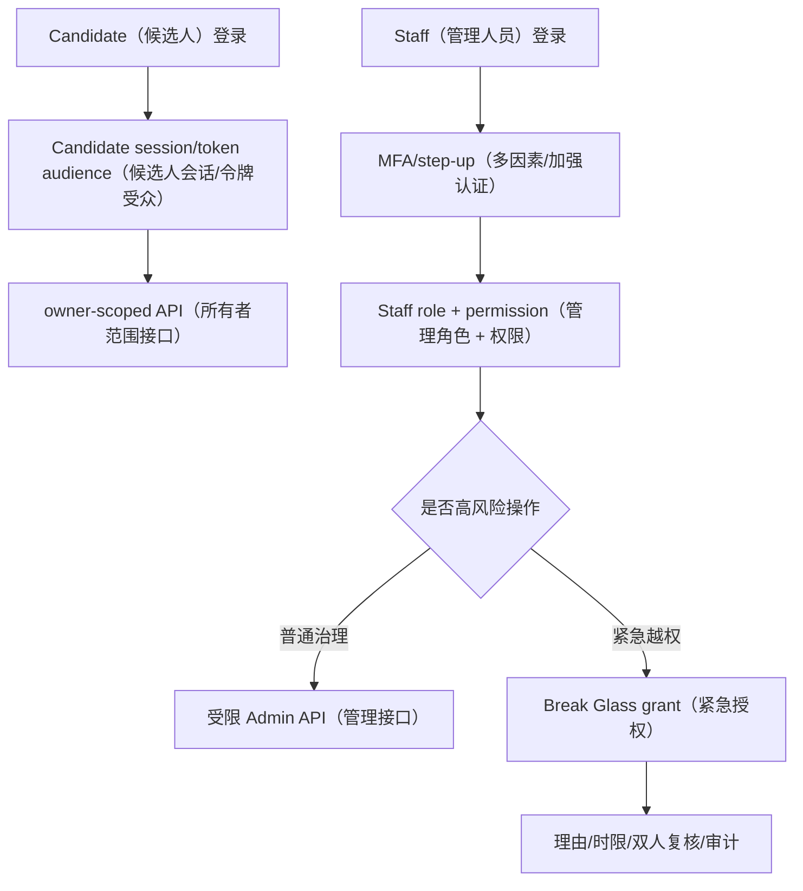
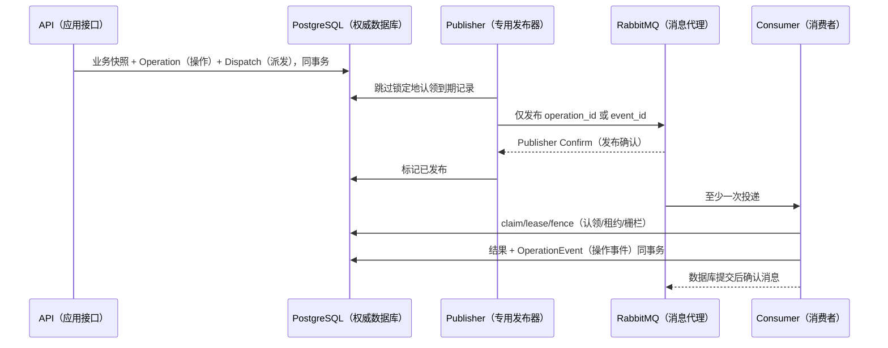
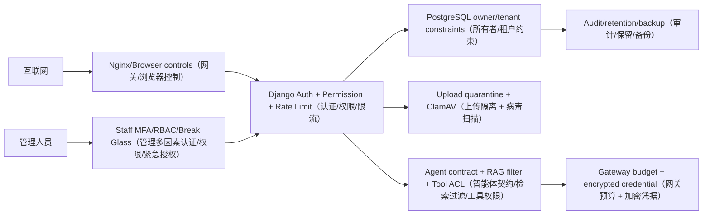

# 卷六：平台工程、可靠性、安全与运维

## 1. 平台卷解决什么

Career、Resume、Interview、Agent 解释了用户主链，但一个可长期维护的平台还需要：

- 身份、Session、OAuth、隐私和通知偏好；
- 独立 Staff 控制面与高风险访问；
- Community/Blog/Chat/Notifications 的内容与实时治理；
- 幂等、AsyncOperation、Outbox/Inbox、运行策略和限流；
- PostgreSQL、Redis、RabbitMQ、Celery、索引、对象存储和观测；
- 上传安全、Secret、审计、备份、故障响应和测试。

这些能力不是“基础设施附件”。例如一次 Resume 导出若没有 AsyncOperation、队列、对象安全和清理，就无法真正向用户交付；一次 Staff Agent 配置若没有 MFA 和审计，就会成为全平台 Prompt/模型密钥的高风险入口。

## 2. Candidate Identity

自定义 User 模型保存 email/username、基础资料、headline/location/availability、onboarding 状态等。迁移 `users.0005` 使用 `UniqueConstraint(Lower('email'))` 之类的数据库约束保证 email 大小写不重复，不能只在 serializer 中 `lower()`。

候选人认证涉及：

- CSRF cookie 获取；
- email/password 登录与 Session/令牌；
- profile/session 恢复；
- refresh/logout/blacklist；
- GitHub OAuth flow/callback；
- 隐私导出/删除请求；
- 通知偏好。

OAuth 用 `OAuthFlow` 保存 state/nonce/redirect/过期，回调校验后绑定 SocialAccount。不要把 GitHub access token返回浏览器或长期明文保存。OAuth 账号 email 与本地账号合并需要已验证 email 和显式策略，防账号接管。

观察重点：state 是一次性数据库记录，token exchange 在后端；redirect 受白名单约束。

面试时如何讲：解释 OAuth 防 CSRF、账号合并和 token 最小化，而不是只说用了 allauth。

## 3. Staff 独立认证、MFA 与 RBAC

Staff 不是 `User.role=admin`。`staff_admin` 有 `StaffAccount`、角色/权限、Session/邀请/恢复、MFA/Recovery、审计、Break Glass、Feature Flag 等模型和接口。前端也在 `ai-interview-admin/` 独立构建。

登录页明确“候选人账号无法登录此管理端”，要求员工邮箱、密码、MFA 动态口令或恢复码。MFA secret 加密保存；恢复码只存 hash，使用后作废；高风险操作可要求 recent MFA。

RBAC 使用权限代码而不是页面名。例如知识审批、Agent 配置发布、Gateway 凭据、隐私访问、Staff 管理各是不同 permission。角色只是权限集合。后端每个 action 检查权限，前端菜单隐藏不是安全控制。

观察重点：普通操作与 Break Glass 最终都进入审计；Feature Flag 只能控制暴露，不能绕过 permission。

面试时如何讲：用 Support 查看候选人隐私的例子说明最小权限、二次验证、理由、限时和复核。

## 4. 审计与防篡改

`AdminAuditEvent` 记录 actor、action、target、request id、原因、前后摘要、IP/UA hash、时间，并有 event_hash/previous hash 类字段形成链式证据。哈希链能发现离线修改，但不能阻止拥有数据库权限的人重算整条链；生产要将摘要/锚点外送到只追加存储或 SIEM，并限制表权限。

审计不应保存密码、TOTP、Provider secret、完整 Resume/回答。对大对象保存字段级 diff/hash 和安全摘要。审计查询本身也要授权与记录。

## 5. Break Glass

高风险访问流程：

1. Staff 有基础 permission；
2. 提交目标、operation reason、工单/事故号；
3. recent MFA；
4. 服务端签发短期 grant，只限 target/scope；
5. 每次访问验证 grant 未过期/未撤销；
6. 记录审计并通知安全/复核人；
7. 到期自动失效。

不能以一个长期 `is_superuser` 替代。生产目标可增加双人审批，但当前是否完整实现需以 Staff 模型/action 测试为准。

## 6. Core Platform：幂等与异步操作

`core.AsyncOperation` 原表已经就地演进为平台权威 Operation；为保持数据库表名和旧外键兼容，Python 类名本轮仍保留 `AsyncOperation`。它覆盖 `pending`、`claimed`、`running`、`retrying`、`review_required`、`cancel_requested`、`succeeded`、`failed`、`canceled`，并保存输入引用与哈希、结果引用与脱敏摘要、幂等键哈希、attempt 上限、下一次执行时间、lease owner/expiry/heartbeat、fencing token、状态版本、取消时间、correlation/trace、事件序号及开始/完成时间。

数据库约束保证：`claimed/running` 必须有有效 lease 字段，终态必须有 `completed_at`，attempt 不超过上限，进度不超过 100。所有状态变化只能经过 `create_operation_with_dispatch`、`claim_operation`、`heartbeat_operation`、`complete_operation`、`fail_operation`、`request_operation_cancel` 和 stale recovery 服务，Worker 与管理端不得直接更新状态。`IdempotencyRecord` 可关联同一个 Operation，异步响应的 Header、Body、events URL 和 result URL 使用同一个 UUID；同步请求不再伪造 Operation ID。

取消与完成采用确定性竞态：成功事务先提交时，后到取消返回终态冲突；取消 CAS 先成功时立即提高 fencing token，旧 Worker 的完成写入会被拒绝。lease 过期后新 Worker 获得更高 token，旧 Worker 即使稍后返回也不能覆盖新状态。前端任务中心聚合 Operation 和 Career `LearningTask`，但前者是系统执行，后者是用户行动。

面试时如何讲：以文档导入和 Agent 执行各举一次重复投递。

## 7. Outbox/Inbox

平台现在明确区分两种 Outbox（事务发件箱）：

- `OperationDispatchOutbox` 驱动 Resume、Career、Knowledge、Media、Community 等高成本命令；唯一约束为 `(operation, fencing_token)`，消息只包含 `operation_id`，queue/routing 由 allowlist handler registry（处理器白名单注册表）解析。
- `IntegrationOutbox` 发布已经发生的领域事实，保存 producer、aggregate、event type/version、严格 `EventEnvelopeV1`、payload hash、available time、attempt 和发布结果。递归敏感字段、深度、数组长度和总大小均受约束。

`OperationEvent` 是 append-only（只追加）耐久进度流，`(operation, sequence)` 唯一，状态变更与阶段事件同一事务提交；逐 Token 流只进入 Redis，Redis 丢失后从 PostgreSQL 快照与耐久事件恢复。`ConsumerInbox` 以 `(consumer_name, event_id)` 唯一，并具有 claim token、lease owner/expiry、fencing token 和 next attempt。数据库投影必须把“业务投影 + processed”放入同一事务；需要访问外部服务的消费者只创建 Operation + Dispatch，不在 Inbox handler 中直接产生不可恢复副作用。

Publisher 多实例用 `select_for_update(skip_locked)` 认领；Mandatory Routing（强制路由）与 Publisher Confirm（发布确认）失败时保留数据库记录并按 `available_at` 指数退避。业务重试也由数据库的延迟 Dispatch 统一调度，不维护第二套 Rabbit TTL 重试时钟。Confirm 后、数据库标记前宕机允许重复发布，最终由 Operation claim/fence、Inbox 和领域唯一约束保证只产生一次业务结果。

## 8. RuntimePolicy 与限流准入

`RuntimePolicy` 让 queue、并发、超时、降级等策略可配置。不同任务成本差异大：Career 聚合是 DB 读，Resume render 占 CPU/外部工具，Agent/评估占模型预算，媒体占带宽/存储。统一每用户请求数限流不足。

准入已经以 Coordination Redis（协调 Redis）中的 Lua 原子脚本组合判断，避免先扣一个维度、再被第二维拒绝：

- user/IP/tenant/enterprise/deployment request rate；
- 同一用户、企业、任务类型、模型 Deployment、OCR、Embedding、Rerank、Render、Media 并发槽；
- queue depth/oldest age；
- Gateway budget；
- 系统 dependency readiness；
- Staff emergency flag；
- 幂等复用已有 Operation。

租约带 owner token，renew 与 release 都校验所有者；但最终正确性仍由 PostgreSQL fence 与唯一约束保证。用户/企业配额或槽不足返回 `429 capacity_limited`；Coordination、安全依赖或队列背压不可用返回 `503 dependency_unavailable`/`503 async_backpressure`，并带 `retry_after_ms`、correlation ID 和可复用 Operation ID。Coordination 故障时安全流程和高成本写 fail-closed（安全关闭），普通只读继续。

## 9. Community 与 Revision

Community 原生模型覆盖 Content、Revision、Comment、Reaction/Bookmark/Follow、Topic、Challenge、Reputation/Growth、Moderation/Appeal、Webhook 等。正文与 Revision 分离使审核、编辑历史和撤回可追踪。发布只指向已审核 revision。

内容状态机：

互动计数可用异步聚合/每日 metric，但 Reaction 唯一关系是事实源。不能只增减 count 而没有用户关系，否则重试和取消会漂移。Webhook 发送走 Outbox、签名、重试/DLQ。

旧 `interactions` 的 Like/Bookmark/Follow 与 Community 模型重叠，标为 `legacy-compatible`。收敛要先统计调用、双读对账、迁移关系、切写入、再删旧接口。

## 10. Blog

Blog 有 Category、Tag、Post、Comment、推荐/统计与 DailyPostStats。它适合平台文章，不承担用户社区全部审核语义。Post 的发布状态、作者、slug、时间、标签关系是权威；bookmark_count/统计是派生。

Blog 与 Community 的边界应按内容来源/治理决定，而不是都叫“文章”就合表：官方长文可在 Blog，用户原生内容在 Community。跨域展示用读模型或事件同步。

## 11. Chat

Chat 由 Conversation、Participant/ParticipantState、Message、MessageAttachment、Block/Report 与 ChatOutbox 组成。ParticipantState 保存每用户已读/隐藏/静音等状态，避免在 Conversation 上存一个全局 unread。

发送消息：

观察重点：先持久化再广播；attachment 必须扫描完成；block/report 在服务端检查；离线通知不依赖 WebSocket 在线。

面试时如何讲：说明 Redis channel 丢失后用户刷新仍从 PostgreSQL 补消息。

## 12. Notifications

Notification 保存用户、类型、标题/内容、data/link、read/created；NotificationOutbox 保存业务事件到通知投递的状态。用户偏好控制类别/渠道/免打扰。发布异步化，业务事务只写 outbox。

通知是 at-least-once，前端以 notification id 去重；未读计数来自数据库/缓存投影。链接必须是白名单内部 route，不能把外部不可信 URL直接渲染。删除源对象后通知仍可显示安全摘要，点击给出已失效。

## 13. PostgreSQL

PostgreSQL 16 是唯一关系运行库。连接 URL 经 `postgres_database_config()` 解析；可配置 conn max age、pool、server-side cursor。核心职责：

- 外键、唯一/check 条件约束；
- JSONB 版本内容/配置/trace；
- transaction/row lock；
- outbox/inbox；
- Staff 审计；
- Agent 业务执行。

Agent checkpoint、LiteLLM、Langfuse 等可有独立数据库/role，避免 schema/权限混用。生产 role 应分 owner/migrator/app/read-only/backup，app role 不应建库或读其他 DB。

索引以查询为证据：Career `(user,status,next_action)`、Outbox pending、Execution status/heartbeat、Knowledge revision/status、Ledger user/task/time。JSONB 大字段避免 SELECT *，列表用 projection。

## 14. Redis

开发与预发布 Compose 已将 Redis 拆为三个进程/故障域，而不是同一实例的 DB number：Cache 使用 `allkeys-lfu`，Coordination 与 Realtime 使用 `noeviction`。生产契约是三个托管故障域、`rediss://`、分域 ACL 服务账户和最小权限；本地单节点只能验证语义，不能作为生产 HA 证据。

唯一 Key Builder（键构造器）输出 `ifaceoff:<env>:<domain>:<tenant-or-global>:<resource>:v<schema>:<opaque-id>`。邮箱、IP、Token 等先 HMAC/hash；Coordination/Realtime Key 必须有 TTL；新 Key 写入与旧 Key 双读最多一个 24 小时 TTL 窗口。在线清理只能 namespace SCAN，禁止 `KEYS *`。

Key 例：

- `ifaceoff:prod:cache:tenant-42:career-dashboard:v2:<hash>`；
- `ifaceoff:prod:coord:global:admission:v1:<hmac>`；
- `ifaceoff:prod:realtime:tenant-42:operation-events:v1:<uuid>`。

验证码的值与 TTL 在一个 Lua/事务操作中写入，并带 resend generation；WebSocket Ticket 在一个 Lua 调用中完成 scope/resource 校验与原子消费，错误资源请求不会提前耗尽合法 Ticket。Single-flight leader lease 位于 Coordination，缓存结果位于 Cache；非 leader 只等待有限 deadline。Redis Stream 配置长度和 TTL，丢失后回到 PostgreSQL OperationEvent/Execution Snapshot。

## 15. RabbitMQ 与 Celery

稳定 Exchange（交换机）仍为 `ifaceoff.commands`、`ifaceoff.events`、`ifaceoff.dlx`；新队列统一使用 `ifaceoff.v2.*`，避免旧同名队列参数不兼容。Agent、Career、Documents、Resume Render、Media、Moderation、关键 Events 使用 Quorum Queue（仲裁队列），Notifications/Search 使用可重建的普通持久队列。关键队列配置 delivery limit、max length/bytes、`overflow=reject-publish` 与按域 DLQ（死信队列）。

Publisher/Recovery、Agent、Career、Document/OCR、Resume Render、Media/FFmpeg、Community Moderation、Events、Notification/Search 和单副本 Beat 分组部署；Document 不再与 Media 共用 Worker，Publisher 不再与 Notification 共用。全局 `prefetch=1`、late/manual ACK（延迟/手工确认）、worker-lost reject、soft/hard deadline 和子进程回收已配置。

本轮不再宣称存在 Rabbit TTL Retry Queue：业务错误由 PostgreSQL `OperationDispatchOutbox.available_at` 延迟重试，RabbitMQ 只负责运输、Worker 崩溃 redelivery（重新投递）和 delivery limit 后的 DLQ。管理端已经区分数据库 `OperationDispatchOutbox/IntegrationOutbox` 的 dead 记录与 Broker DLQ；真正的 Broker DLQ dry-run/replay（试运行/重放）尚未完整接通，状态为 partial/pending-verification（部分完成/待验证）。旧 406 队列采用新 vhost/版本队列蓝绿迁移，必须先 passive inventory（被动盘点）ready/unacked/consumer/binding，再 canary、排空或受控 shovel；禁止直接删除含消息的旧队列。详见 [[10-运行与故障手册]]。

## 16. Qdrant、Meilisearch、LiteLLM、Langfuse

Qdrant/Meili 是可重建索引，健康检查不仅 ping，还要 query/upsert 权限、collection/index schema 和 lag。LiteLLM 是 provider proxy，可有独立 PostgreSQL；业务 Gateway 仍保存租户策略和账本。避免业务层与 LiteLLM 两边都进行不透明重试。

Langfuse/ClickHouse 用于 LLM trace/指标。trace id 与业务 Run/Ledger 关联；脱敏后发送；观测失败不应阻断核心交易，但高风险评估若审计为强制可 fail-closed。保留期按隐私政策。

## 17. 对象存储、ClamAV、FFmpeg 与 Nginx

对象存储保存 Resume source/artifact、Knowledge source、Chat attachment、Interview media。bucket/prefix 按用途和敏感级别分；默认 private；下载短签；服务端加密/生命周期；数据库保存 key/hash，不保存公开 URL。

ClamAV 扫描是上传安全一环，不代替 parser sandbox。FFmpeg 处理不可信媒体要限制时长、分辨率、codec、CPU/内存和命令参数，禁止 shell 拼接。Nginx 限制 body、timeout、rate，正确代理 WebSocket/SSE（禁缓冲/适当 read timeout）。

## 18. 威胁模型

主要威胁：

- IDOR 读取其他用户 Resume/Session/Run；
- Staff 账号接管或权限扩大；
- OAuth state/redirect 攻击；
- 上传恶意文档、压缩炸弹、FFmpeg/解析器漏洞；
- RAG 跨租户和 prompt injection；
- 模型密钥泄漏和成本滥用；
- WebSocket/SSE 订阅未授权 run；
- Outbox payload/日志泄 PII；
- 公开分享 token 猜测和无限下载；
- Break Glass 无理由/无复核。

## 19. Secret 管理

Secret 通过部署环境/Secret manager 注入：Django SECRET_KEY、数据库、Staff MFA encryption、Provider key、OAuth secret、对象存储、Meili master、LiteLLM master/salt 等。`.env.example` 只放占位；文档和截图不含值。

轮换策略：

- 数据库/对象凭据支持双凭据窗口；
- ProviderCredential 新建切 deployment，再停旧；
- encryption key 轮换需 key version/重加密；
- Django SECRET_KEY 影响 session/token，需计划；
- 泄漏时撤销、审计、扫描 Git history、通知。

本地 fixture 密码和 TOTP 只从进程环境读取，命令输出只说明“来自环境”，不打印明文。

## 20. 隐私与保留

数据分类：公开职位/文章；账号资料；Career/Resume；回答/报告；媒体；Staff 审计；模型 trace。保留和删除不能一刀切：

- 用户删除：主对象、对象存储、索引、checkpoint、缓存、观测 trace；
- 合规审计：按合法期限保留最小元数据，正文脱敏；
- 分享访问：hash 化 IP/UA，短期保留；
- 媒体：默认短于文字报告；
- 备份：删除有延迟窗口，要在政策说明；
- 模型 Provider：配置不训练/保留策略。

## 21. 可观测性

每个请求生成/透传 Request、Trace 与 Correlation ID，Operation、两类 Outbox、Celery task、Agent Execution/Run、Gateway Request/Attempt 和 Langfuse trace 通过关联 ID 串联。内部 `/internal/metrics` 不经公网 Nginx 暴露；指标不得以 user、tenant 或 Operation UUID 作为高基数 label，也不记录正文。

关键指标：

- HTTP rate/error/p95，按 route/status；
- DB pool/slow query/lock/dead tuple；
- Redis eviction/memory/stream lag；
- RabbitMQ ready/unacked/oldest/DLQ/consumer；
- Celery runtime/retry/failure/worker heartbeat；
- Agent execution state age/SSE replay/fallback；
- RAG index lag/empty context/cross-tenant rejects；
- Gateway budget/attempt/fallback/cost；
- upload scan/parse/transcode failures。

readiness 以 capability（能力）返回，不再把可选依赖压成一个布尔值：`ordinary_reads`、`security_flows`、`expensive_writes`、`async_acceptance`、`realtime` 可分别为 ready/degraded/blocked。探针覆盖 Cache SET/GET/DEL、Coordination Lua/TTL/write、Realtime XADD/XREAD/EXPIRE、Rabbit 拓扑等价性、关键 queue consumer、Publisher 与最老 Dispatch/Outbox；当前代码和 Compose 契约已具备，真实 Broker/Worker 指标采集与告警仍待 Docker/预发布环境验证。

## 22. 备份与恢复

PostgreSQL 做基备/WAL 或逻辑备份，必须演练到独立环境并执行模型级验证。对象存储启用版本/复制并对数据库 key 抽样。Qdrant/Meili 可从 PostgreSQL重建，但重建耗时纳入 RTO。Redis cache 不备份也能恢复；协调/实时需按业务容忍度决定持久化。

恢复顺序：数据库与 Secret → 对象存储 → Django read-only 验证 → Worker/Outbox → 索引重建 → 实时/外部 provider。不要先开 Worker 消费旧消息再验证 schema。

## 23. 测试策略

测试金字塔：

- 单元：hash、状态、contract、切块、RRF、budget；
- Model/DB：约束、事务、并发、migration；
- API：auth/owner/RBAC/CSRF/idempotency/error；
- Task：真实 broker/worker 与重复投递；
- Integration：PostgreSQL、Redis、Qdrant、Meili、Object/ClamAV；
- E2E：Candidate/Staff 页面与 API 数据；
- Security：IDOR、上传、OAuth、WebSocket/SSE、prompt injection；
- Reliability：kill worker、broker down、Redis eviction、index drift；
- Capacity：k6 请求/队列/Agent 并发。

本轮本地证据为：Django 全量发现 295 项，其中 293 项通过、2 项外部 PostgreSQL Checkpoint 测试因未启用集成环境而显式跳过；`manage.py check`、`makemigrations --check --dry-run`、Candidate/Admin 两个生产构建、四组 Compose config 与聚焦并发/状态机/Redis/模型网关测试通过。Docker daemon 不可用，因此真实 Rabbit/Redis/Celery 容器、三节点 Quorum 故障、外部 Checkpoint、500 用户负载与灾备演练均为 pending-verification，不能用静态 Compose 或页面 heading 代替。

## 24. 部署与回滚

部署顺序：

1. 备份/检查 migration；
2. 部署向后兼容 schema；
3. 运行 migration；
4. 部署 Django；
5. 验证 read/write/readiness；
6. 部署 Workers/Beat 并检查队列拓扑；
7. 部署 Candidate/Staff/Nginx；
8. 运行 smoke/E2E；
9. 逐步开 Feature Flag。

回滚代码前确认新写数据是否旧代码可读；破坏性 schema 分 expand-migrate-contract 三阶段。队列、Prompt、索引和 Gateway policy 也需要版本回滚，不只回滚容器镜像。

## 25. 当前生产差距

- 单机/本地 Compose 不是多 AZ；
- 三 Redis 进程和 ACL/TLS 契约已落代码，但托管多故障域、容量告警与故障切换尚未验收；
- `ifaceoff.v2.*` 拓扑已落代码，旧队列 passive inventory、受控 shovel 与三节点故障演练待预发布验证；
- Broker DLQ 监控和受控 replay 尚未完成，数据库 dead record 不能冒充 Broker DLQ；
- 外部 PostgreSQL Checkpoint 与真实 Worker 本轮未完整跑通；
- Beat 仍要求单副本，没有独立 leader lease；
- 没有当前完整容量基线；
- 备份/恢复与灾备演练证据不足；
- Secret manager、外部 trace 脱敏、隐私删除全链仍需生产验收；
- Community/Chat 审核与滥用防护需要规模验证。

这些应作为 Roadmap，而不是用 `production_readiness=90%` 之类无证据数字掩盖。

## 26. 30 秒口述卡

“平台层把候选人身份和独立 Staff/MFA/RBAC 分开，用 Idempotency、AsyncOperation、Outbox/Inbox 和数据库约束保证可重试；RabbitMQ/Celery 承担异步，Redis 按缓存/协调/实时拆故障域，PostgreSQL 保存权威状态，索引和对象都是投影。上传经隔离扫描，模型密钥走 Gateway，所有 Staff/Agent/模型调用用 request/run/ledger id 串审计。”

## 27. 2 分钟口述卡

从 Candidate 与 Staff 双身份讲安全；用 Outbox/Inbox 讲至少一次；讲 Redis 三域和 RabbitMQ 队列迁移；讲 Community/Chat/Notification 的持久化后广播；讲 Secret、上传、审计、备份和部署。最后列出当前从零迁移成功与 Worker/页面真实缺口。

## 28. 连续追问

**Outbox 会不会无限增长？** 
按状态/时间分区或归档，publisher 索引 pending，成功事件设保留期；审计需要的摘要另存。清理前确认消费者和重放策略。

**Redis 全挂怎么办？** 
缓存回源；协调/实时进入 degraded/readiness failure，停止新 Agent/高风险任务；业务状态仍在 PostgreSQL；连接恢复后按 Execution/Message/Event 快照重建。

**RabbitMQ 队列参数为何不能直接改？** 
durable queue 的 DLX 等声明参数是协议身份的一部分，同名不等价会 406，防止客户端误接错误语义；必须迁移队列/vhost。

**审计哈希链是否绝对防篡改？** 
不是。它能发现局部修改；管理员可重算。要外部只追加锚定、权限隔离和备份。

**如何删除用户 RAG 数据？** 
事务标记/删除主库 revision，Outbox 触发 Qdrant/Meili/object/checkpoint/trace 清理，记录 tombstone 和重试，查询先按主库/tenant过滤防删除窗口泄漏。

## 29. 身份链路：Candidate 与 Staff 为什么不能共用一个“is_admin”

候选人注册、登录、GitHub OAuth、隐私请求和通知偏好服务于个人求职闭环；Staff 管理 Agent 配置、
知识发布、模型凭据、审计和运维，风险等级完全不同。把两者放进同一登录页面、同一 token audience
或一个 `is_staff` 布尔值，会让前端误路由、Cookie 作用域、会话撤销和审计主体都变得含糊。

Candidate 请求仍需 owner permission：已登录并不等于可读任意 Resume/Interview。Staff 也不是天然
可见所有候选人正文；RBAC 应按 resource/action/tenant 决定，敏感操作要求 MFA freshness，
Break Glass 是有时间、理由、范围和复核的例外，而不是超级管理员后门。页面隐藏按钮只是体验，
服务端 View/permission 与对象过滤才是边界。

观察重点：身份、角色、对象权限和临时高权限是四层，不由一个字段替代。

面试时如何讲：选“查看 Agent Trace”和“轮换 ProviderCredential”两个操作，说明为什么后者需要
更强的 MFA、审计和最小权限；再讲候选人删除请求为什么不能被普通运营随意读取。

密码与 TOTP seed 不能进入文档或 seed 默认值。本次 `seed_documentation_demo` 只在 DEBUG 且
`ALLOW_DOCS_DEMO_DATA=1` 时运行，临时密码/TOTP 由进程环境传入；namespace 让重复执行复用数据并
可定向清理。这个命令是本地维护接口，不是生产 bootstrap。

## 30. Outbox/Inbox 的数据库视角

高成本命令的业务输入快照、Operation 和 `OperationDispatchOutbox` 同事务创建；已经发生的领域事实
则由 `IntegrationOutbox` 发布。publisher 以 `select_for_update(skip_locked)` 批量认领到期记录，
通过 handler allowlist 确定固定队列，使用持久消息、Mandatory Routing 与 Publisher Confirm。
若 Confirm 后进程崩溃，记录仍可重发，因此 Operation claim/fence、Inbox 和领域唯一约束共同处理重复。

观察重点：Outbox 解决“数据库提交与消息发送”之间的丢失窗口，不消除重复；Inbox/业务唯一约束
解决重复消费。

面试时如何讲：主动讲 publisher 在 confirm 后宕机的窗口，说明为什么系统选择至少一次，再给出
consumer 的唯一键和事务顺序。不要说“RabbitMQ 保证恰好一次”。

两类 Outbox 均有 pending/available/attempt 索引；Operation Dispatch 的消息不携带正文，Integration
Event 只传必要 ID、状态和有限摘要。Operations 页面已展示数据库 dead/retry/stale lease，但 RabbitMQ
Broker DLQ 的读取与受控 replay 仍为部分完成，必须等原 exchange/routing/header 校验、Confirm、失败不
ACK 原死信、权限/幂等/原因和审计全部接通后才能称为已实现。

## 31. Community、Blog、Chat 与 Notification 的连续链路

用户发布 Community 内容时，当前 revision 与历史 revision 分开能支持编辑审核和申诉。互动关系、
声誉与挑战属于社区域；旧 `interactions` 点赞/收藏/关注和 `questions` 题库是兼容层，应通过适配
或迁移逐步收敛，不能让两个计数源永久双写。Blog 更偏公开内容、分类标签、评论和统计；与 Community
共用展示组件不意味着数据生命周期相同。

Chat 的权威顺序在数据库消息，不在 WebSocket。发送请求先校验会话成员、屏蔽/举报和附件状态，
写 Message 与 Chat Outbox，再广播。接收方离线时消息仍存在；重连按 last message id 拉取缺口。
附件必须先隔离扫描，不能因它来自登录用户就直接公开对象 URL。删除/撤回也要保留最小审计和对
参与者一致的 tombstone 语义。

Notification 是下游投影：社区回复、面试完成或任务失败产生领域事件，通知消费者依据
NotificationPreference 建站内通知/邮件等投递。偏好是在投递时读取还是在事件时 snapshot，需要
明确产品语义；安全告警不能被普通营销偏好关闭。投递 Outbox 的重复执行以 notification/event/
channel 唯一，邮件 Provider 失败与站内通知失败分开记录。

| 链路 | 权威状态 | 实时/异步层 | 典型一致性规则 |
|---|---|---|---|
| Community edit | Content + Revision | 审核/搜索投影 | 当前 revision 指针 |
| Chat send | Message | WebSocket broadcast | client id/sequence 去重 |
| Notification | Notification | delivery outbox | event+recipient+channel 唯一 |
| Legacy interaction | 收敛目标模型 | 兼容 adapter | 禁止永久双写无对账 |

## 32. Redis 三故障域的运行含义

开发/预发布 Compose 现在使用三个 Redis 进程，Cache、Coordination、Realtime 不再只是 DB number。
这验证了不同 TTL、eviction、ACL 与降级语义，但单主机仍不是高可用。生产目标是三个托管故障域；
任何“HA 已验证”声明都必须来自多节点故障与恢复证据，而不是本地 Compose。

Cache 可以丢，恢复时回源 PostgreSQL；key 必须包含 schema/tenant/version，避免旧结构污染。协调
键承载限流、semaphore（信号量）、single-flight lease（单飞租约）时，丢失可能导致并发执行，业务仍需数据库 fence/唯一约束；Redis 锁不是
最终正确性。Realtime pub/sub 只做低延迟通知，断线缺口从 Chat Message/Agent Event 的 durable
store 补。把 SSE 权威序号只放 Redis 会在重启后无法恢复。

内存满时不同域的正确动作不同：Cache 可以 eviction；coordination 不应随机淘汰关键 lease；
realtime 可以丢瞬时广播但要告警。Readiness 也应按能力表达：缓存不可用可保持 ready/degraded，
幂等协调或 Agent event 依赖不可用可能拒绝高风险新任务。

## 33. RabbitMQ 406 的现场含义和安全处理

本次文档环境的 Worker 连接默认 vhost 时，Broker 对 `celery`/`notifications` 队列返回
`PRECONDITION_FAILED (406)`：已有 durable queue 的声明参数与当前代码期望的 DLX 参数不一致。
RabbitMQ 把 durable queue 的这些参数视作身份，拒绝客户端用同名队列偷偷改变语义。这不是网络
不通，也不是重启 Worker 能解决。

代码侧已通过 `ifaceoff.v2.*` 新队列名避免对旧同名队列做参数覆盖；但真实环境仍必须执行以下安全迁移：

1. passive 查询 queue arguments、message count、unacked、consumer 与 bindings。
2. 确认 vhost/queue 的所有者和数据是否可丢，生产必须有变更窗口与回滚。
3. 在隔离 vhost 声明稳定 exchange、`ifaceoff.v2.*` queue、按域 DLQ，再启动 canary consumer（小流量消费者）。
4. 停止旧生产者，排空/受控 shovel 旧消息，验证业务幂等。
5. 观察新队列后才删除旧队列；删除动作另行授权并审计。

本轮没有删除默认 vhost 的任何现有队列。四组 Compose config 已通过，但 Docker daemon 不可用，
所以 passive inventory、隔离 vhost、canary、排空/shovel、每队列消费者 readiness 与 Broker DLQ
仍标记 pending-verification。静态配置通过不能替代真实 Broker 验收。

## 34. PostgreSQL 备份恢复不是“有一个 dump”

备份策略要先定义 RPO/RTO、数据域与加密。业务库、Agent checkpoint 库、对象存储和搜索/向量索引
的恢复优先级不同：PostgreSQL 是权威源，Qdrant/Meili 可从 revision 重建；对象文件若不可再生则
必须纳入独立版本/复制；checkpoint 可丢的范围由正在执行任务的恢复承诺决定。

一次合格演练包括：在隔离环境验证备份 hash/解密；恢复数据库；运行 migrations/check；
核对行数与关键约束；重建索引到新 physical collection/index；验证对象引用；启动只读冒烟；
再验证写入和 Outbox backlog。恢复脚本成功退出不等于业务恢复，必须用候选人/Staff关键流程验收。

PITR 场景要处理“数据库回到 T0，但对象/消息已经到 T1”的时间错位。稳定对象 key 和可重放事件能
帮助 reconciliation；恢复后先冻结外部副作用，确认 Outbox/Inbox/Artifact/Ledger，再逐步开放。
任何生产恢复都记录操作人、时间、备份 id 和验证结果。

## 35. 威胁模型按数据流展开

公开入口面对凭据填充、OAuth state 劫持、注册滥用和 CSRF；Candidate API 面对 IDOR、批量枚举和
公开 ShareLink 泄漏；上传面对恶意文件、压缩炸弹和解析器漏洞；Chat/Community 面对 XSS、垃圾内容
和骚扰；Agent/RAG 面对 Prompt Injection、跨租户检索和工具滥用；Staff/Gateway 面对 MFA 绕过、
Secret 泄漏与高权限误操作。

防护必须落在对应边界：

- 浏览器：Secure/HttpOnly/SameSite Cookie、CSRF、CSP、输出编码和受控 CORS。
- API：认证、对象权限、限流、字段白名单、幂等和一致错误语义。
- 数据：tenant/owner filter、加密、保留期、备份权限和审计。
- 上传：隔离区、大小/类型/解压限制、ClamAV、解析 sandbox、短期签名对象。
- AI：system/untrusted context 分层、结构化输出、tool registry 权限、RAG filter、Gateway Secret。
- Staff：独立 audience、MFA freshness、RBAC、Break Glass、双人复核和不可忽略告警。

观察重点：没有一个“安全中间件”能覆盖所有数据流；每层阻止不同攻击并留下不同证据。

面试时如何讲：选择一个恶意简历文件和一个 RAG prompt injection，分别走完上传与 AI 链，证明
你能把安全要求翻译成模型字段、任务状态和权限代码，而不是只说 HTTPS/JWT。

## 36. 可观测性：一条业务链应该怎样被找到

Nginx/Django 生成或透传 request id；异步创建 operation/outbox/dispatch id；Agent 有 execution/
run/node/event；RAG 有 revision/retrieval trace；Gateway 有 ledger/attempt。日志以这些 id 关联，
指标按 endpoint/task/model/status 聚合，但不要把邮箱、简历全文、Prompt Secret 当 label 或默认
日志字段。

核心 SLI 可按产品承诺定义：

| 能力 | SLI | 告警线索 |
|---|---|---|
| Candidate API | 成功率、P95、5xx | endpoint/request id |
| Resume render | 接受到 ready 的耗时、失败率 | queue/artifact/renderer |
| Interview Agent | queue wait、execution age、event gap | execution/run |
| RAG | ready latency、zero-result、degraded rate | revision/profile |
| Gateway | success、fallback、unknown usage、cost | alias/deployment/ledger |
| Notification | event 到站内/外部投递延迟 | event/channel |

Liveness 只说明进程能运行；readiness 应验证此实例是否可接流量；dependency health 独立暴露
PostgreSQL、Redis、Broker、对象/索引/模型状态。不要因可选 Langfuse 挂掉让整个 Candidate API
退出，也不要在 checkpoint 必需时仍返回绿色总健康。

## 37. 发布、回滚与 Schema 兼容

数据库迁移遵循 expand/migrate/contract：先加可空字段/新表并让旧代码仍工作，再回填并切读写，
最后在确认没有旧实例后收紧约束/删除旧字段。`resumes.0008` 的修复说明 migration operation 顺序
也属于运行代码：RunPython 使用历史模型时，所需字段必须先由 AddField 建立。MigrationExecutor
从 0007 带历史数据迁移，才能覆盖这个真实窗口。

前端和后端发布不原子，所以 v1/v2 contract 要有兼容期。消息 event 有 schema version，消费者要
支持 N/N-1 或使用新 routing key；队列 topology 通过版本化迁移。Agent graph/prompt/knowledge/model
都固定 revision，回滚应用代码时已有 Run 仍能按旧版本完成或显式迁移。

回滚前检查是否已有不可逆写入、新 migration、对象格式、消息和索引 revision；不能只把容器镜像
换回去。若数据库已写新字段，旧代码读取是否安全必须在发布前测试。回滚后的 Outbox/任务也要按
旧消费者能理解的 schema 处理。

## 38. 面向面试的“当前状态”回答

可以确认的当前证据包括：独立 PostgreSQL 从零完成 migrations；Resume 0008 空库和 0007 历史数据
回归通过；Django system check 通过；合成 seed 两次运行保持身份稳定；当前 Candidate/Staff 页面
完成 28 张 1440×900 截图；前后端关键路由和模型可由事实索引追踪。

不能宣称的包括：默认 RabbitMQ vhost 上 Worker 全链运行；Resume v2 页面已正确展示 seed；
Interview 报告所有字段完整；Staff Agent Config 当前可用；Gateway 真实付费 Provider 可调用。
这些分别被 406、双版本 URL、fixture 缺口、白屏和无凭据策略阻塞。清晰说出边界并给出下一步测试，
比使用“基本完成”更可信。
