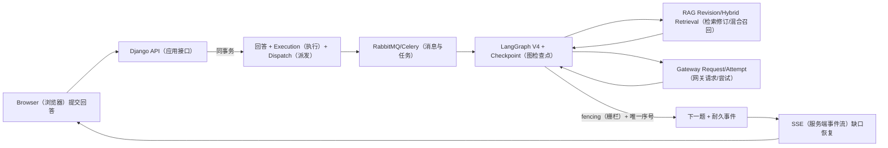

# 项目面试题与连续追问

## 使用方法

每道题不要背“标准答案”。先用 20 秒给结论，再用项目对象和执行链证明，最后主动补一个失败窗口和当前限制。推荐结构：

`业务问题 → 当前实现 → 代码/模型证据 → 一致性/失败 → 取舍与演进`

如果只说“用了 Redis、Celery、LangGraph、RAG”，追问两次就会暴露。下面共 72 题，按产品、全栈、数据、异步、Agent、RAG、Gateway、安全、测试运维分类。

## 一、产品与项目真实性（1～8）

### 1. 用 30 秒介绍 iFaceoff。

iFaceoff 是证据驱动的 AI 求职闭环：候选人把已确认经历保存为 `CareerFact`，围绕 `JobTarget` 创建 `ResumeVersion`，基于岗位/简历快照进行 `InterviewSession`，评估再形成 `AbilitySnapshot` 与 `LearningTask`。前端有候选人和 Staff 两套 Vue，后端用 Django/PostgreSQL、RabbitMQ/Celery、LangGraph、Qdrant/Meili 与模型 Gateway。当前已补齐统一 Operation、V2 队列与 Redis 三域代码；真实 Broker/Worker、多节点故障和负载仍待外部环境验证。

追问：为什么不叫 AI 面试题库？因为题目只是闭环中一环，输入事实、版本、执行恢复、报告行动与平台治理才是工程主体。

### 2. 这个项目解决了什么真实痛点？

求职事实、岗位、简历、面试反馈和学习计划彼此断裂，单次 AI 生成不可追溯。项目用稳定 ID 和版本把它们连接，并要求 AI 输出回到可审阅对象，而不是覆盖用户内容。证据是 Career/Resume/Interview/Career learning 的外键链。

追问：用户录入事实太重怎么办？导入和 GitHub/面试可产生 draft Fact，但确认权仍给用户。

### 3. 核心闭环怎样证明不是 PPT？

`CareerFact`、`JobTarget`、`JobApplication.resume_version`、`InterviewSession`、`LearningTask.interview_session`、`AbilitySnapshot.source_refs` 都是当前模型；Resume/Career 高成本入口已在事务内创建领域快照、Operation 与 Dispatch。数据库有表仍不等于产品完全可用，当前缺少 Docker 真机 Worker、完整 Playwright 与容量证据。

追问：数据库有表是否等于产品可用？不等，必须看 API、页面、任务和 E2E。

### 4. 项目最有技术含量的三点是什么？

一是 Resume 内容/草稿/设计/制品/证据版本分离；二是 Agent V4 strict contract + checkpoint + durable execution + SSE；三是 RAG 双索引与 Gateway 路由/预算/账本。共同主题是“让不确定 AI 进入可恢复、可审计业务系统”。

### 5. 你如何避免夸大项目？

使用 implemented/partial/legacy-compatible/target-design/pending-verification 五种状态；每个结论指向代码和运行证据。比如可以说 V2 拓扑与 Agent lease/fence 代码、单元测试和 Compose config 已通过，但不能说三节点 RabbitMQ、真实 Worker kill/recover 或生产 HA 已验证。

### 6. 为什么有独立 Staff 端？

Staff 管 Prompt、知识、Gateway 和隐私，风险远高于候选人操作。独立 `StaffAccount`、MFA、Session、RBAC、Audit 和 Vue 应用缩小候选人 token 横向风险。菜单隐藏不是权限，Staff API action 仍检查 permission。

### 7. 企业招聘能力完成了吗？

有 Company、Verification、Member、JobPosting/Revision 和 employer endpoints，属于部分实现；本轮没有企业入驻到投递的完整真机 E2E，所以不描述成成熟 ATS。演进需要 company scope、审核、职位发布、候选授权和数据隔离验收。

### 8. 你在本次复盘发现了什么真实问题？

历史复盘曾发现 Resume Axios v1 base 拼 v2 path、`resumes.0008` 回填顺序、RabbitMQ 旧同名队列 406、Staff 契约与截图偏差。本轮进一步发现并修复了关键命令绕过 Outbox、Operation 无统一 lease/fence、虚假的 TTL Retry Queue 声明、数据库 Dead 与 Broker DLQ 文案混淆、Redis 安全状态落在可淘汰缓存、Chat/ASR/TTS 模型网关旁路；仍保留真实环境待验证清单。

## 二、全栈请求与 API（9～16）

### 9. 从 Dashboard 页面讲一次 GET。

`Dashboard.vue` 调 `/api/v2/career-dashboard/`，Axios 带 cookie/CSRF，根 URL 分发到 `CareerDashboardView`；View 以 `request.user` 聚合 JobTarget、confirmed CareerFact、Resume、Application 和 LearningTask，DRF 返回读模型。Redis 可缓存，但 PostgreSQL 各表仍是权威。

### 10. View、Serializer、Service、Task 如何分工？

View 管认证/权限/HTTP；Serializer 管结构和跨字段；Service 管领域事务；Task 按稳定 ID 执行耗时副作用并写 Operation。把模型调用塞 Serializer 会让超时、重试和审计失控。

### 11. v1/v2 为什么并行？

渐进迁移降低一次性破坏，v2 可引入新模型契约；代价是 client、OpenAPI、弃用和 base URL 复杂。Resume 当前 bug 就是代价。收敛需要调用统计、deprecation header、迁移 E2E 和删除日期。

### 12. Cookie/CSRF 与 JWT/Session 怎么理解？

浏览器使用 cookie 时写请求必须 CSRF；token 也需安全存储/刷新/撤销。前端 router 恢复 session 只改善体验，后端每次 API 仍认证。Staff 用独立 Session/MFA，不复用候选人令牌。

### 13. 为什么 404 不能都转为空数组？

空数组表示合法“没有资源”，404/503 表示路由/依赖故障。Resume 把 404 catch 成空集合，让用户误以为没简历。正确错误契约包含 code、message、request_id、retryable，页面显示故障与重试。

### 14. 如何防 IDOR？

所有 queryset 以 `request.user`/Company membership/Staff permission 过滤；取对象时也用 scoped queryset。UUID 不能替代授权；SSE/WebSocket handshake 和每次资源访问都检查 owner。

### 15. 前端怎样避免重复提交？

按钮 loading 只是体验，服务端仍用 Idempotency-Key、当前状态/sequence 条件和唯一约束。相同 key/同 payload 返回已有 resource/operation；同 key/不同 payload 返回 409。

### 16. OpenAPI 能覆盖什么、不能覆盖什么？

覆盖 DRF HTTP schema、字段和错误的一部分；不能自动完整描述 WebSocket、SSE event、RabbitMQ envelope、Prompt/output contract。它们需独立 versioned contract 和测试。

## 三、数据库与版本建模（17～25）

### 17. 为什么统一 PostgreSQL？

业务需要事务、外键、条件唯一、JSONB、行锁和 Outbox 查询；统一减少 MySQL/SQLite 语义差。Agent checkpoint、LiteLLM/Langfuse可独立数据库/role。迁移完成仍要恢复/容量验证。

### 18. Resume 为什么拆四类对象？

`ResumeVersion` 是不可变内容，`ResumeDraft` 是可编辑态，`ResumeDesignRevision` 是模板/布局，`ResumeArtifact` 是 PDF 等派生物。这样编辑、换模板和渲染失败互不覆盖，旧投递可复现。

### 19. ResumeVersion 如何保证不可变？

模型 save 拒绝更新，`(resume, version_number)` 唯一；应用只创建新版本。QuerySet.update 仍可绕过，若生产要求更强可数据库 trigger/权限。当前事实要说“模型级不可变保护”。

### 20. 版本号并发怎么处理？

不能只 `max+1`。事务锁 Resume 行后计算，或插入捕获唯一冲突重试；Version、EvidenceLink 和 current_version 一起提交。

### 21. Draft 如何处理多人/多标签页冲突？

`revision + etag` 乐观锁，客户端 If-Match；不一致返回 409 和最新版本。模型有字段不等于所有 endpoint 已实现，需 API 测试证明。

### 22. CareerFact 与 EvidenceLink 为什么都要 snapshot/hash？

CareerFact 会被编辑；旧 ResumeVersion 必须复现当时事实。EvidenceLink 保存 fact snapshot/hash 与 JSON Pointer，后续版本重新选择。Fact 被历史引用时 PROTECT。

### 23. 为什么 JobTarget 保存 JD snapshot？

职位发布会更新，匹配和面试必须基于当时 JD。JobPosting/Revision 分离，Target/Analysis/Session 保存 revision/hash，历史结果可解释。

### 24. 如何设计索引？

从查询出发：Career `(user,fact_type,status)`、Application `(user,status,next_action)`、Outbox `(status,available_at,created_at)`、Ledger `(user,task,created_at)`。大 JSON 列表用 projection，索引不凭字段“看起来重要”添加。

### 25. `resumes.0008` 为什么会失败，怎么修？

RunPython 使用 migration 历史 model state；原先在三个 ResumeDraft 字段 AddField 前回填，空库从 0007 前进时创建 Draft 访问不存在字段。把 RunPython 移到 AddField 后，不改最终 schema，不让已应用库重跑；MigrationExecutor 覆盖历史数据和重复迁移。

## 四、异步、消息与一致性（26～34）

### 26. 为什么使用 RabbitMQ + Celery？

导入、渲染、分析、索引、媒体和 Agent 需要持久路由、确认、重新投递和 Worker 隔离。RabbitMQ 管运输，Celery 管任务执行；PostgreSQL Operation 是执行权威状态，业务延迟重试由数据库 Dispatch 调度。

### 27. Celery 能保证恰好一次吗？

不能。late ack + worker lost 会重投。任务按 stable ID 重载、claim、检查 succeeded、用唯一约束/idempotency/fence 防副作用。恰好一次是业务效果目标，不是 Broker 承诺。

### 28. `on_commit(send_task)` 有什么缺口？

能防 Worker 读未提交，但 commit 后进程在 send 前宕机会丢。高成本命令以领域输入、Operation 与 `OperationDispatchOutbox` 同事务；领域事实以业务行与 `IntegrationOutbox` 同事务。Publisher 后续重发，`on_commit()` 只保留给非关键唤醒。

### 29. Outbox 发布成功但未标记 published 就宕机呢？

会重复发布，所以 Operation Worker 用 claim/lease/fencing 与领域唯一约束，事件消费者用带 lease/fencing 的 Inbox。Publisher Confirm 只证明 Broker 接收，不证明数据库标记成功。

### 30. Worker 完成副作用但未 ack 呢？

消息重投；任务检查 Operation/business result 和输入 hash，复用成功结果。外部对象写以稳定 key/hash，模型账本以 request id 记录多 Attempt。

### 31. 为什么需要 Dispatch 表？

平台高成本命令统一使用 `OperationDispatchOutbox`；Agent 为保持 LangGraph Execution/Checkpoint 契约，仍保留专用 Agent Dispatch，并对外一对一投影 Operation。两个 Dispatch 都只发稳定 ID，不发送回答、简历、JD 或 Prompt 正文。

### 32. stale Worker 怎么防晚提交？

claim 获得 owner、lease 和 fencing token；heartbeat 续租；取消或 stale recovery 提高 token。完成事务必须携带原 claim/fence，旧 Worker 的晚提交会被拒绝。Redis lease 只减少竞争，PostgreSQL fence 才是最终正确性。

### 33. RabbitMQ 406 是什么问题？

同名 durable queue 已存在但 DLX 参数不同，Broker 拒绝不等价声明。代码已改用稳定 exchange + `ifaceoff.v2.*` 队列；真实环境仍需 passive inventory、隔离 vhost、canary、排空/受控 shovel 与两周期回滚窗口，不能直接删除有 ready/unacked 的旧队列。

### 34. 如何隔离不同任务？

按 publisher、agent.interactive、career.analysis、documents、resume.render、media、community.moderation、events、notifications/search 分 Worker；prefetch 1、time limit、资源回收、admission 与按域 DLQ。Document 不与 Media、Publisher 不与 Notification 共用 Worker。

## 五、Agent Runtime（35～44）

### 35. V4 比 V3 多什么？

V4 继承 V3 业务图，增加 strict Pydantic contract、state schema v4、PostgreSQL checkpoint、durable Execution 状态映射和有序 StreamEvent。增量迁移降低重写风险，代价是兼容映射。

### 36. AgentTurnInput 为什么限制长度和 extra？

防无界上下文/意外字段进入图，减少 Prompt 注入面和状态漂移。strict + extra forbid 让任务 contract 可版本化；超长内容由 ContextBudgetManager 压缩。

### 37. 结构化输出失败怎么办？

`_node_evidence_guard` 校验 AnswerEvaluation，失败退 `rule_only_degraded`、保留规则分、风险标志和 fallback reason。QuestionPlan 失败退 medium/PROBE/no RAG。不能用默认 0 冒充模型判断。

### 38. Checkpoint thread id 如何设计？

`session_id.run_id.phase`，phase 是 prepare/finalize/report；metadata 保留 business session。重复完成 phase 直接返回 snapshot，未完成从 `snapshot.next` 续跑。

### 39. Checkpoint 与业务库不在一个事务怎么办？

节点幂等、Execution/NodeRun input hash、唯一 question sequence、fencing 和 reconciliation。考虑 checkpoint 前后四个宕机点，恢复时查业务结果决定重放或复用。

### 40. Agent 事件如何断线恢复？

每 run sequence 单调，event_id 去重；SSE Last-Event-ID 续读。delta 是显示加速，数据库 Question + completed event 是权威；保留不足返回 state.snapshot，不重跑模型。

### 41. 为什么同时有 Session、Run、Execution、NodeRun、Trace？

Session 面向用户业务；Run 聚合一次 Agent；Execution 面向调度恢复；NodeRun 面向节点幂等/耗时；Trace 面向解释。生命周期和查询不同。

### 42. 记忆怎么做？

不是拼全部历史。MemoryEvent 保存摘要/事实/来源，ContextBudgetManager 优先当前题、最近回答、确认事实，旧历史压缩并保留 source refs；token 截断写 trace。

### 43. Tool Call 如何安全？

模型只提 name/args；Registry schema 验证，Executor 做 permission、timeout、idempotency，保存 args hash/结果摘要。模型不能自行绕过 owner/Staff 权限。

### 44. Agent 如何降级？

模型失败可 rule_only_degraded；RAG optional 可关键词/无 RAG；required RAG 无上下文则失败；预算拒绝返回明确错误；已有问题可继续基础题。降级必须写 reason/trace。

## 六、RAG（45～54）

### 45. RAG 完整链路是什么？

安全上传 → Document/Revision → 结构 block → child/parent chunk draft → 审批发布 → embedding/Qdrant + Meili → multi query → tenant filter → 双召回 → RRF → rerank → parent/adjacent expansion → token budget → chunk 引用/trace。

### 46. 为什么 parent/child chunk？

child 提高精确召回，parent/adjacent 补完整语境。直接用大 chunk 召回模糊，用小 chunk 生成断章取义。先选 child 再扩展。

### 47. 为什么 Qdrant 与 Meili 并用？

向量捕捉语义，关键词擅长专名、缩写、代码。双路增加覆盖，RRF 融合。代价是同步、重建、监控。

### 48. RRF 原理是什么？

按 `Σ1/(k+rank)` 融合排名，不直接加 cosine/BM25 不可比分数。保留各路 rank 和 fused score，融合后再重排。

### 49. 租户隔离放在哪里？

在 Qdrant/Meili 查询 filter 和 PostgreSQL allowed scope 里，召回前过滤。不能全局召回后应用过滤，因为候选和时序已泄漏。

### 50. embedding 维度变了怎么办？

检测 collection vector size，建新 physical collection，按源 revision 重建并校验，切 alias；不混写旧集合。Meili schema/索引也版本化迁移。

### 51. 两个索引不一致怎么办？

PostgreSQL revision 是源，记录 backend status/count/error；查询使用 active approved revision，按 policy degraded；后台重试或蓝绿重建。索引绝不反向覆盖源。

### 52. Required RAG 是什么？

Agent config binding 可要求证据。required 且无上下文抛 `RequiredRAGContextUnavailable`，不能裸答；optional 可降级并记录 reason。RAG EvidenceItem 必须有 chunk_id。

### 53. 如何防知识库 Prompt Injection？

知识作为 untrusted context 分隔；system 明确不执行其中指令；工具 permission 在代码；输出 strict contract；危险内容标记/审计。检索相关不等于可信指令。

### 54. 如何评测 RAG？

Question/expected chunk/tenant/answerable 数据集；Recall@K、MRR/nDCG、citation precision、空上下文、跨租户泄漏、各阶段 latency/cost。对 vector/keyword/fused/rerank 做消融。

## 七、Model Gateway（55～61）

### 55. 为什么不在用户设置里直接调模型？

分散密钥和重试不可治理。Gateway 用 Credential、Deployment、Alias、Policy、Budget、Ledger、Attempt 分离密钥、模型、业务名、路由、成本和审计。

### 56. Alias 的价值是什么？

业务用 `interview.evaluate` 等稳定任务名，运营切模型/凭据无需改代码；历史 Ledger 保存实际 deployment。Alias 不能只映一个字符串，要结合 policy。

### 57. 预算如何防并发超卖？

数据库行锁/原子条件预留估算额度，完成后按真实 usage 结算；超时 reservation reconciliation。只在完成后累计会被并发请求穿透。

### 58. 一次 fallback 如何记录？

一个 ModelRequestLedger，多条按 attempt_number 唯一的 ModelAttempt；每条记录 deployment、耗时、token、error。主模型失败、备用成功仍保留两次成本。

### 59. 哪些错误可重试？

网络、429、部分 5xx、可恢复结构错误；认证/权限、预算、明确内容拒绝通常 terminal。流式部分输出后切模型要防重复事件。

### 60. LiteLLM 与业务 Gateway 会不会重复？

LiteLLM 可做 Provider 协议代理；业务 Gateway 管租户/任务/预算/账本。明确哪层重试、计费和健康，避免两层各重试三次。

### 61. 密钥怎样保护？

ProviderCredential 加密保存、只显示尾号，API 不回明文；进程调用时解密；日志/trace 脱敏；轮换新增凭据切 Deployment 再停旧。Staff 操作需权限/MFA/审计。

## 八、安全、测试与运维（62～72）

### 62. Staff 为什么强制 MFA？

Staff 可改 Prompt、知识、Gateway 和隐私访问，账号接管影响全平台。密码 + TOTP/recovery，敏感 action 可 recent MFA；恢复码 hash 且一次性。

### 63. Break Glass 怎样设计？

基础 permission + operation reason + recent MFA + 限时 target/scope grant + 全审计 + 复核/通知。不是永久超级用户。

### 64. 上传怎样防恶意文件？

用途/大小/扩展/MIME 校验、随机名隔离、ClamAV、解析器/FFmpeg timeout 与资源限制、对象私有、派生物分离、生命周期清理。杀毒不替代 sandbox。

### 65. 公开简历分享如何安全？

高熵 token 只存 hash/hint，固定 content/design version，field policy 默认隐藏 PII，可过期/撤销/密码/下载上限，访问 IP/UA hash 审计，短签下载。

### 66. Redis 三个故障域为什么拆？

Cache 可淘汰和 fail-open；Coordination 承载安全限流、并发槽、single-flight/circuit，故障时安全与高成本写 fail-closed；Realtime 承载 Channels/有限 Stream，故障后用 PostgreSQL 快照与轮询。开发 Compose 已三进程，生产仍需三个托管故障域、TLS/ACL 与故障切换验收。

### 67. 如何做备份恢复？

PostgreSQL 基备/WAL或逻辑备份到独立环境恢复；对象 key/hash 抽样；索引从 PostgreSQL 重建；先验证 schema/read-only 再开 Worker，避免旧消息消费。记录 RPO/RTO 和演练证据。

### 68. 如何观察一次 Agent 请求？

Request/Trace/Correlation ID → Operation/OperationEvent → Agent Run/Execution/NodeRun → Dispatch/Celery task → RAG trace → Gateway ModelRequest/ModelAttempt → SSE event sequence。日志不存正文，只存低基数字段、hash、状态和耗时。

### 69. 你会压测什么？

Dashboard/API p95、DB pool/query；并发 Session 提交；Agent queue age/first event；SSE connections/replay；RAG latency；Gateway budget/fallback；媒体带宽。先定义 SLO 和容量假设，不能只测首页 QPS。

### 70. 如何测试故障恢复？

Worker 在节点前后 kill、Broker 暂停、Redis realtime 清空、Qdrant/Meili 单边故障、Gateway 429、对象存储失败。断言无重复 Question/Artifact/Task、Execution 可恢复、UI显示 degraded/request id。

### 71. 当前验证通过了什么？

截至 2026-08-12：Django 全量发现 295 项，其中 293 项通过、2 项外部 PostgreSQL Checkpoint 测试显式跳过；Django check、无待生成迁移、Candidate/Admin 生产构建、四组 Compose config、Operation/Inbox 并发、Redis Lua、Model Gateway 与领域聚焦测试通过。Docker daemon 不可用，因此真实 Broker/Worker、三节点 Quorum、外部 Checkpoint、Playwright、500 用户压测和灾备待验证。

### 72. 如果再给两周，你先做什么？

第一优先在隔离 vhost 完成 V2 队列 passive inventory/canary/shovel 与 Worker kill/recover；第二接通 Broker DLQ 的受控 replay 和每队列指标；第三运行外部 Checkpoint、Playwright 与跨租户/RAG 集成；第四做 500 用户容量、PITR 和灾备；第五才收缩旧适配器与旧队列。

## 模拟面试组合

### 组合 A：后端/全栈

从 9 → 10 → 13 → 28 → 29 → 24 → 67。要求候选人画事务与消息窗口，并用 Resume 404 说明端到端定位。

### 组合 B：AI 应用

从 35 → 38 → 39 → 45 → 48 → 52 → 55 → 58。要求说明 contract、checkpoint、RAG 证据和成本账本，不能只讲 Prompt。

### 组合 C：架构与可靠性

从 17 → 27 → 31 → 32 → 33 → 66 → 70。要求给出重复、宕机、重连和迁移的具体处理。

### 组合 D：安全

从 14 → 62 → 63 → 64 → 65 → 49 → 61。要求同时覆盖用户、Staff、文件、知识和模型密钥。

## 回答评分表

| 维度 | 0 分 | 1 分 | 2 分 |
|---|---|---|---|
| 业务理解 | 只说技术名 | 有用户场景 | 能解释闭环与边界 |
| 真实实现 | 无代码证据 | 能说类名 | 能走完请求/数据链 |
| 一致性 | 假设恰好一次 | 知道要重试 | 能指出故障窗口/约束 |
| AI 工程 | 只说 Prompt | 有 RAG/Agent | 有 contract/trace/budget |
| 安全 | 只说登录 | 有权限 | 有租户、MFA、上传、Secret |
| 不夸大 | 全说完成 | 承认少量缺口 | 能用证据分状态并给 Roadmap |

## 九、工程判断与项目复盘（73～88）

### 73. 为什么这次选择彻底重写知识库，而不是继续补 288 篇？

**参考回答：**旧库按模块机械拆页，能做状态索引，却不能沿一条用户链讲到代码、数据和故障；大量
短页还会让同一事实复制后漂移。我先在仓库外做 ZIP、SHA-256 和全量清单，在临时目录重写 15 篇
长文，校验通过才替换。新结构让 Career→Resume→Interview→Agent→RAG 连续阅读，事实索引自动生成，
解释性正文只能人工维护。

**继续追问：为什么 15 篇就一定更好？** 
不是文件少本身更好。标准是核心链不被跳转打断、每个结论可回到代码、重复内容受校验。若未来一
卷大到无法维护，可以按稳定读者任务拆分，但不能恢复成同一模板的占位页。

**失分回答：**“Obsidian 文件太多，看着乱，所以删了。”

### 74. 你如何证明截图不是 Mock 或旧图？

**参考回答：**截图由 Playwright 连接当前 Vue、Django 和独立 PostgreSQL；seed 命令只在 DEBUG 与
显式开关下运行，数据有 namespace；Manifest 记录 route、commit、时间、fixture 和 current/
current-partial。28 个 PNG 都是 1440×900 且 SHA 不重复。Interview Room 使用虚拟媒体，不出现真人。
空态或白屏也保留并标缺口，不拿旧图替换。

**继续追问：截图能证明后端功能吗？** 
不能。截图证明采集时 UI 和一部分接口状态，数据库约束、异步恢复要用 migration/test/runtime
证据。比如 Room 能进入不等于 Worker 已成功生成下一题。

### 75. 一项代码改动以后怎样定位必须更新哪一段文档？

**参考回答：**`scripts/doc_sync_map.json` 把路径映射到权威卷和具体二级标题。同步检查器读取 diff
行范围，目标文件变化必须落在映射章节，并更新 `verified_commit` 与项目变更日志。自动事实索引
只能证明符号存在，不能代替解释正文；真正无影响才登记豁免。

**继续追问：只改标题旁边一个空格能通过吗？** 
章节行范围检查只能证明落点，质量检查还负责总量、图、链接和事实引用；评审仍要判断内容是否
解释了变化。自动化不能完全替代 code review。

### 76. 为什么生成器不能写解释性正文？

**参考回答：**生成器擅长确定性事实，例如模型、路由、Compose 服务和测试入口；它不知道某个失败
窗口的产品语义，也容易覆盖人工取舍。新 `build_project_facts.py` 只生成事实索引，长卷包含人工
验证的状态、故事、故障和面试表达。这样代码变化导致事实索引过期时自动失败，但不会把认真写的
章节重新模板化。

### 77. 你发现迁移缺陷时为什么允许改业务仓库？

**参考回答：**用户边界允许修复阻塞全新 PostgreSQL 启动的确定性 bootstrap 缺陷，且不改变最终
Schema/API。`resumes.0008` 的 RunPython 在所需 ResumeDraft 字段 AddField 之前执行；我只调整
migration operation 顺序，并用 MigrationExecutor 覆盖空库、0007 历史数据和重复迁移语义。已应用
环境不会重新运行 0008。

**继续追问：改历史 migration 不危险吗？** 
已应用数据库按 migration 记录不会重跑，但不同环境看到的文件 hash 变化需要团队规范和发布说明。
若已有未应用但部分执行环境，要先盘点；本场景明确针对从 0007/空库前进，并保留回归。

### 78. 演示数据命令最大的安全风险是什么？

**参考回答：**误在生产运行或把固定凭据写进仓库。因此命令同时要求 `DEBUG=true` 和
`ALLOW_DOCS_DEMO_DATA=1`，密码/TOTP 只从进程环境读取，不创建 Provider Secret，不调用收费模型；
namespace 让它幂等并能定向清理。生产配置中任一 guard 不满足就拒绝。

**继续追问：DEBUG 被误开怎么办？** 
双开关降低单点误配，但还可检查允许的数据库名/host、环境标识和交互确认；CI 用专用 DB。最根本
是生产 Secret/网络权限不允许该维护命令获得可写身份。

### 79. 为什么不为了截图直接修掉所有页面问题？

**参考回答：**截图必须来自当前应用与合成数据。产品代码已经变化而本机真实运行环境不可用时，
不能沿用旧图证明新功能；应保留 `current-partial`，先完成代码、测试和文档，再在可运行环境重拍并登记。

### 80. 如何决定技术债优先级？

**参考回答：**先看用户正确性和恢复承诺，再看安全/数据泄漏，再看可演示性和效率。当前优先顺序是
真实 V2 Broker/Worker 验证、Broker DLQ 治理、外部 Checkpoint、容量与灾备；社区 signal debounce 等
遗留旁路和 Beat 单副本随后收敛，之后才是增加更多 AI 功能。每项要有复现、影响、修复验证和回滚。

### 81. 项目中什么是权威源，什么是投影？

**参考回答：**PostgreSQL 中的业务版本、Execution、Revision、Ledger 是权威状态；Qdrant/Meili、
缓存、WebSocket/SSE live 通道、统计 dashboard 是可重建投影；对象存储中的不可再生用户文件不是
简单投影，需独立备份/保留。Checkpoint 保存图恢复状态，与业务库通过 reconciliation 协作。

**继续追问：既然索引可重建，查询时为什么还要关心一致性？** 
重建需要时间。在线请求必须按 revision/status 决定使用旧索引、degraded 还是拒绝，不能把半更新
结果混进 required RAG。

### 82. 系统里最重要的三个唯一约束是什么？

**参考回答：**可举 Resume 的 `(resume, version_number)`，Agent Execution 的幂等身份，
Inbox 的 `(event_id, consumer)`；再补 Message client id、Artifact cache key 或 Event sequence。
唯一约束是并发最后防线，但前面仍要有友好冲突契约和稳定业务身份。

### 83. 为什么不能只靠 Redis 锁？

**参考回答：**锁可能过期、实例可能重启、持锁 Worker 可能暂停后晚提交。数据库状态/version 和唯一
约束最终决定谁能推进，Redis 锁只减少竞争。Agent 用 execution fence，Draft 用 revision 条件更新，
任务用 idempotency/Outbox identity。

### 84. 你怎样设计一次灾难恢复演练？

**参考回答：**定义 RPO/RTO；在隔离环境恢复 PostgreSQL 备份；跑 migrations/check 和约束核对；
恢复/验证不可再生对象；从 revision 重建 Qdrant/Meili；冻结 publisher 后核对 Outbox/Inbox/
Artifact/Ledger；依次做只读、写入、异步、Agent 冒烟。记录备份 id、耗时、缺口和责任人。

### 85. 如何防止“监控全绿但用户不可用”？

**参考回答：**把 liveness、readiness、dependency health 和业务 SLI 分开。Django 进程活着不代表
Resume URL 正确，RabbitMQ 端口可连不代表 queue arguments 兼容。增加合成关键路径、queue passive
declaration、stale execution、SSE gap、RAG ready 和 Gateway ledger 指标。

### 86. 当前项目为什么仍是模块化单体，而不是微服务？

**参考回答：**Career/Resume/Interview 数据事务和迭代频繁，模块化 Django 能降低分布式事务、部署
和本地开发成本；异步、索引、模型和媒体已通过明确接口/队列分离。等到独立扩缩、团队所有权或
故障隔离收益超过一致性成本，再抽 Agent worker、媒体或 Gateway，而不是为简历堆技术名。

### 87. 你会如何处理遗留 `interactions` 和 `questions`？

**参考回答：**先确认真实调用和数据所有权，定义目标 Community/Interview 模型；建立读适配、一次
回填与对账指标；写路径只保留一个权威源，必要时短期双写但有事件 id/失败补偿；调用清零后再
contract。文档明确为“遗留兼容”，不能把两套模型都当新架构亮点。

### 88. 如何把这个项目讲成自己的工作，而不是背文档？

**参考回答：**选择一条亲自验证的链，例如 Resume：从页面 Network 的错误 URL，走到 DRF router、
PostgreSQL seed、ResumeVersion/Draft、0008 migration，再到回归测试与 current-partial 截图；主动
说发现了什么、为什么没越界修、下一步如何验收。能指出代码符号和失败证据，比背组件列表真实。

## 十、架构扩展追问（89～100）

### 89. 如果用户增长十倍，先扩什么？

**参考回答：**先用 SLI 分解瓶颈。普通 API 慢看查询/索引/连接池；Agent 慢看队列等待还是 Provider；
RAG 慢看 embedding、Qdrant、Meili、rerank；媒体看上传带宽/FFmpeg。Web 和不同 Celery queue 可
独立水平扩，缓存只用于 bounded read。没有指标就先加可观测性，不直接上更多机器。

### 90. 如果 Provider 全部不可用，面试还能进行吗？

**参考回答：**Session/回答先持久化；新 Agent execution 标 retryable，页面轮询/事件提示。允许的
阶段可使用模板题和确定性反馈，required 模型评估不能伪造完成。Gateway 熔断不健康 deployment，
预算不重复扣；恢复后按 execution id 重派。

### 91. 如果 Qdrant 挂了但 Meili 正常呢？

**参考回答：**optional profile 可只用关键词召回，Trace 标 degraded/backends；required hybrid
策略若最低证据无法满足则抛 `RequiredRAGContextUnavailable`。不能把单路结果冒充完整混合检索。
后台按 PostgreSQL revision 重建/恢复向量索引。

### 92. 如何实现零停机模型切换？

**参考回答：**新 `ModelDeployment` 先健康检查/小流量；`RoutePolicyTarget` 按权重或优先级灰度；
Run 记录 resolved deployment。Alias 保持业务稳定名，旧 deployment 在已有 Run/回滚窗口内保留。
比较质量、延迟、成本和 fallback，而不只比较成功率。

### 93. 如何给 RAG 做 A/B 测试？

**参考回答：**RetrievalProfileRevision 固定 chunk/multi-query/fusion/rerank 参数，按稳定实验分桶
绑定；离线 evaluation dataset 比 Recall@k、MRR/nDCG、证据充分性，在线看追问质量/人工接受和成本。
保存 query、revision 与 result ids，隔离用户隐私；不能让同一 Run 中途切 profile。

### 94. 多租户后数据库怎么演进？

**参考回答：**所有权字段、唯一约束和索引显式包含 tenant；View queryset、RAG payload filter、
对象 key、缓存 key 和 Ledger budget 一致带 tenant。高合规租户可独立 schema/database/key；
迁移和备份恢复按租户边界。不要只在前端加 organization selector。

### 95. 如何处理热点 Resume 分享链接？

**参考回答：**分享固定不可变 Version/Artifact，适合 CDN/短期缓存；token 校验、撤销和 expires
仍走安全边界。响应不含 owner 私有字段；下载用短期签名 URL。撤销传播、缓存 TTL 和访问审计要在
产品上说明。热点不会锁 Draft，因为分享不读可变编辑态。

### 96. SSE 有一百万连接怎么办？

**参考回答：**先确认真实并发和事件频率。Web 层用异步 server/连接限额，durable event 与 live
fan-out 分离，分区 channel；客户端退避重连，完成态关闭连接；低频状态可轮询。数据库不为每次
heartbeat 做重查询，事件按 run/sequence 索引和保留。仍不能牺牲 gap recovery。

### 97. 如何防止 Celery 重试风暴？

**参考回答：**错误分类、数据库 `available_at` 指数退避 + full jitter、max attempts、依赖熔断和全局准入。
RabbitMQ 不再维护另一套 TTL Retry Queue；Worker 崩溃只走 Broker redelivery，超过 delivery limit 进入按域
DLQ。重试前读取 Operation 终态与 fence；Operations 显示 backlog/oldest age，而不是只看 Worker 数。

### 98. 如果需要企业招聘端，现有架构怎么复用？

**参考回答：**可复用 Company/JobPostingRevision、JobMatchAnalysis、InterviewTemplate/Rubric、
Staff RBAC 和审计，但现有主要是候选人闭环。企业成员权限、候选人同意、招聘流程、评价共享、
数据驻留与公平性需要新产品/安全设计，不能把 Staff Admin 当企业 ATS。先定义 tenant 与授权，再
开放 API。

### 99. 如何证明系统没有把模型输出当事实？

**参考回答：**CareerFact 有来源/验证；Resume Suggestion 固定 base version 且需用户接受；
EvidenceLink/metric validation 拒绝无依据内容；RAG chunk 引用 revision；Interview 报告保存
Rubric/evidence refs；模型输出先过 Pydantic schema。仍需测试绕过路径和 Staff 人工修订审计。

### 100. 最后让你画一张图，你画什么？

**参考回答：**画“提交一轮面试回答”：Browser（浏览器）→ Answer API（回答接口）→ PostgreSQL 回答/Execution/Dispatch →
RabbitMQ/Celery → LangGraph Checkpoint（图检查点）→ RAG（检索增强生成）→ Gateway Request/Attempt（网关请求/尝试）→下一题/Event（事件）→ SSE（服务端事件流）。每条箭头
标事务、idempotency、fence 和降级。它能同时展示业务、全栈、AI 与可靠性，是项目最有代表性的链。

观察重点：数据库先接受业务事实，AI 在事务外执行，所有不可靠边界都有 durable identity。

面试时如何讲：每讲一个组件都回答“为什么存在、失败会怎样、权威状态在哪里”，不要沿箭头只念
技术名。最后主动指出代码拓扑已经版本化，但 Docker/三节点环境不可用使真实 Worker 证据仍待验证。

## 十一、三种长度的项目表达

### 30 秒

iFaceoff 是把职业事实、岗位目标、版本化简历、模拟面试和学习计划连接起来的 AI 求职平台。前端是
Vue，后端是 Django/PostgreSQL；耗时任务用 RabbitMQ/Celery，Agent 用 LangGraph checkpoint 和 SSE
恢复，RAG 用 Qdrant+Meili 混合召回，模型调用经 Gateway 做路由、预算和审计。我的重点是让 AI
输出有版本、有证据、可恢复，而不是只做一次聊天调用。

### 2 分钟

先讲产品闭环：CareerFact 是可信输入，JobTarget 固定 JD，ResumeVersion/Draft/Design/Artifact
分离编辑与投递，Interview 用 Template/Rubric 固定规则，结果回流 AbilitySnapshot/LearningTask。
再讲一次回答：事务内写回答、Execution 和 Dispatch，Worker 在事务外跑 V4 图；checkpoint 保存
图状态，fencing 和唯一约束防迟到重复写，事件按 sequence 用 SSE 补发。需要知识时，文档以
Revision/Chunk 审核发布，Qdrant 和 Meili 通过 RRF/rerank 融合；模型 Alias 经 Policy/预算生成
Request/Attempt。最后诚实说明单元/领域回归、前端构建和 Compose config 已通过，但真实 Broker、
外部 Checkpoint、多节点故障、容量与灾备仍是当前缺口。

### 5 分钟白板

第一分钟画用户闭环；第二分钟画容器与同步/异步；第三分钟展开 Resume 或 Interview 数据模型；
第四分钟讲 Agent/RAG/Gateway 三层；第五分钟只讲三个故障：Outbox confirm 后宕机、checkpoint
与业务双写、两个索引部分成功。每个故障给检测字段、恢复动作和测试。这样比把全部 100 题压缩
成组件清单更容易形成稳定叙事。

## 十二、面试官判断真实性的核验路线

若面试官要求现场证明，可按下面顺序：

1. 打开 `ai_interview_backend/resumes/models.py`，指出 ResumeVersion/Draft/Artifact/EvidenceLink。
2. 打开 `resumes/rendering.py` 和 `intelligence.py`，说明缓存键、证据校验和结构化 patch。
3. 打开 `interviews/execution.py`、`tasks.py`、`agent_v4/contracts.py`，走 Execution/Dispatch/V4。
4. 打开 `knowledge/services.py`，找 collection alias、Qdrant/Meili 与 required RAG。
5. 打开 `system/models.py`、`model_gateway.py`，找 Credential/Deployment/Alias/Policy/Budget/Ledger。
6. 打开 migration 回归、领域 tests 和 Playwright screenshot spec，区分代码存在与运行已验证。
7. 最后展示 `13-截图证据清单.md` 中的 current-partial，不回避发现的问题。

这种路线允许面试官随机跳到任何一层；回答仍围绕同一业务故事，不依赖背诵文档页码。
