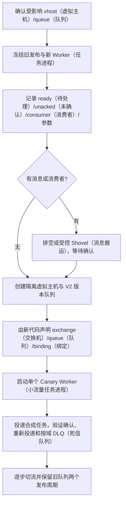
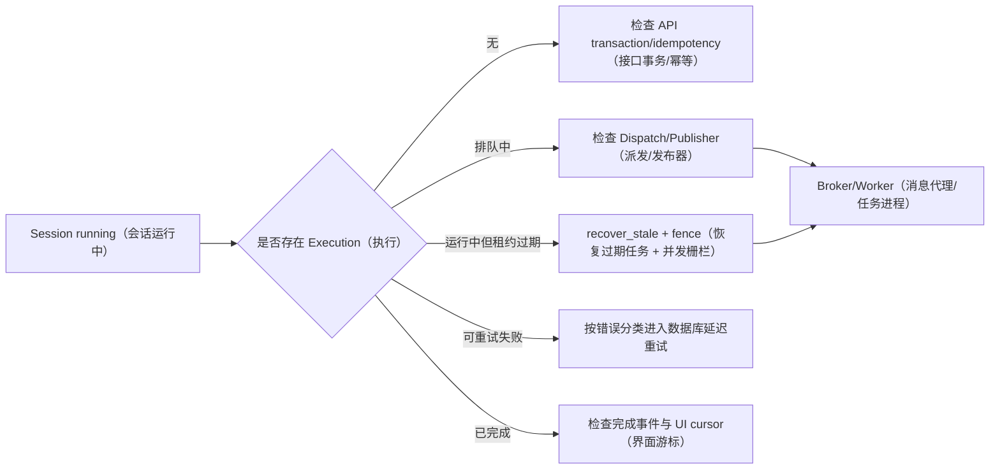
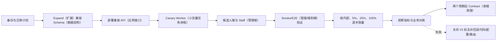

# 运行与故障手册

## 1. 先确认你要启动哪一层

- 只做模型/迁移/API 单测：使用测试 settings 或独立 PostgreSQL，不需要全部基础设施；
- 做普通页面：PostgreSQL + Redis + Django + Candidate/Staff Vue；
- 做异步导入/渲染/Agent：再需要 RabbitMQ + Celery；
- 做完整 RAG：再需要 Qdrant + Meilisearch，embedding 还需 Gateway；
- 做媒体：需要 ClamAV、对象存储/本地媒体配置、FFmpeg；
- 做可观测：LiteLLM/Langfuse/ClickHouse 视配置启动。

所有命令先从仓库根 `E:\AI_interview` 执行只读检查：

```powershell
git status --short
docker compose -f docker-compose.infra.yml ps
Get-NetTCPConnection -State Listen |
  Where-Object LocalPort -in 8000,5173,5174,5433,5672,6379,6380,6381,6333,7700
```

不要在脏工作树执行 reset；不要把 `.env`、数据库 dump、真实 Resume 放入 Vault。

## 2. 仅启动基础设施

```powershell
docker compose -f docker-compose.infra.yml up -d
docker compose -f docker-compose.infra.yml ps
```

默认本地端口：PostgreSQL 5433、Cache Redis 6379、Coordination Redis 6380、Realtime Redis 6381、RabbitMQ 5672/15672、Qdrant 6333/6334、Meilisearch 7700、LiteLLM 4000、ClamAV 3310。三个 Redis 是三个进程，用来验证不同淘汰与降级语义；本地单主机不代表生产高可用。以 Compose 展开结果和本地 env 为准，不把默认开发密码当生产配置。

`healthy` 只表示容器 healthcheck。应用 readiness 还要验证：

- PostgreSQL app role 可连接目标 DB；
- Django migration 已应用；
- Cache SET/GET/DEL、Coordination Lua/TTL/write、Realtime XADD/XREAD/EXPIRE 分别可用；
- RabbitMQ 当前代码能等价声明稳定 exchange、`ifaceoff.v2.*` queue/binding，并且每个关键 queue 有消费者；
- Qdrant collection/Meili index schema 匹配；
- Gateway credential/policy 可用或允许降级。

## 3. 数据库迁移

设置 `IFACEOFF_DATABASE_URL` 指向明确的 PostgreSQL 后：

```powershell
Set-Location E:\AI_interview\ai_interview_backend
python manage.py showmigrations
python manage.py migrate --plan
python manage.py migrate --noinput
python manage.py check
```

高风险生产步骤：

1. 记录当前 release/schema；
2. 验证备份可恢复；
3. 检查 migration 是否锁大表/数据回填；
4. expand schema，部署兼容代码；
5. 后台回填和验证；
6. 切流；
7. 下个 release 才 contract。

本轮 `resumes.0008` 修复只影响尚未应用该 migration 的环境。已应用环境不重跑。不要对已应用 production migration 随意修改后假设 Django 会执行。

## 4. 独立文档演示数据库

文档截图使用独立临时数据库，从零 migration，不复用开发主库。命名应包含日期/随机后缀，创建前查询是否存在。清理前再次解析并核对精确数据库名，不对 `postgres`、`ifaceoff_app` 或未知数据库执行 drop。

演示数据：

```powershell
$env:DEBUG='true'
$env:ALLOW_DOCS_DEMO_DATA='1'
$env:IFACEOFF_DOCS_PASSWORD='<process-only>'
$env:IFACEOFF_DOCS_STAFF_PASSWORD='<process-only>'
$env:IFACEOFF_DOCS_TOTP_SECRET='<process-only>'
python manage.py seed_documentation_demo --namespace ifaceoff-docs-v1 --json
```

保护条件：

- DEBUG 必须为 true；
- ALLOW_DOCS_DEMO_DATA 必须为 1；
- 密码/TOTP 只从进程环境；
- namespace 必须安全；
- 重跑不重复；
- `--purge` 只清该 namespace；
- 不调用收费模型，Gateway fixture 禁用且无 secret。

## 5. 启动 Web

后端：

```powershell
Set-Location E:\AI_interview\ai_interview_backend
python manage.py runserver 127.0.0.1:8000 --noreload
```

候选人端：

```powershell
Set-Location E:\AI_interview\ai-interview-frontend
npm run dev -- --host 127.0.0.1 --port 5173
```

Staff 端：

```powershell
Set-Location E:\AI_interview\ai-interview-admin
npm run dev -- --host 127.0.0.1 --port 5174
```

检查 HTTP 200、浏览器 Network、Django server log。API 根 404 不一定是故障；访问明确 health/readiness/业务 endpoint。

## 6. 启动 Celery

先由受控管理命令声明并校验 V2 拓扑；它不会用“异常即重建”覆盖旧队列：

```powershell
Set-Location E:\AI_interview\ai_interview_backend
python manage.py declare_celery_topology
```

Windows 本地可用 solo pool 做单队列功能验证，必须显式指定队列；不要用一个全队列 Worker 作为隔离证据：

```powershell
Set-Location E:\AI_interview\ai_interview_backend
python -m celery -A ai_interview_backend worker -l info -P solo `
  -Q ifaceoff.v2.publisher,ifaceoff.v2.events,ifaceoff.v2.notifications
```

生产按 Publisher/Recovery、Agent Interactive、Career Analysis、Document/OCR、Resume Render、Media/FFmpeg、Community Moderation、Events、Notification/Search 分 Worker，Beat 保持单副本。Document 与 Media、Publisher 与 Notification 不得重新合并。启动后用同一环境：

```powershell
python -m celery -A ai_interview_backend inspect ping --timeout 5
python -m celery -A ai_interview_backend inspect active --timeout 5
python -m celery -A ai_interview_backend inspect reserved --timeout 5
```

`inspect ping` 只证明至少一个 Worker 存活。发布 readiness 还必须查询 `ifaceoff.v2.agent.interactive`、`career.analysis`、`documents`、`resume.render`、`media`、`community.moderation`、`events`、`notifications`、`search.index`、`publisher` 的 ready/unacked/consumer/oldest age，并检查 Dispatch/Integration Outbox 最老 pending age。

## 7. RabbitMQ 406：队列声明不兼容

### 症状

Worker 日志：

`PRECONDITION_FAILED - inequivalent arg 'x-dead-letter-exchange' for queue 'celery' ... current is none`

### 原因

旧队列用相同名字创建但没有当前 DLX。RabbitMQ 不允许客户端热改 durable queue 声明参数，以防两个消费者对队列语义理解不同。代码现已使用 `ifaceoff.v2.*` 队列规避同名覆盖，但真实环境仍要完成旧队列盘点、排空与回滚窗口。

### 只读诊断

```powershell
docker exec Ifaceoff-infra-rabbitmq rabbitmqctl list_queues `
  name durable arguments messages_ready messages_unacknowledged consumers
docker exec Ifaceoff-infra-rabbitmq rabbitmqctl list_exchanges name type durable
docker exec Ifaceoff-infra-rabbitmq rabbitmqctl list_bindings
```

### 安全处置



观察重点：没有先执行 delete；删除是经过消息与消费者核验、业务幂等、canary 和回滚窗口后的最后一步。本轮业务延迟重试由 PostgreSQL `OperationDispatchOutbox.available_at` 调度，不存在应被运维依赖的 Rabbit TTL Retry Queue。

数据库 `OperationDispatchOutbox/IntegrationOutbox.status=dead` 与 RabbitMQ Broker DLQ 是两类不同对象。当前管理端可以查看和受控处理数据库 dead 记录；Broker DLQ 的读取、dry-run、最多 100 条批次、原 exchange/routing/header 校验、Confirm 和“重发失败不 ACK 原死信”仍为 partial/pending-verification，不得把前者称为“Broker 死信重放”。

面试时如何讲：Compose healthy 与 Worker readiness 分开；同名队列参数不能热变。

## 8. 运行截图

截图测试需要 fixture 返回的 Resume/Interview ID 和当前 Staff TOTP code。只把变量名写入脚本/文档，不保存值。

```powershell
$env:IFACEOFF_E2E_BASE_URL='http://127.0.0.1:5173'
$env:IFACEOFF_DOCS_ADMIN_URL='http://127.0.0.1:5174'
$env:IFACEOFF_DOCS_SCREENSHOT_DIR='<temporary-vault>\assets\screenshots'
$env:IFACEOFF_DOCS_VIRTUAL_MEDIA='1'
$env:IFACEOFF_DOCS_EMAIL='<synthetic>'
$env:IFACEOFF_DOCS_PASSWORD='<process-only>'
$env:IFACEOFF_DOCS_STAFF_EMAIL='<synthetic>'
$env:IFACEOFF_DOCS_STAFF_PASSWORD='<process-only>'
$env:IFACEOFF_DOCS_STAFF_MFA_CODE='<current-code>'
$env:IFACEOFF_DOCS_RESUME_ID='<seed-id>'
$env:IFACEOFF_DOCS_ACTIVE_INTERVIEW_ID='<seed-id>'
$env:IFACEOFF_DOCS_COMPLETED_INTERVIEW_ID='<seed-id>'
npx playwright test tests/e2e/documentation-screenshots.spec.ts
```

`IFACEOFF_DOCS_VIRTUAL_MEDIA=1` 只在文档测试时给 Edge 增加 fake media 参数。截图后校验 1440×900、文件数、SHA-256 和隐私。

## 9. Resume 页面显示 0 份

### 诊断

1. 查看 Network 最终 URL；
2. 查看 Django 日志；
3. 查询当前用户 Resume；
4. 对比 URLConf；
5. 检查 Axios base。

本轮最终 URL 是 `/api/v1/api/v2/resumes/`，Django 404，而数据库有 Resume。修复方向是统一 host base 或独立 v2 client；不要再 seed。

修复后回归：

- 列表显示稳定 fixture title；
- Studio detail/draft/version/template/quality/share/suggestion/avatar 请求全部 `/api/v2/...`；
- 401/404/503 不变空数组；
- Candidate build + Playwright；
- 更新卷二/卷三与变更日志。

## 10. Staff Agent Config 白屏

复现 `/agent-config`，抓 console error、Network 与 Vue error handler。对照 `AgentConfig.vue` 的 setup 依赖、API schema 和条件渲染。先加 error boundary/明确错误态，再修数据契约。空白 PNG 只作为缺陷证据，不计功能成功。

## 11. Agent Execution 卡住

查询顺序：

1. Session 业务状态；
2. AgentRun/Execution status、updated/heartbeat、attempt/fence；
3. Dispatch status、celery task id、error/next attempt；
4. RabbitMQ queue depth/consumer；
5. Worker log；
6. checkpoint thread；
7. NodeRun/Trace；
8. last durable event sequence。



不要直接手改 Session finished 或复制问题。恢复必须通过 Execution/Dispatch 协议。

## 12. SSE 断线

- 客户端保存 last event id；
- 重连带 cursor；
- 服务端校验 owner 和 run；
- 从 durable/stream 读取 `sequence > cursor`；
- 若超出保留，返回 state.snapshot；
- 最终 completed 后回读 Question/Execution。

若 Redis realtime 丢失，但数据库已完成，页面可通过 snapshot/轮询恢复，不重新调用模型。

## 13. RAG 无结果

按顺序检查：

1. Document visibility/approval/current revision；
2. published Chunk count；
3. AgentConfigKnowledgeBinding scope/revision/required；
4. Qdrant collection alias/vector size/payload filter；
5. Meili index/task/filter attributes；
6. tenant user；
7. query plan/multi query；
8. trace 中 candidate_filter_reason；
9. token budget 是否截断；
10. required/optional fallback。

不要为了“有结果”去掉租户过滤或把未审批文档设公开。

## 14. 索引重建

从 PostgreSQL 固定 source revision，建新物理索引，分批写入，核对 count/hash/抽样查询/tenant，切 alias/active，再延迟清旧。重建期间旧活动索引继续读。

Meili 若当前版本不支持所需原子 alias，使用版本化 index name + 应用配置切换，明确短窗口和回滚。

## 15. Gateway 故障

检查 Alias → Policy → Target → Deployment → Credential active；Budget reservation；Ledger/Attempt error；LiteLLM/provider health；timeout/retry 层。认证/预算错误不重试；429/5xx按 policy；结构错误记录 Attempt。

降级：

- rule-only evaluation；
- RRF 无 reranker；
- keyword/SQL fallback；
- 非关键文案稍后重试。

严禁业务代码绕过 Gateway 读取某个环境 API key。

## 16. 数据库备份恢复

恢复验证不是 `pg_restore` 退出码。至少检查：

- migration 一致；
- 用户/权限/关键表数量；
- 外键/唯一约束；
- Resume current version/draft/artifact；
- Session/Execution/Dispatch；
- Outbox/Inbox；
- Knowledge revision/chunk；
- Staff audit hash；
- sequence；
- 随机业务读。

索引/对象按 key/hash 对账。恢复环境隔离外部 webhook/邮件/模型，避免重放副作用。

## 17. 发布与回滚



数据库与消息采用 expand–backfill–switch–retain（扩展—回填—切换—保留）。新建请求按领域 Feature Flag 进入 V2 Operation Dispatch，运行中的旧任务保持旧路径；禁止双执行外部任务。回滚只关闭 V2 domain flag 并切回兼容适配器，不删除 Operation、Dispatch、Event、新队列或历史结果。回滚不仅是 Git：还要回滚 Prompt revision、Gateway Policy、FeatureFlag、索引 alias 和 queue routing。已写新 schema 数据时旧代码是否能读必须提前验证。

## 18. 事故响应

等级按数据泄漏、认证越权、面试中断、模型成本、异步积压和普通页面错误划分。共同步骤：

1. 记录时间、影响、request/run/ledger id；
2. 止损：flag/限流/停 Worker/撤密钥；
3. 保存日志/队列/审计证据；
4. 修复/恢复并验证；
5. 通知受影响方；
6. 根因与故障窗口；
7. 行动项含 owner/date/test；
8. 更新对应卷和变更日志。

不要在事故中删除失败记录来“清干净”，应保留可审计状态并按保留政策处理。

## 19. 停止临时环境

停止本轮启动的 Django/Vite/Worker 时按端口和启动时间确认 PID，只停止明确进程。临时 PostgreSQL DB/vhost 的删除属于破坏操作：先确认没有连接/消息、名称精确匹配文档 namespace，再执行；不删除共享 Compose volume。

## 20. 发布验收清单

- Django `check` 与 `makemigrations --check --dry-run`；
- Django 全量发现 295 项：293 项通过、2 项外部 PostgreSQL Checkpoint 测试显式跳过；
- Candidate/Admin 两个 Vue production build；
- base、infra、production-resilience、observability 四组 Compose config；
- API/OpenAPI facts；
- 真实 Broker 拓扑、每关键 queue consumer、Mandatory unroutable、Confirm NACK/timeout；
- Worker 重复投递、崩溃、lease/fence、Agent Checkpoint/recovery；
- RAG query/index lag；
- Gateway budget/ledger；
- Playwright；
- secret/privacy scan；
- backup restore evidence；
- 文档 sync/links/facts/changelog。

截至 2026-08-12，前四项中的静态检查、Django 测试、两个前端构建和 Compose config 已通过。Docker daemon 当前不可用，真实 RabbitMQ/Redis/Celery 容器、三节点 Quorum、外部 PostgreSQL Checkpoint、500 用户压测、备份恢复与灾备仍是发布阻断项，状态为 `pending-verification`。
