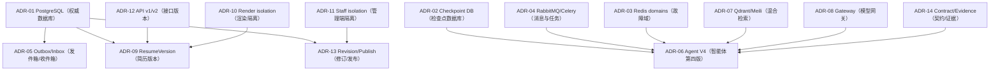
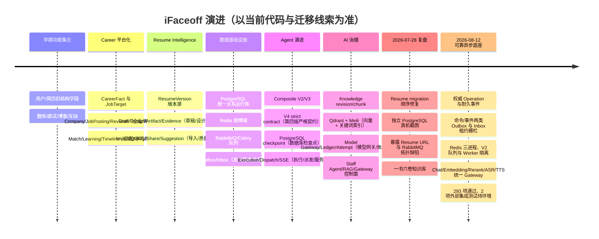

# ADR 与项目演进时间线

## 如何读这篇

ADR 记录“为什么选、替代方案、代价、何时重评”，不是把当前技术栈再列一次。状态使用 accepted、superseded、target。历史线索不能替代当前代码验证。

## ADR-01：PostgreSQL 作为统一关系数据库

**状态：accepted。** 
业务需要外键、条件唯一、CheckConstraint、行锁、JSONB、Outbox 和审计查询。统一 PostgreSQL 减少 MySQL/SQLite 行为差异。替代方案是长期双库或 MySQL；代价是迁移与运维学习成本。

**边界：** Agent checkpoint、LiteLLM、Langfuse 可使用独立 PostgreSQL database/role，不要求把所有 schema 放一库。重评条件是某领域出现明确独立扩展/合规需求。

## ADR-02：Agent Checkpoint 使用独立数据库

**状态：accepted，集成仍需完整运行验证。** 
图状态写入频率、保留和恢复与业务主库不同，隔离减少膨胀/锁影响。替代是主库表或 Redis-only；前者耦合，后者难做 durable 恢复。

**代价：** checkpoint 与业务结果不能单事务，必须用 Execution、节点幂等、fence 和 reconciliation。若规模小且双库运维成本过高，可重评合并但仍保持 schema/role 隔离。

## ADR-03：Redis 按缓存、协调、实时拆分故障域

**状态：accepted；开发/预发布三进程已实现，生产托管故障域待验证。** 
Cache 可淘汰/fail-open（故障开放），Coordination 的安全/高成本入口 fail-closed（故障关闭），Realtime 丢失后回到 PostgreSQL 快照。开发与预发布 Compose 已拆成三个 Redis 进程；生产目标是三个托管故障域、TLS 与分域 ACL。替代是单实例/逻辑 DB 或一开始就自建三套集群。

**代价：** 连接、容量和监控增加。单主机 Compose 仍共宿主机故障，不能作为生产 HA 证据；最终业务正确性仍依靠 PostgreSQL fencing 与唯一约束。

## ADR-04：RabbitMQ + Celery 承担异步任务

**状态：accepted；V2 拓扑已实现，真实蓝绿迁移待验证。** 
需要持久路由、Publisher Confirm（发布确认）、Mandatory Routing（强制路由）、manual/late ACK（手工/延迟确认）、Quorum Queue（仲裁队列）和 Python Worker 生态。稳定 exchange 配合 `ifaceoff.v2.*` 版本队列；Publisher、交互 Agent、Career、Document/OCR、Render、Media、Moderation、Events、Notification/Search 分组。替代 Redis broker、Kafka 或只使用数据库 job table。

**代价：** 至少一次、队列拓扑迁移、重复执行与运维复杂度。业务延迟重试选择 PostgreSQL `OperationDispatchOutbox.available_at` 作为唯一时钟，不建立未消费的 Rabbit TTL Retry Queue。旧队列 406 说明 declaration 需要版本化、passive inventory、canary 与每队列 readiness；本地单节点 Quorum 只验证语义。

## ADR-05：Outbox/Inbox 保证事件可靠性

**状态：accepted。** 
业务 commit 与 broker publish 不能原子。高成本命令使用 `OperationDispatchOutbox`，已经发生的领域事实使用 `IntegrationOutbox`；消费者以带 lease/fencing 的 `ConsumerInbox` 去重。外部副作用消费者只在事务内创建新的 Operation + Dispatch。替代是 `on_commit(send_task)` 或分布式事务；前者存在 commit 后丢消息窗口，后者复杂且不适合当前生态。

**代价：** publisher/recovery/cleanup/lag/poison message 和状态对账。Confirm 后进程崩溃仍会重复发布，因此依靠 Operation claim/fence、Inbox 与领域唯一约束；只承诺至少一次与可恢复，不宣称恰好一次。数据库 dead record 与 Broker DLQ 必须分开治理。

## ADR-06：LangGraph Composite V4 作为当前 Agent 引擎

**状态：accepted。** 
在 V3 行为上增加 strict contract、PostgreSQL checkpoint、durable execution 和事件版本。替代是自写状态机、纯 Celery chain 或一次 LLM call。

**代价：** V3/V4 映射、checkpoint 运维、节点幂等。未来当兼容窗口结束，应收敛旧 engine 和状态命名。

## ADR-07：Qdrant 与 Meilisearch 职责分离

**状态：accepted。** 
Qdrant 做语义向量，Meili 做关键词/专名/过滤，RRF 融合。替代是 PostgreSQL pgvector/full-text 单库、只向量或 Elastic。

**代价：** 双投影同步、重建、成本。数据量较小时 pgvector 可简化，但当前实现已提供物理集合/alias与 Meili pipeline。

## ADR-08：模型调用经 Gateway 统一治理

**状态：accepted。** 
Credential/Deployment/Alias/Policy/Budget/Ledger/Attempt 分离，业务不绑定厂商。LiteLLM 可做协议代理，业务 Gateway 管租户语义。

**代价：** 控制面成为关键依赖，需明确两层重试/计费。简单个人部署可用单默认 policy，但不能在业务代码散落 secret。

## ADR-09：ResumeVersion 是内容版本源

**状态：accepted。** 
Resume 是聚合身份，Version 不可变，投递/分析/分享固定 Version。替代是原地更新 Resume JSON 或全关系子表。

**代价：** 存储与版本管理。收益是可回滚、可复现和证据链。旧 structured fields 在兼容期 readable，最终收敛。

## ADR-10：Resume 内容与模板渲染隔离

**状态：accepted。** 
DesignRevision 与内容分开，Artifact 固定 content/design/renderer。替代是内容 JSON 嵌模板字段或模型直接生成 PDF。

**代价：** 对象更多，但缓存、测试和重现更可靠。RenderCV/Typst 等 renderer 可换而不改内容源。

## ADR-11：Staff 与候选人认证隔离

**状态：accepted。** 
Staff 具高权限，使用独立 Account/Session/MFA/RBAC/Audit/Frontend。替代是 User role 或 Django admin。

**代价：** 两套登录/前端和权限维护。安全收益足够；企业账号也不等于 Staff。

## ADR-12：API v1/v2 并行演进

**状态：accepted，但需收敛计划。** 
新 Career/Resume Intelligence 契约用 v2，旧调用保留 v1。替代是破坏式升级或永久无版本。

**代价：** client 基址与文档复杂，Resume 当前 bug 已证明。需要独立 client、OpenAPI、调用统计、弃用头和删除里程碑。

## ADR-13：知识/配置使用 Revision + 发布

**状态：accepted。** 
Knowledge Document/Base/RetrievalProfile、Agent Config、Prompt、Template/Rubric 都使用稳定身份 + revision + current/published pointer。替代是原地编辑。

**代价：** 发布工作流和清理更复杂；收益是历史 Run 可解释、索引可重建、回滚可控。

## ADR-14：AI 输出必须先过结构契约和证据门

**状态：accepted。** 
Pydantic strict contract、JSON Resume/schema、Rubric/evidence guard 将自由文本限制在边界；失败降级而不是写非法状态。

**代价：** 模型输出合法率和修复逻辑需要维护；收益是业务数据不被不可预测 JSON 污染。

## 决策依赖图

观察重点：V4 不是独立技术选择，它依赖 checkpoint、队列、实时、RAG、Gateway 和契约；Resume v2 依赖版本/渲染/API 三个决策。

面试时如何讲：被问“为什么这么复杂”时，从依赖的故障和审计目标解释，不从流行技术出发。

## 项目演进时间线

观察重点：时间线是技术能力逐步收敛，不宣称每个阶段都已生产完成；当前基线仍保留 legacy compatibility。

面试时如何讲：选择一个演进故事——例如 Resume 从旧字段到 Version/Draft——说明为什么改、怎样兼容、迁移遇到什么问题。

## 下一阶段触发条件

- 删除 v1：调用量归零、客户端迁完、弃用窗口结束；
- 删除 legacy Resume 子表：读写对账通过、导入/导出只用 JSON Resume；
- 生产托管 Redis 验收：TLS/ACL、容量、`noeviction` 写满、故障切换和快照恢复全部通过后；
- 旧 Rabbit 队列退出：passive inventory、shovel/排空、canary、两周期回滚窗口与三节点演练完成后；
- Broker DLQ replay 上线：dry-run、原路由校验、Confirm、失败不 ACK、权限/幂等/原因/审计全部通过后；
- RAG 迁 pgvector/Elastic：双索引运维成本与实际质量收益不匹配；
- Agent V5：V3 兼容移除、V4 运行评测和恢复指标稳定后；
- 多 AZ：有明确 RTO/RPO/SLO 和生产负载，完成恢复演练。
- Beat 高可用：周期任务全部证明重复 tick 幂等，或引入数据库 leader lease 后再增加副本。
