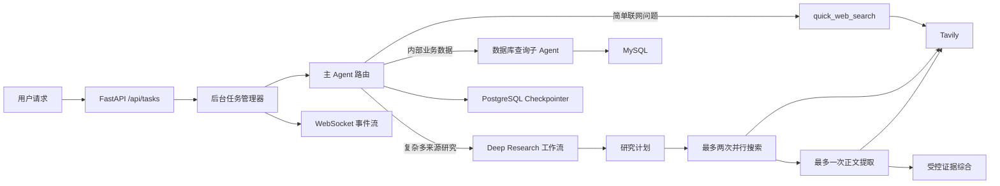

# 索引与项目概览

## 项目目标

参考开源项目 `deep-search-pro`，从零搭建一个可持续演进的深度研究 Agent 后端。项目不是机械复刻，而是把它作为 Python 后端、FastAPI、Docker、异步编程、数据库、LangGraph、多 Agent 和可靠性治理的综合练习。

## 开发边界

- 使用 PyCharm 编写、调试和运行本地 FastAPI；
- Docker 主要承载 MySQL、PostgreSQL 等基础设施，当前不把本地开发应用强行容器化；
- DeepSeek V4 Flash 作为模型；
- Tavily 负责快速搜索和网页正文提取；
- MySQL 模拟企业业务数据；
- PostgreSQL 保存 LangGraph Checkpoint；
- HTTP 创建后台任务，WebSocket 推送运行事件；
- `task_id` 表示一次执行，`thread_id` 表示可恢复的会话。

## 当前架构

## 大问题索引

| 编号 | 问题 | 核心能力 |
|---|---|---|
| 01 | [[01-Docker基础设施与异步数据库兼容]] | Docker Compose、MySQL、PostgreSQL、Windows 异步兼容 |
| 02 | [[02-Agent工具契约与异步任务事件流]] | Tool Schema、后台任务、WebSocket、Checkpoint |
| 03 | [[03-网络研究失控与可靠性硬边界]] | Middleware、预算、并发、熔断、超时 |
| 04 | [[04-简单查询误入DeepResearch与分层重构]] | 路由、工作流、上下文工程、性能优化 |
| 05 | [[05-DeepSeek思考模式的节点化控制]] | Thinking 模式、tool choice、模型节点职责 |
| 06 | [[06-Agent测试与可观测性方法]] | 离线测试、在线轨迹、Fresh Thread、指标 |

## 当前可验证成果

- FastAPI、MySQL、PostgreSQL 基础设施闭环；
- DeepSeek 模型连接；
- 数据库只读查询子 Agent；
- PostgreSQL Checkpoint 会话恢复；
- 后台任务、取消、会话运行锁和 WebSocket 事件流；
- 网络研究预算、URL 去重、供应商熔断和根任务超时；
- 简单联网查询与复杂 Deep Research 分流；
- 简单联网查询在线测试约 8.07 秒完成；
- 范围受控的复杂研究在线测试约 32.04 秒完成；
- 关键边界均有不消耗外部额度的离线回归脚本。

> 上述耗时是 2026-08-11 对指定测试问题、全新会话和当时网络环境的单次实测，不是所有任务的 SLA。
