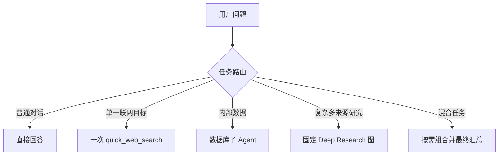

# 简单查询误入 Deep Research 与分层重构

## 问题现象

用户只问：

```text
请联网搜索 Tavily 实现网络搜索子 Agent 的用途并给出来源。
```

旧链路却把它扩展成多个框架、深度研究、代码示例和完整报告。一次测试接近十分钟仍在运行，另一次在完成搜索与正文提取后最终综合超时。

## 证据定位

一条失败轨迹表现为：

```text
主 Agent 委派 internet-researcher
→ 子 Agent 创建 6 项 Todo
→ 并行 4 次搜索
→ 提取 3 个 URL
→ 最终综合阶段超时
```

Tavily 可见请求总耗时只有几秒，真正时间主要花在多轮模型调度、过长上下文和最终综合，而不是搜索供应商本身。

另一个关键证据是测试复用了旧 `thread_id`。PostgreSQL 中已有多日 Checkpoint 历史，因此它不是干净的性能测试。独立基准测试应不传 `thread_id`，只有继续真实对话时才复用。

## 根因

1. 主 Agent Prompt 强制所有联网或需要来源的任务委派给研究子 Agent；
2. 子 Agent 描述把“任何需要 URL 的任务”都定义为深度研究；
3. Deep Agents 的 Task 工具会把委派描述补充得很详细，进一步扩大范围；
4. 自由循环 Agent 可以继续规划、搜索和提取；
5. 最终模型需要读取系统提示、Todo、工具调用和全部工具结果；
6. 内容截断只能减少输入体积，不能修复错误路由。

## 设计原则

简单问题和复杂研究不是同一条链路的不同预算档位，而是不同执行模式：



## 实现一：快速联网路径

`quick_web_search` 的边界：

- 主 Agent 直接调用，不经过子 Agent；
- 不生成研究计划；
- 通常不提取正文；
- 一次搜索；
- 最多 3 条结果；
- 单条摘要最多 450 字符；
- 单次总结果最多 1800 字符；
- 保留真实 URL；
- 最终答案必须使用 Markdown 链接；
- 用户仅要求“联网”或“来源”不等于深度研究。

## 实现二：固定 Deep Research 图

旧的自由循环子 Agent 被固定阶段工作流替代：

```text
plan_research
→ search_sources（最多两个查询，并行）
→ extract_sources（最多一次，最多两个唯一 URL）
→ synthesize_research（只接收原问题和受控证据）
```

关键提升：

- 阶段由代码确定，不由模型随意追加；
- 规划最多两个问题；
- 搜索并行降低工具等待；
- URL 在提取前规范化去重；
- 最终模型不再读取整个子 Agent 历史；
- Budget 快照仍记录真实搜索、提取和内容消耗；
- 失败阶段可以明确定位。

## 在线验证

### 简单查询

```text
轨迹：quick_web_search
委派次数：0
结果：completed
耗时：8.07 秒
```

### 范围受控的复杂研究

```text
轨迹：task
→ submit_research_plan
→ 2 × tavily_search
→ tavily_extract
→ completed

搜索次数：2
提取次数：1
供应商错误：0
耗时：32.04 秒
```

上述是指定问题和当时环境的单次实测，不应直接作为生产 SLA。

## 失败迭代也值得记录

重构不是一次成功，中间暴露了两个真实边界：

1. DeepSeek thinking 模式不支持强制指定具体 `tool_choice`；
2. 两个搜索结果可能是同一 URL 的不同 fragment，原字符串去重不足。

分别通过节点化模型模式和提取前 URL 规范化解决。详见 [[05-DeepSeek思考模式的节点化控制]]。

## 提升与收获

- 简单问题从失败或分钟级等待降到约 8 秒；
- 复杂研究从不可预测自由循环变成约 32 秒的固定轨迹；
- 路由、执行和内容限制职责分离；
- 认识到“更多 Agent”不一定更智能，错误委派只会增加模型轮次和上下文；
- Deep Research 更适合有预定阶段的 Workflow，简单查询更适合单 Agent 直接工具调用。

## 面试表达

> 我遇到过一个典型的 Agent 过度编排问题：用户只问一个 Tavily 用途，主 Agent 却委派深度研究子 Agent，生成多项计划、执行多次搜索和正文提取，最终在综合阶段超时。我通过轨迹证明外部搜索只占几秒，主要瓶颈是错误路由和上下文膨胀。随后把系统拆成快速查询与复杂研究两条通道：简单问题由主 Agent 一次搜索，复杂问题进入固定 LangGraph 工作流。在线实测简单查询约 8 秒、复杂研究约 32 秒完成，同时保留预算和来源协议。
